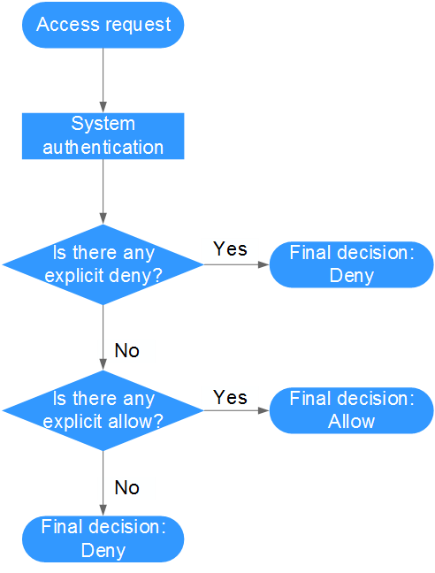

# Policy Syntax<a name="cce_01_0180"></a>

## Policy Structure<a name="section34287870"></a>

A permissions policy consists of a Version and a Statement. Each policy can have multiple statements.

**Figure  1**  Policy structure<a name="fig6755360"></a>  


## Policy Syntax<a name="section10352173123317"></a>

The  **CCE Viewer**  policy is used as an example to describe policy syntax.

```
{
        "Version": "1.1",
        "Statement": [
                {
                        "Effect": "Allow",
                        "Action": [
                                "cce:*:get",
                                "cce:*:list",
                                "cce:kubernetes:*",
                                "ecs:*:get",
                                "ecs:*:list",
                                "evs:*:get",
                                "evs:*:list",
                                "evs:*:count",
                                "vpc:*:get",
                                "vpc:*:list",
                                "elb:*:get",
                                "elb:*:list",
                                "sfs:*:get",
                                "sfs:*:list",
                                "aom:*:get",
                                "aom:*:list",
                                "aom:autoScalingRule:*"
                        ]
                }
        ]
}
```

-   **Version**: Distinguishes between role-based access control \(RBAC\) and fine-grained policies.
    -   **1.0**: RBAC policies. An RBAC policy consists of permissions for an entire service. Users in a group with such a policy assigned are granted all of the permissions required for that service.
    -   **1.1**: Fine-grained policies. A fine-grained policy consists of API-based permissions for operations on specific resource types. Fine-grained policies, as the name suggests, allow for more fine-grained control than RBAC policies. Users granted permissions of such a policy can only perform specific operations on the corresponding service. Fine-grained policies include system and custom policies.

-   Statement: Permissions defined by a policy, including Effect and Action.
    -   Effect

        The valid values for Effect are Allow and Deny. System policies contain only Allow statements. For custom policies containing both Allow and Deny statements, the Deny statements take precedence.

    -   Action

        Permissions in the format of Service name:Resource type:Operation. A policy can contain one or more permissions. The wildcard \(\*\) is allowed to indicate all of the services, resource types, or operations depending on its location in the action.

        Examples:

        -   **cce:\*:get**: Permissions for querying all types of resources in CCE.
        -   **cce:kubernetes:\***: Permissions for performing all operations on Kubernetes resources in CCE.


## Authentication Logic<a name="section6295723"></a>

If a user is granted permissions of multiple policies or of only one policy containing both Allow and Deny statements, then authentication starts from the Deny statements. The following figure shows the authentication logic for resource access.

**Figure  2**  Authentication logic<a name="fig48552050"></a>  


> **NOTE:**   
>The actions in each policy bear the OR relationship.  

1.  A user accesses the system and makes an operation request.
2.  The system evaluates all the permissions policies assigned to the user.
3.  In these policies, the system looks for explicit deny permissions. If the system finds an explicit deny that applies, it returns a decision of Deny, and the authentication ends.
4.  If no explicit deny is found, the system looks for allow permissions that would apply to the request. If the system finds an explicit allow permission that applies, it returns a decision of Allow, and the authentication ends.
5.  If no explicit allow permission is found, IAM returns a decision of Deny, and the authentication ends.

