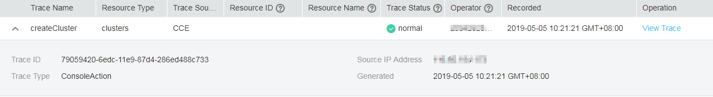

# Querying CTS Logs

After you enable Cloud Trace Service \(CTS\), the system starts recording operations on  CCE  resources. Operation records of the last 7 days can be viewed on the  CTS  management console.

## Scenario

After you enable CTS, the system starts recording operations on CCE resources. Operation records of the last 7 days can be viewed on the CTS management console.

## Procedure

1.  Log in to the management console.
2.  Click    in the upper left corner and select a region.
3.  Choose  **Service List**  from the main menu. Choose  **Management & Deployment**  \>  **Cloud Trace Service**.
4.  In the navigation pane of the CTS console, choose  **Cloud Trace Service**  \>  **Trace List**.
5.  On the  **Trace List**  page, query operation records based on the search criteria. Currently, the trace list supports trace query based on the combination of the following search criteria:
    -   **Trace Source**,  **Resource Type**, and  **Search By**

        Select the search criteria from the drop-down lists. Select  **CCE**  from the  **Trace Source**  drop-down list.

        If you select  **Trace name**  from the  **Search By**  drop-down list, specify the trace name.

        If you select  **Resource ID**  from the  **Search By**  drop-down list, select or enter a specific resource ID.

        If you select  **Resource name**  from the  **Search By**  drop-down list, select or enter a specific resource name.

    -   **Operator**: Select a specific operator \(at user level rather than account level\).
    -   **Trace Status**: Set this parameter to any of the following values:  **All trace statuses**,  **normal**,  **warning**, and  **incident**.
    -   **Start Date**  and  **End Date**: You can specify the time period to query traces.

6.  Click    on the left of a trace to expand its details, as shown in  [Figure 1](#fig1324117817394).

    **Figure  1**  Expanding trace details  
    

7.  Click  **View Trace**  in the  **Operation**  column. In the dialog box shown in  [Figure 2](#fig365411360512), the trace structure details are displayed.

    **Figure  2**  Viewing event details  
    

