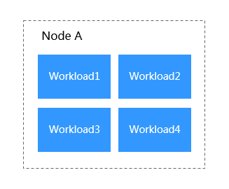

# Scheduling Policy Overview

CCE supports both simple and custom scheduling policies. A simple scheduling policy includes basic scheduling settings and is easy to configure, while a custom scheduling policy allows you to configure advanced scheduling \(node affinity and workload affinity/anti-affinity\).

## Simple Scheduling Policies

A simple scheduling policy allows you to configure affinity between workloads and AZs, between workloads and nodes, and between workloads.

-   **Workload-AZ Affinity and Anti-Affinity**
    -   **Affinity between workloads and AZs**:  [Workload-AZ Affinity](workload-az-affinity.md)
    -   **Anti-affinity between workloads and AZs**:  [Workload-AZ Anti-Affinity](workload-az-anti-affinity.md)

-   **Workload-Node Affinity and Anti-Affinity**
    -   **Affinity between workloads and nodes**:  [Workload-Node Affinity](workload-node-affinity.md)
    -   **Anti-affinity between workloads and nodes**:  [Workload-Node Anti-Affinity](workload-node-anti-affinity.md)

-   **Workload-Workload Affinity and Anti-Affinity**: Determines whether workloads are deployed in the same topology domain.
    -   **Affinity between workloads**: For details, see  [Workload-Workload Affinity](workload-workload-affinity.md). You can deploy workloads on the same node to reduce consumption of network resources.

        [Figure 1](#fig3017424713)  shows an example of affinity deployment, in which all workloads are deployed on the same node.

        **Figure  1**  Affinity between workloads  
        

    -   **Anti-affinity between workloads**: For details, see  [Workload-Workload Anti-Affinity](workload-workload-anti-affinity.md). Constraining multiple instances of the same workload from being deployed on the same node reduces the impact of system breakdowns. Anti-affinity deployment is also recommended for workloads that may interfere with each other.

        [Figure 2](#fig1505421971)  shows an example of anti-affinity deployment, in which four workloads are deployed on four different nodes.

        **Figure  2**  Anti-affinity between workloads  
        

> **NOTICE:**   
>When setting workload-workload affinity and workload-node affinity, ensure that the affinity relationships do not contradict each other; otherwise, workload deployment will fail. For example, workload creation will fail for Workload3 when the following conditions are met:  
>-   Anti-affinity is configured for Workload1 and Workload2. Workload1 is deployed on Node A and Workload2 is deployed on Node B.  
>-   Affinity is configured between Workload2 and Workload3, but anti-affinity is configured between Workload3 and Node C.  

## Custom Scheduling Policies

You can configure node affinity, workload affinity, and workload anti-affinity in a custom scheduling policy. For details, see  [Affinity and anti-affinity](https://kubernetes.io/docs/concepts/configuration/assign-pod-node/?spm=a2c4g.11186623.2.34.7f4d38f6C1WPWj#affinity-and-anti-affinity).

-   [Node Affinity](node-affinity.md)
-   [Workload Affinity](pod-affinity.md)
-   [Workload Anti-Affinity](pod-anti-affinity.md)

> **NOTE:**   
>Custom scheduling policies depend on node labels and pod labels. You can use default labels or customize labels as required.  

