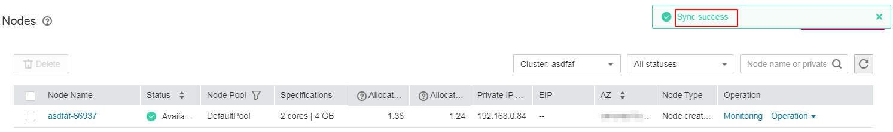

# Synchronizing Node Data

## Context

Each node in a cluster is a cloud server. After a cluster node is created, you can change the cloud server name or specifications as required.

After you change a cloud server name or specifications on the CCE console, use the  **node data synchronization**  function to synchronize the new name or specifications from the ECS console to the CCE console.

## Procedure

1.  Log in to the CCE console. In the navigation pane, choose  **Resource Management**  \>  **Nodes**.
2.  In the same row as the node whose data will be synchronized, choose  **Operation**  \>  **More \> Sync Node Data**.

    > **NOTE:** 
    >Alternatively, click the node name, and click  **Sync Node Data**  in the upper right corner of the node details page.

    **Figure  1**  Synchronizing node data  
    

    After the synchronization is complete, the "Synchronization successful" message is displayed in the upper right corner.

    **Figure  2**  Successful data synchronization  
    

