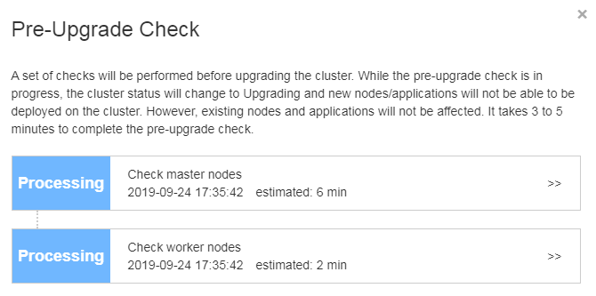
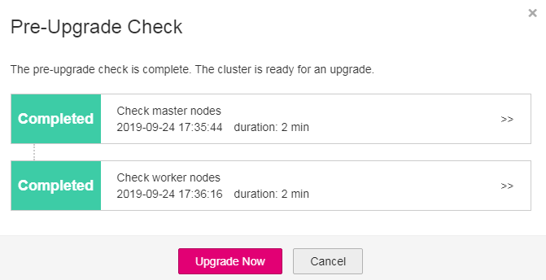
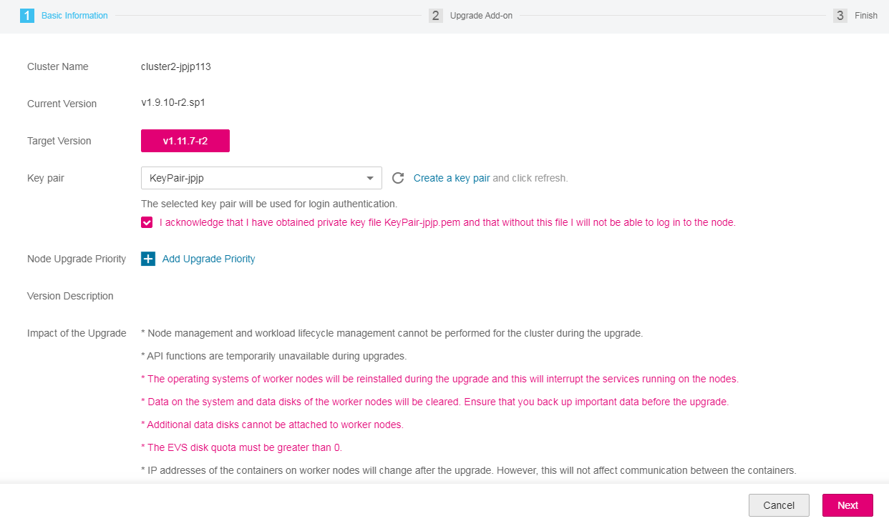

# Upgrading a Cluster<a name="cce_01_0120"></a>

Kubernetes versions are expressed as x.y.z, where x is the major version, y is the minor version \(for example, v1.13\), and z is the patch version. Minor releases occur approximately every 3 months to provide new features, design updates, and bug fixes, and each minor release branch is maintained for approximately 9 months. You can use the CCE console to upgrade your cluster to the latest Kubernetes version or a bug fix.

## Precautions<a name="section4557144475115"></a>

-   There is a certain possibility that cluster upgrade may fail. To avoid data loss, back up data before the upgrade.
-   The upgrade from v1.13 or earlier to v1.15 is not supported.
-   During the upgrade from Kubernetes 1.9 to 1.11, the kube-dns of the cluster will be uninstalled and replaced with CoreDNS, which may cause loss of the cascading DNS configuration in the kube-dns or temporary interruption of the DNS service. Back up the DNS address configured in the kube-dns so you can configure the domain name in the CoreDNS again when domain name resolution is abnormal.
-   During a cluster upgrade, you can upgrade a user node only by resetting the node. This upgrade mode is simple and rarely fails, and also supports OS upgrade. However, services will be interrupted during the upgrade. In addition, the node OS will be reinstalled, and data in the system disk and data disk will be cleared.
-   User nodes can be upgraded in batches to minimize service interruption.

## Preparation<a name="section9871020102918"></a>

Before upgrading a cluster, make sure that the cluster is healthy.

1.  Log in to the master node of the cluster. For details, see  [Connecting to a Kubernetes Cluster Using kubectl](connecting-to-a-kubernetes-cluster-using-kubectl.md).
2.  Run the following command to verify that all modules are in the Healthy state:

    **kubectl get cs**

    Information similar to the following is displayed:

    ```
    NAME                 STATUS    MESSAGE              ERROR
     scheduler            Healthy   ok
     controller-manager   Healthy   ok
     etcd-0               Healthy   {"health": "true"}
     etcd-1               Healthy   {"health": "true"}
     etcd-2               Healthy   {"health": "true"}
    ```

3.  Run the following command to verify that all nodes are in the Ready state:

    **kubectl get nodes**

    > **NOTE:** 
    >All nodes must be in the Ready state.

    ```
     NAME              STATUS    ROLES     AGE       VERSION
     eu-de-01-xxx   Ready     master    38d       v1.9.10-r2
     eu-de-01-xxx   Ready     <none>    38d       v1.9.10-r2
     eu-de-01-xxx   Ready     <none>    38d       v1.9.10-r2
     eu-de-01-xxx   Ready     <none>    38d       v1.9.10-r2
     eu-de-01-xxx   Ready     master    38d       v1.9.10-r2
     eu-de-01-xxx   Ready     master    38d       v1.9.10-r2
    ```


## Cluster Pre-upgrade Checklist<a name="section14190181819293"></a>

Before upgrading a cluster, follow the pre-upgrade checklist to identify risks and problems in advance.

**Table  1**  Cluster pre-upgrade checklist

<a name="table1238111218323"></a>
<table><thead align="left"><tr id="row132391129329"><th class="cellrowborder" valign="top" width="21.709999999999997%" id="mcps1.2.3.1.1"><p id="p1423913122324"><a name="p1423913122324"></a><a name="p1423913122324"></a>Object</p>
</th>
<th class="cellrowborder" valign="top" width="78.29%" id="mcps1.2.3.1.2"><p id="p18239161220325"><a name="p18239161220325"></a><a name="p18239161220325"></a>Check Item</p>
</th>
</tr>
</thead>
<tbody><tr id="row424018124321"><td class="cellrowborder" rowspan="2" valign="top" width="21.709999999999997%" headers="mcps1.2.3.1.1 "><p id="p1524071220320"><a name="p1524071220320"></a><a name="p1524071220320"></a>Cluster</p>
</td>
<td class="cellrowborder" valign="top" width="78.29%" headers="mcps1.2.3.1.2 "><p id="p1324061214324"><a name="p1324061214324"></a><a name="p1324061214324"></a>Check whether IP addresses (including EIPs) of cluster nodes are included in other configurations/whitelists.</p>
</td>
</tr>
<tr id="row824016123329"><td class="cellrowborder" valign="top" headers="mcps1.2.3.1.1 "><p id="p20240812143219"><a name="p20240812143219"></a><a name="p20240812143219"></a>Complete the pre-upgrade check.</p>
</td>
</tr>
<tr id="row924013120321"><td class="cellrowborder" rowspan="2" valign="top" width="21.709999999999997%" headers="mcps1.2.3.1.1 "><p id="p1724021216325"><a name="p1724021216325"></a><a name="p1724021216325"></a>Workload</p>
</td>
<td class="cellrowborder" valign="top" width="78.29%" headers="mcps1.2.3.1.2 "><p id="p1424041263216"><a name="p1424041263216"></a><a name="p1424041263216"></a>Record the quantity and status of workloads for comparison after the upgrade.</p>
</td>
</tr>
<tr id="row1296933813911"><td class="cellrowborder" valign="top" headers="mcps1.2.3.1.1 "><p id="p59693385919"><a name="p59693385919"></a><a name="p59693385919"></a>Evaluate the possible changes that the upgrade may bring to whitelists, routing, and security group policies of databases (such as Redis and MongoDB).</p>
</td>
</tr>
<tr id="row15579521103820"><td class="cellrowborder" valign="top" width="21.709999999999997%" headers="mcps1.2.3.1.1 "><p id="p12579172163813"><a name="p12579172163813"></a><a name="p12579172163813"></a>Storage</p>
</td>
<td class="cellrowborder" valign="top" width="78.29%" headers="mcps1.2.3.1.2 "><p id="p257992123818"><a name="p257992123818"></a><a name="p257992123818"></a>Record storage status. Storage must not be lost after the upgrade.</p>
</td>
</tr>
<tr id="row1740471712383"><td class="cellrowborder" rowspan="2" valign="top" width="21.709999999999997%" headers="mcps1.2.3.1.1 "><p id="p640513174387"><a name="p640513174387"></a><a name="p640513174387"></a>Network</p>
<p id="p1578613471673"><a name="p1578613471673"></a><a name="p1578613471673"></a></p>
</td>
<td class="cellrowborder" valign="top" width="78.29%" headers="mcps1.2.3.1.2 "><p id="p340521718381"><a name="p340521718381"></a><a name="p340521718381"></a>Check and back up load balancing services and Ingresses.</p>
</td>
</tr>
<tr id="row1178610472077"><td class="cellrowborder" valign="top" headers="mcps1.2.3.1.1 "><p id="p1478694720715"><a name="p1478694720715"></a><a name="p1478694720715"></a>If Direct Connect is used and node/pod IP addresses may change after the upgrade, configure new routes on Direct Connect in advance.</p>
</td>
</tr>
<tr id="row146320432505"><td class="cellrowborder" valign="top" width="21.709999999999997%" headers="mcps1.2.3.1.1 "><p id="p7631443125015"><a name="p7631443125015"></a><a name="p7631443125015"></a>Add-on</p>
</td>
<td class="cellrowborder" valign="top" width="78.29%" headers="mcps1.2.3.1.2 "><p id="p106364317505"><a name="p106364317505"></a><a name="p106364317505"></a>When Kubernetes v1.9 is upgraded to v1.11, the kube-dns of the cluster will be uninstalled and replaced with CoreDNS. Back up the DNS address configured in kube-dns so that you can configure the DNS address in CoreDNS when domain name resolution is abnormal.</p>
</td>
</tr>
<tr id="row96853135389"><td class="cellrowborder" rowspan="2" valign="top" width="21.709999999999997%" headers="mcps1.2.3.1.1 "><p id="p46861813153810"><a name="p46861813153810"></a><a name="p46861813153810"></a>O&amp;M</p>
</td>
<td class="cellrowborder" valign="top" width="78.29%" headers="mcps1.2.3.1.2 "><p id="p868691311386"><a name="p868691311386"></a><a name="p868691311386"></a>Ensure that nodes and containers do not store configurations such as data-plane passwords, certificates, and environment variables. After the upgrade, nodes and containers may restart (typically, a container restarts when the pod is migrated from a faulty node to an available node) and the configurations will become lost, which results in service exceptions.</p>
</td>
</tr>
<tr id="row202401212143211"><td class="cellrowborder" valign="top" headers="mcps1.2.3.1.1 "><p id="p142408126323"><a name="p142408126323"></a><a name="p142408126323"></a>Check and back up kernel parameters or system configurations.</p>
</td>
</tr>
</tbody>
</table>

## Procedure<a name="section9456205813519"></a>

This section describes how to upgrade a VM cluster from v1.9.10-r2 to v1.11.7-r2. The procedure for other upgrade paths is similar.

1.  Log in to the CCE console. In the navigation pane, choose  **Resource Management \> Clusters**. On the cluster list, view your cluster version. In this example, the cluster version is v1.9.10-r2.

    > **NOTE:** 
    >If your cluster version is up-to-date, the  **Upgrade**  button is unavailable.

2.  Click  **More**  for the cluster you want to upgrade, and select  **Upgrade**  from the drop-down menu.
3.  In the displayed  **Pre-upgrade Check**  dialog box, click  **Check Now**.

    **Figure  1**  Pre-upgrade check<a name="fig222963412364"></a>  
    

4.  The pre-upgrade check starts. While the pre-upgrade check is in progress, the cluster status will change to Upgrading and new nodes/applications will not be able to be deployed on the cluster. However, existing nodes and applications will not be affected. It takes 3 to 5 minutes to complete the pre-upgrade check.

    **Figure  2**  Pre-upgrade check in process<a name="fig7449134343916"></a>  
    

5.  When the status of the pre-upgrade check is  **Completed**, click  **Upgrade Now**.

    **Figure  3**  Pre-upgrade check completed<a name="fig6715157124019"></a>  
    

6.  On the  **Upgrade Cluster**  page, confirm the basic information and click  **Next**.

    **Figure  4**  Basic information about cluster upgrade<a name="fig112061923419"></a>  
    

7.  On the  **Upgrade Add-on**  page, click  **Upgrade**  in the lower right corner.
8.  In the displayed  **Upgrade**  dialog box, confirm the information and click  **OK**. The upgrade cannot be rolled back.

    **Figure  5**  Confirming cluster upgrade<a name="fig1221222915614"></a>  
    

9.  You can  **Back to Cluster List**  or  **Go to Cluster Details Page**  to view the cluster upgrade status.

    It takes some time to complete the upgrade. After the upgrade is complete, you can view the cluster version on the cluster list page.


