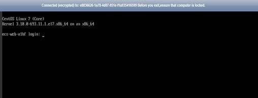
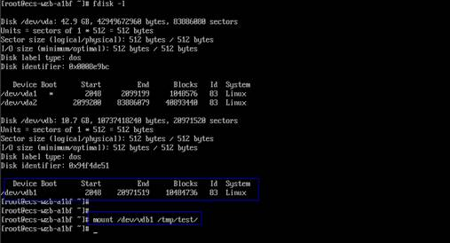
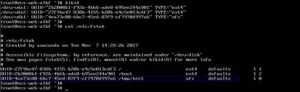

# An ECS Created Using an Image Enters the Maintenance Mode After Login

## Symptom

After you create an image using an ECS backup, use the image to create an ECS, and log in to the ECS, the ECS enters the maintenance mode and cannot be used properly.

## Possible Cause

When the source ECS has data disks, the configuration parameters contained in the  **/etc/fstab**  file in the system disk of the new ECS are the source ECS's, causing the UUID information inconsistent with the new data disks. In such conditions, the ECS encounters an error when uploading  **/etc/fstab**  during the bootup and enters the maintenance mode.

## Solution

This section uses CentOS as an example.

1.  After creating an ECS using an image, log in to the ECS console, click  **Remote Login**  in the row of the ECS.
2.  In the maintenance interface that is displayed, access the system as prompted.

    **Figure  1**  Interface displayed when an ECS enters the maintenance mode  
    

3.  Run the  **cat /etc/fstab**  command to check the attachment information about the data disks.

    **Figure  2**  Data disk UUIDs  
    

4.  Run the  **vi /etc/fstab**  command to open the file, press  **i**  to enter the editing mode, and delete the attachment information of all data disks. Then, press  **Esc**  to exit the editing mode and run  **:wq!**  to save the change and exit.

    **Figure  3** **/etc/fstab**  after being updated  
    

5.  Run the  **reboot**  command to restart the system.

    **Figure  4**  Normal bootup page  
    

6.  After entering the system, attach the data disks manually.

    **Figure  5**  Attaching the data disks manually  
    

7.  Run the  **blkid**  command to obtain the UUID information of the data disks.

    **Figure  6**  Obtaining UUIDs of data disks  
    

8.  Run the  **vi /etc/fstab**  command to open the file, press  **i**  to enter the editing mode, and add the attachment information of all data disks. Then, press  **Esc**  to exit the editing mode and run  **:wq!**  to save the change and exit.

    **Figure  7**  Adding attachment information of data disks  
    

    After the information is added, the system will automatically attach the data disks on restart.

