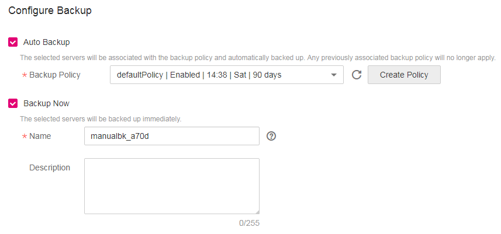
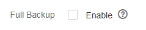
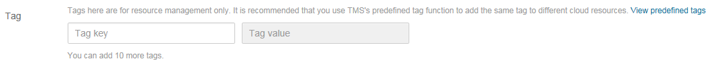

# Creating a CSBS Backup

This section explains how to create CSBS backup jobs to protect ECS data.

## Prerequisites

-   If you want to use a backup to create an image, perform the following operations before creating a CSBS backup:
    -   You have optimized the Linux ECS \(referring to  [\(Optional\) Optimizing a Linux Private Image](https://docs.otc.t-systems.com/usermanual/ims/en-us_topic_0047501133.html)\) and installed Cloud-Init \(referring to  [Installing Cloud-Init](https://docs.otc.t-systems.com/usermanual/ims/en-us_topic_0030730603.html)\).
    -   You have optimized the Windows ECS \(referring to  [\(Optional\) Optimizing a Windows Private Image](https://docs.otc.t-systems.com/usermanual/ims/en-us_topic_0047501112.html)\) and installed Cloudbase-Init \(referring to  [Installing Cloudbase-Init](https://docs.otc.t-systems.com/usermanual/ims/en-us_topic_0030730602.html)\).

## Procedure

1.  Log in to the CSBS management console.
    1.  Log in to the management console.
    2.  Click    in the upper left corner of the management console and select a region and a project.
    3.  Click  . Under  **Storage**, click  **Cloud Server Backup Service**.

2.  In the upper right corner of the page, click  **Create CSBS Backup**.
3.  In the ECS list, select the ECSs you want to back up. After ECSs are selected, they are added to the list of selected ECSs. See  [Figure 1](#fig7683103644515).

    **Figure  1**  Selecting servers  
    

    > **NOTE:**   
    >-   The selected ECSs must be in the  **Running**  or  **Stopped**  state.  
    >-   ECSs with shared EVS disks can be backed up.  

4.  In the  **Configure Backup**  area, configure a backup scheme for the selected servers. See  [Figure 2](#fig599112219464).

    **Figure  2**  Configuring backup schemes  
    

    -   **Auto Backup**:

        In the  **Backup Policy**  drop-down list, select a backup policy. Alternatively, click  **Create Policy**  to create a backup policy. For details about the parameters of a backup policy, see  [Creating a Backup Policy](creating-a-backup-policy.md).

        After a backup job is created, the selected ECSs are associated with the backup policy and will be periodically backed up according to the backup policy.

        > **NOTE:**   
        >If a selected ECS has been associated with another backup policy, it will be disassociated from the original backup policy automatically and then associated with the new backup policy.  

    -   **Immediate Backup**:

        After a backup job is created, all selected ECSs will be backed up immediately for once.

        Set the  **Name**  and  **Description**  of the backup, as described in  [Table 1](#table4829135361311).

        **Table  1**  Parameter description

        
        <table><thead align="left"><tr id="row148305532138"><th class="cellrowborder" valign="top" width="21.240000000000002%" id="mcps1.2.4.1.1">
Parameter

        </th>
        <th class="cellrowborder" valign="top" width="56.96%" id="mcps1.2.4.1.2">
Description

        </th>
        <th class="cellrowborder" valign="top" width="21.8%" id="mcps1.2.4.1.3">
Remarks

        </th>
        </tr>
        </thead>
        <tbody><tr id="row1783115313136"><td class="cellrowborder" valign="top" width="21.240000000000002%" headers="mcps1.2.4.1.1 ">
Name

        </td>
        <td class="cellrowborder" valign="top" width="56.96%" headers="mcps1.2.4.1.2 ">
Name of the backup you are creating.

        
It is a string of 1 to 255 characters that can contain only digits, letters, underscores (_), and hyphens (-).

        
 NOTE: 

You can use the default name, which defaults to <strong id="b842352706153327">manualbk_</strong><em id="i842352697153330">xxxx</em>.

        
When multiple ECSs are to be backed up, the system automatically adds suffixes to their names, for example, <strong id="b84235270671449">backup-0001</strong> and <strong id="b50763064071456">backup-0002</strong>.

        

        </td>
        <td class="cellrowborder" valign="top" width="21.8%" headers="mcps1.2.4.1.3 ">
manualbk_cbf0

        </td>
        </tr>
        <tr id="row3831195371315"><td class="cellrowborder" valign="top" width="21.240000000000002%" headers="mcps1.2.4.1.1 ">
Description

        </td>
        <td class="cellrowborder" valign="top" width="56.96%" headers="mcps1.2.4.1.2 ">
Supplementary information about the backup.

        
It cannot exceed 255 characters.

        </td>
        <td class="cellrowborder" valign="top" width="21.8%" headers="mcps1.2.4.1.3 ">
--

        </td>
        </tr>
        </tbody>
        </table>

    You can select both the backup methods at the same time. When both the backup methods are selected, a one-off backup will be performed at once and periodic backups will be performed according to the backup policy subsequently.

5.  Determine whether to select  **Enable**  next to  **Full Backup**. If  **Full Backup**  is enabled, the generated full backup and later generated incremental backups will support  [Instant Restore](basic-concepts.md#section181448505477). See  [Figure 3](#fig21211503353).

    **Figure  3**  Enabling Full Backup or not  
    

6.  Add tags to the backup. \(This operation is optional if you select  **Immediate Backup**.\)

    A tag is represented in the form of a key-value pair. Tags are used to identify, classify, and search for cloud resources. These tags are used to filter and manage backup resources only. A backup can have a maximum of 10 tags.

    See  [Figure 4](#fig09521715453).

    **Figure  4**  Adding a tag  
    

    [Table 2](#table191162312815)  describes parameters of a tag.

    **Table  2**  Parameter description

    
    <table><thead align="left"><tr id="row41151331884"><th class="cellrowborder" valign="top" width="16%" id="mcps1.2.4.1.1">
Parameter

    </th>
    <th class="cellrowborder" valign="top" width="65%" id="mcps1.2.4.1.2">
Description

    </th>
    <th class="cellrowborder" valign="top" width="19%" id="mcps1.2.4.1.3">
Example Value

    </th>
    </tr>
    </thead>
    <tbody><tr id="row51153313816"><td class="cellrowborder" valign="top" width="16%" headers="mcps1.2.4.1.1 ">
Key

    </td>
    <td class="cellrowborder" valign="top" width="65%" headers="mcps1.2.4.1.2 ">
Tag key. Each tag of a backup has a unique key. The key of a tag is user-definable or is selected from those of existing tags in Tag Management Service (TMS).

    
The naming rule of a tag key is as follows:

    <ul id="ul1277719205177"><li>It ranges from 1 to 36 Unicode characters.</li></ul>
    <ul id="ul20115438812"><li>It can contain only uppercase letters, lowercase letters, digits, hyphens (-), and underscores (_).</li></ul>
    </td>
    <td class="cellrowborder" valign="top" width="19%" headers="mcps1.2.4.1.3 ">
Key_0001

    </td>
    </tr>
    <tr id="row21161531187"><td class="cellrowborder" valign="top" width="16%" headers="mcps1.2.4.1.1 ">
Value

    </td>
    <td class="cellrowborder" valign="top" width="65%" headers="mcps1.2.4.1.2 ">
Tag value. Tag values can be repetitive or null.

    
The naming rule of a tag value is as follows:

    <ul id="ul1640142918175"><li>It ranges from 0 to 43 Unicode characters.</li></ul>
    <ul id="ul211610318811"><li>It can contain only uppercase letters, lowercase letters, digits, hyphens (-), and underscores (_).</li></ul>
    </td>
    <td class="cellrowborder" valign="top" width="19%" headers="mcps1.2.4.1.3 ">
Value_0001

    </td>
    </tr>
    </tbody>
    </table>

7.  Click  **Create Now**.
8.  On the  **Confirm**  page, confirm the resource details and click  **Submit**.
9.  Return to the CSBS page as prompted.
    -   Auto Backup

        On the  **Policies**  tab page, click  .png)  on the left of the backup policy name. If all selected ECSs are displayed under  **Associated Servers**, they are associated with the backup policy successfully, and automatic backup will be periodically performed as scheduled.

    -   Immediate Backup

        On the  **Backups**  tab page, if the generated backups are in the  **Available**  state, the one-off backup job is successful. 

