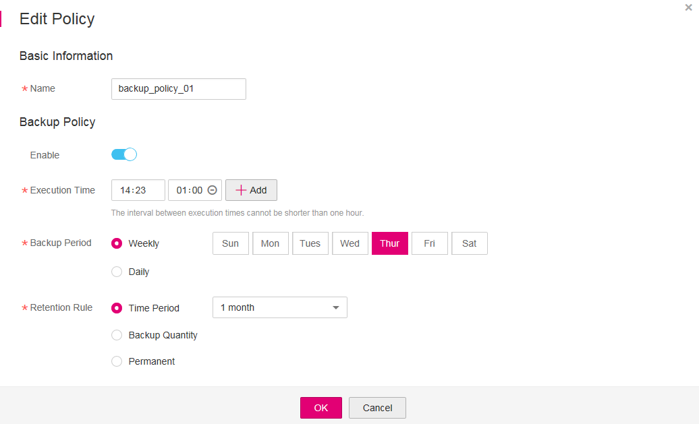

# Editing a Backup Policy

This section describes how to edit a backup policy.

## Prerequisites

You have created at least one backup policy.

## Procedure

1.  Log in to the CSBS management console.
    1.  Log in to the management console.
    2.  Click    in the upper left corner of the management console and select a region and a project.
    3.  Click  . Under  **Storage**, click  **Cloud Server Backup Service**.

2.  Click the  **Policies**  tab.
3.  In the row of the backup policy you want to modify, click  **Edit**.
4.  Edit the backup policy.  [Figure 1](#fig232654615382)  displays example backup policy information.

    **Figure  1**  Editing a backup policy  
    

    Related parameters are described in  [Table 1](creating-a-backup-policy.md#table18975142115146).

    For details about how to modify backup policy tags, see  [Managing Backup Policy Tags](managing-backup-policy-tags.md).

5.  Click  **OK**.

