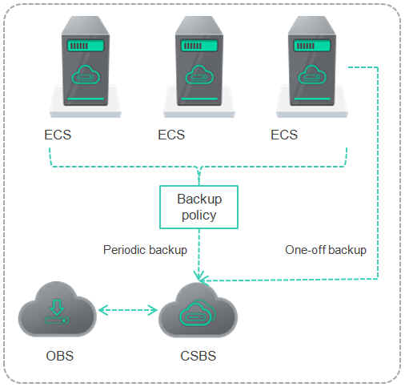

# Scenarios

CSBS supports one-off backup and periodic backup. A one-off backup job is manually created by users and takes effect for only one time. Periodic backup jobs are automatically driven by a user-defined backup policy.

[Table 1](#table31963779194543)  describes the two backup options.

**Table  1**  One-off backup and periodic backup

<table><thead align="left"><tr id="row25019286194543"><th class="cellrowborder" valign="top" width="19.830000000000002%" id="mcps1.2.4.1.1">
Item

</th>
<th class="cellrowborder" valign="top" width="40.17%" id="mcps1.2.4.1.2">
One-Off Backup

</th>
<th class="cellrowborder" valign="top" width="40%" id="mcps1.2.4.1.3">
Periodic Backup

</th>
</tr>
</thead>
<tbody><tr id="row39557296194543"><td class="cellrowborder" valign="top" width="19.830000000000002%" headers="mcps1.2.4.1.1 ">
Backup policy

</td>
<td class="cellrowborder" valign="top" width="40.17%" headers="mcps1.2.4.1.2 ">
None

</td>
<td class="cellrowborder" valign="top" width="40%" headers="mcps1.2.4.1.3 ">
Required

</td>
</tr>
<tr id="row28986151194543"><td class="cellrowborder" valign="top" width="19.830000000000002%" headers="mcps1.2.4.1.1 ">
Number of backup operations

</td>
<td class="cellrowborder" valign="top" width="40.17%" headers="mcps1.2.4.1.2 ">
Only one, manual

</td>
<td class="cellrowborder" valign="top" width="40%" headers="mcps1.2.4.1.3 ">
Periodic operations driven by the backup policy

</td>
</tr>
<tr id="row30678101194912"><td class="cellrowborder" valign="top" width="19.830000000000002%" headers="mcps1.2.4.1.1 ">
Backup name

</td>
<td class="cellrowborder" valign="top" width="40.17%" headers="mcps1.2.4.1.2 ">
User-defined backup name, which defaults to <strong id="b842352706163625">manualbk_</strong><em id="i842352697163627">xxxx</em>

</td>
<td class="cellrowborder" valign="top" width="40%" headers="mcps1.2.4.1.3 ">
System-assigned backup name, which defaults to <strong id="b842352706163712">autobk_</strong><em id="i842352697163714">xxxx</em>

</td>
</tr>
<tr id="row11946619194919"><td class="cellrowborder" valign="top" width="19.830000000000002%" headers="mcps1.2.4.1.1 ">
Backup method

</td>
<td class="cellrowborder" valign="top" width="40.17%" headers="mcps1.2.4.1.2 ">
Full backup at the first time and incremental backup subsequently, by default

</td>
<td class="cellrowborder" valign="top" width="40%" headers="mcps1.2.4.1.3 ">
Full backup at the first time and incremental backup subsequently, by default

</td>
</tr>
<tr id="row52750521201028"><td class="cellrowborder" valign="top" width="19.830000000000002%" headers="mcps1.2.4.1.1 ">
Application scenario

</td>
<td class="cellrowborder" valign="top" width="40.17%" headers="mcps1.2.4.1.2 ">
Executed before patching or upgrading the OS or upgrading an application on an ECS. A one-off backup can be used to restore an ECS to the original state in case the patching or upgrading fails.

Executed before patching or upgrading the OS or upgrading an application on a server. A one-off backup can be used to restore a server to the original state in case the patching or upgrading fails.

</td>
<td class="cellrowborder" valign="top" width="40%" headers="mcps1.2.4.1.3 ">
Executed for routine maintenance of an ECS. The latest backup can be used to restore an ECS in case an unexpected failure or data loss occurs.

</td>
</tr>
</tbody>
</table>

Users can also intermix the two backup options for a special need. For example, associate all ECSs with a backup policy to execute periodic backup of all ECSs, and manually perform one-off backups for the most important ECSs to further ensure those ECSs' data security, as shown in  [Figure 1](#fig6436164020634).

**Figure  1**  Intermixed use of the two backup options  

