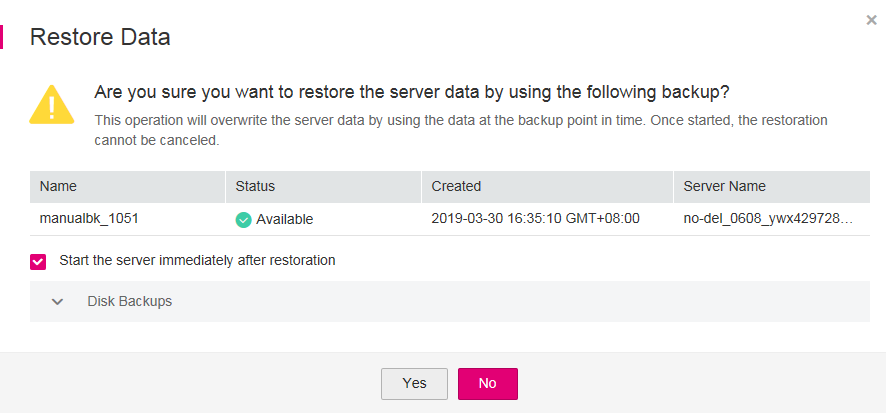

# Using Backups to Restore ECSs

When EVS disks on an ECS are faulty or ECS data is lost due to misoperations, you can use a backup to restore the ECS.

## Context

-   CSBS supports backup and restoration of all EVS disks as a whole instead of part of the EVS disks on an ECS.
-   Data on data disks cannot be restored to system disks.
-   CSBS does not support restoration to ECSs that are in the  **Faulty**,  **Resizing**, or  **Verifying resizing**  state.

## Prerequisites

-   EVS disks on the ECS whose data needs to be restored are running properly.
-   The ECS whose data needs to be restored has at least one  **Available**  backup.

## Procedure

1.  Log in to the CSBS management console.
    1.  Log in to the management console.
    2.  Click    in the upper left corner of the management console and select a region and a project.
    3.  Click  . Under  **Storage**, click  **Cloud Server Backup Service**.

2.  Click the  **Backups**  tab. Locate the backup for the ECS. For details, see  [Viewing a Backup](viewing-a-backup.md).
3.  In the row of the backup, click  **Restore**. See  [Figure 1](#fig34262656175638).

    > **NOTICE:**   
    >The historical data at the backup point in time will overwrite the current ECS data. The restoration cannot be undone.  

    **Figure  1**  Restoring a server  
    

4.  Optional: Deselect  **Start the server immediately after restoration**.

    If you deselect  **Start the server immediately after restoration**, manually start the ECS after the restoration is complete.

    > **NOTICE:**   
    >VMs are shut down when restoring ECSs. Therefore, perform a restoration job during off-peak hours.  

5.  In the  **Specified Disk**  drop-down list, select the target EVS disk to which the backup will be restored.

    > **NOTE:**   
    >-   If the ECS has only one EVS disk, the backup is restored to the only EVS disk by default.  
    >-   If the ECS has multiple EVS disks, the backup will be restored to the original EVS disk. Alternatively, you can specify another EVS disk for the restoration. The specified EVS disk must have an equal capacity to or a larger capacity than the original EVS disk.  
    >-   Data on data disks cannot be restored to system disks.  

6.  Click  **OK**  and confirm the restoration is successful.

    In the backup list, view the restoration status. When the backup enters the  **Available**  state and no new failed restoration job exists in  **Task Status**, the restoration is successful.

    To query failed restoration jobs, see  [Processing Failed Jobs](processing-failed-jobs.md).

    > **NOTICE:**   
    >If a Windows ECS is restored, data disks may fail to be displayed due to Windows limitations.  
    >You need to manually set these data disks to be online. For details, see  [Data Disks Are Not Displayed After a Windows ECS Is Restored](data-disks-are-not-displayed-after-a-windows-ecs-is-restored.md).  

