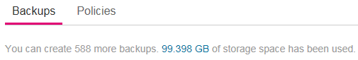
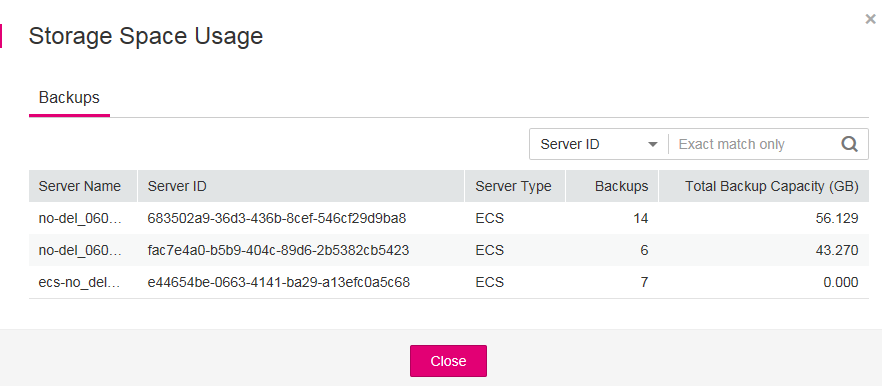

# Viewing a Backup

After a backup job is delivered or completed, you can set search criteria to filter backups from the backup list and view backup details.

## Prerequisites

A backup job has been created.

## View Backup Details

1.  Log in to the CSBS management console.
    1.  Log in to the management console.
    2.  Click    in the upper left corner of the management console and select a region and a project.
    3.  Click  . Under  **Storage**, click  **Cloud Server Backup Service**.

2.  Click the  **Backups**  tab. Search for backups by filtering conditions.
    -   You can search for backups by selecting a status displayed in the upper right corner of the backup list.

        [Table 1](#table27644511104124)  describes each state.

        **Table  1**  State description

        
        <table><thead align="left"><tr id="row60378258104124"><th class="cellrowborder" valign="top" width="15.1%" id="mcps1.2.4.1.1">
State

        </th>
        <th class="cellrowborder" valign="top" width="16.79%" id="mcps1.2.4.1.2">
State Attribute

        </th>
        <th class="cellrowborder" valign="top" width="68.11%" id="mcps1.2.4.1.3">
Description

        </th>
        </tr>
        </thead>
        <tbody><tr id="row3808446420388"><td class="cellrowborder" valign="top" width="15.1%" headers="mcps1.2.4.1.1 ">
All statuses

        </td>
        <td class="cellrowborder" valign="top" width="16.79%" headers="mcps1.2.4.1.2 ">
--

        </td>
        <td class="cellrowborder" valign="top" width="68.11%" headers="mcps1.2.4.1.3 ">
All statuses of backups.

        </td>
        </tr>
        <tr id="row24922559104124"><td class="cellrowborder" valign="top" width="15.1%" headers="mcps1.2.4.1.1 ">
Available

        </td>
        <td class="cellrowborder" valign="top" width="16.79%" headers="mcps1.2.4.1.2 ">
A stable state

        </td>
        <td class="cellrowborder" valign="top" width="68.11%" headers="mcps1.2.4.1.3 ">
A stable state of a backup after the backup is created

        
This state allows various operations.

        </td>
        </tr>
        <tr id="row18418804104124"><td class="cellrowborder" valign="top" width="15.1%" headers="mcps1.2.4.1.1 ">
Creating

        </td>
        <td class="cellrowborder" valign="top" width="16.79%" headers="mcps1.2.4.1.2 ">
An intermediate state

        </td>
        <td class="cellrowborder" valign="top" width="68.11%" headers="mcps1.2.4.1.3 ">
An intermediate state of a backup from the start of a backup job to the completion of the backup job.

        
In this state, a progress bar is displayed indicating the backup progress. If the progress bar remains unchanged for a long time, an exception has occurred. Contact the administrator for support.

        </td>
        </tr>
        <tr id="row38153904104124"><td class="cellrowborder" valign="top" width="15.1%" headers="mcps1.2.4.1.1 ">
Restoring

        </td>
        <td class="cellrowborder" valign="top" width="16.79%" headers="mcps1.2.4.1.2 ">
An intermediate state

        </td>
        <td class="cellrowborder" valign="top" width="68.11%" headers="mcps1.2.4.1.3 ">
An intermediate state when using the backup to restore data.

        
In this state, a progress bar is displayed indicating the restoration progress. If the progress bar remains unchanged for a long time, an exception has occurred. Contact the administrator for support.

        </td>
        </tr>
        <tr id="row30853749104124"><td class="cellrowborder" valign="top" width="15.1%" headers="mcps1.2.4.1.1 ">
Deleting

        </td>
        <td class="cellrowborder" valign="top" width="16.79%" headers="mcps1.2.4.1.2 ">
An intermediate state

        </td>
        <td class="cellrowborder" valign="top" width="68.11%" headers="mcps1.2.4.1.3 ">
An intermediate state from the start of deleting the backup to the completion of deleting the backup.

        
In this state, a progress bar is displayed indicating the deletion progress. If the progress bar remains unchanged for a long time, an exception has occurred. Contact the administrator for support.

        </td>
        </tr>
        <tr id="row3832257104124"><td class="cellrowborder" valign="top" width="15.1%" headers="mcps1.2.4.1.1 ">
Error

        </td>
        <td class="cellrowborder" valign="top" width="16.79%" headers="mcps1.2.4.1.2 ">
A stable state

        </td>
        <td class="cellrowborder" valign="top" width="68.11%" headers="mcps1.2.4.1.3 ">
A backup enters the <strong id="b84235270692120">Error</strong> state when an exception occurs when the backup is being used.

        
A backup in this state cannot be used for backup or restoration, and must be deleted manually. If manual deletion fails, contact the administrator for support.

        </td>
        </tr>
        </tbody>
        </table>

    -   You can search for backups by selecting a time segment displayed in the upper right corner of the backup list.
    -   You can search for backups by server name, server ID, backup name, or backup ID. Click    to search for target backups.
    -   You can click  **Search by Tag**  in the upper right corner to search for backups by tag.

        -   On the  **Search by Tag**  tab page that is displayed, enter a tag key and a tag value \(must be among existing keys and values\) and click  . The added tag search criteria are displayed under the text boxes. Click  **Search**  in the lower right corner.
        -   You can use more than one tag for a combination search. Each time after a key and a value are entered, click  . The added tag search criteria are displayed under the text boxes. When more than one tag is added, they will be applied together for a combination search. A maximum of 10 tags can be added at the same time.
        -   You can click  **Reset**  in the upper right corner to reset the search criteria.

        > **NOTE:**   
        >Backups whose backup type is  **Enhanced backup**  support Instant Restore. Backups whose backup type is  **Enhanced backup**  support Instant Restore. For details, see  [Instant Restore](basic-concepts.md#section181448505477).  

3.  Click    on the left of a backup name to view details about the backup.

## View Backup Space Usage

1.  Log in to the CSBS management console.
    1.  Log in to the management console.
    2.  Click    in the upper left corner of the management console and select a region and a project.
    3.  Click  . Under  **Storage**, click  **Cloud Server Backup Service**.

2.  Click the  **Backups**  tab and then the number indicating the used storage space can be viewed in the backup overview.  [Figure 1](#fig635912816013)  provides an example.

    **Figure  1**  Backup overview  
    

3.  In the displayed dialog box, view the storage space usage.

    Each record indicates an ECS. In the displayed dialog box,  **Backups**  specifies the number of backups created for an ECS and  **Total Backup Capacity \(GB\)**  specifies the capacity used by the ECS's backups in total.

    **Figure  2**  Storage space usage  
    

