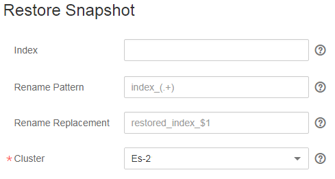

# Migrating a Cluster

Cluster migration migrates data from a cluster to another one. In certain scenarios, for example, due to the growing business data, you can create a cluster of higher specifications and migrate all data of the current cluster to the new one. Alternatively, you can merge indices in two clusters to one cluster to satisfy your business needs. CSS enables cluster migration by using the index backup and restoration function, specifically, by restoring the snapshot of a cluster to the target cluster.

In this section, assume that data of cluster  **Es-1**  is migrated to cluster  **Es-2**. 

## Procedure

1.  On the  **Clusters**  page, click  **Es-1**. On the displayed page, click  **Cluster Snapshots**.
2.  Click  **Create Snapshot**  to manually create a snapshot. In the displayed dialog box, enter the snapshot name and click  **OK**.

    If you use the index backup and restoration function for the first time, you need to perform basic configurations first. For details, see  [Manually Creating a Snapshot](index-backup-and-restoration.md#section43906502025).

    **Figure  1**  Creating a snapshot  
    

3.  In the snapshot list, locate the row where the target snapshot resides and click  **Restore**  in the  **Operation**  column to restore data to cluster  **Es-2**.

    -   Leave the  **Index**  option blank \(default setting\), indicating to restore data of all indices in cluster  **Es-1**.
    -   From the  **Cluster**  drop-down list, select  **Es-2**.

    Click  **OK**. You can also rename the restored index. For details, see  [Index Backup and Restoration](index-backup-and-restoration.md).

    **Figure  2**  Restoring a snapshot  
    

4.  After restoration is complete, data in cluster  **Es-1**  is migrated to cluster  **Es-2**.

