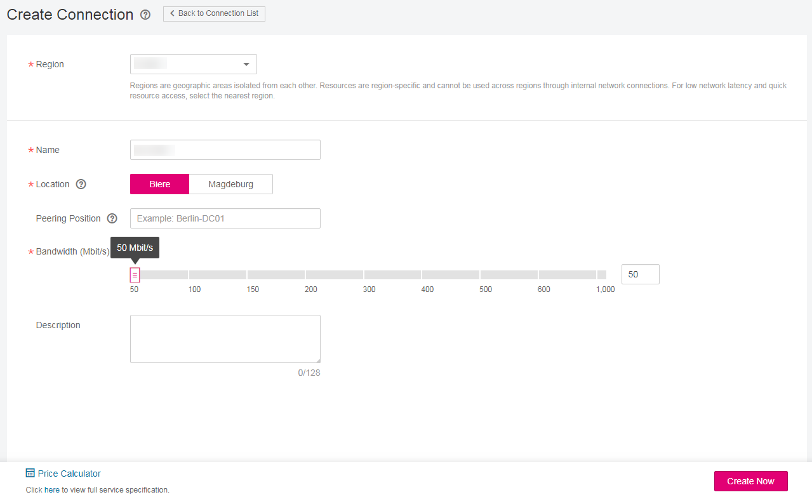
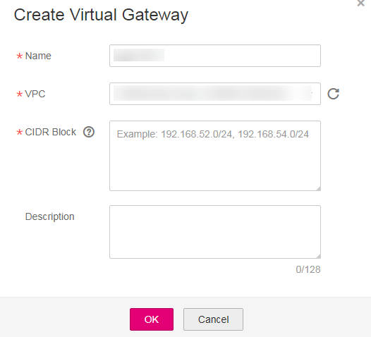

# Creating a Direct Connection

## Scenarios

Apply for a direct connection in the self-service mode to enable ECSs in your VPC to communicate with your data center or private network.

To request a direct connection, you need to create a connection, a virtual gateway, and a virtual interface.

In case the created single connection is faulty, you are recommended to create two connections to connect to different access locations. For details, see  [Redundant Connection Access](redundant-connection-access.md).

## Procedure

1.  Log in to the management console.
2.  Click    in the upper left corner and select a region and a project.
3.  Under  **Network**, click  **Direct Connect**.
4.  In the navigation pane on the left of  **Network Console**, under  **Direct Connect**, choose  **Direct Connect**  \>  **Connections**.
5.  In the upper right corner of the  **Connections**  page, click  **Create Connection**.
6.  Follow the prompts to set the parameters.

    **Figure  1**  Create Connection  
    

    **Table  1**  Connection parameters

    
    <table><thead align="left"><tr id="row20729321173236"><th class="cellrowborder" valign="top" width="22.869999999999997%" id="mcps1.2.4.1.1">
<strong id="b11294882173236">Parameter</strong>

    </th>
    <th class="cellrowborder" valign="top" width="54.83%" id="mcps1.2.4.1.2">
<strong id="b46688243173236">Description</strong>

    </th>
    <th class="cellrowborder" valign="top" width="22.3%" id="mcps1.2.4.1.3">
<strong id="b11535442173236">Example Value</strong>

    </th>
    </tr>
    </thead>
    <tbody><tr id="row12166232201514"><td class="cellrowborder" valign="top" width="22.869999999999997%" headers="mcps1.2.4.1.1 ">
Region

    </td>
    <td class="cellrowborder" valign="top" width="54.83%" headers="mcps1.2.4.1.2 ">
Specifies the region in which the services will be handled.

    
If you already selected a region and a project on the management console, you do not need to select the region here.

    </td>
    <td class="cellrowborder" valign="top" width="22.3%" headers="mcps1.2.4.1.3 ">
eu-de

    </td>
    </tr>
    <tr id="row49534062173236"><td class="cellrowborder" valign="top" width="22.869999999999997%" headers="mcps1.2.4.1.1 ">
Name

    </td>
    <td class="cellrowborder" valign="top" width="54.83%" headers="mcps1.2.4.1.2 ">
Specifies the connection name.

    <ul id="ul24541438114618"><li>It can contain 1 to 64 characters.</li><li>Only digits, letters, underscores (_), and hyphens (-) are allowed.</li></ul>
    </td>
    <td class="cellrowborder" valign="top" width="22.3%" headers="mcps1.2.4.1.3 ">
dc-123

    </td>
    </tr>
    <tr id="row23456554173236"><td class="cellrowborder" valign="top" width="22.869999999999997%" headers="mcps1.2.4.1.1 ">
Location

    </td>
    <td class="cellrowborder" valign="top" width="54.83%" headers="mcps1.2.4.1.2 ">
Specifies the connection access location.

    </td>
    <td class="cellrowborder" valign="top" width="22.3%" headers="mcps1.2.4.1.3 ">
Biere

    </td>
    </tr>
    <tr id="row13638511173236"><td class="cellrowborder" valign="top" width="22.869999999999997%" headers="mcps1.2.4.1.1 ">
Peering Position

    </td>
    <td class="cellrowborder" valign="top" width="54.83%" headers="mcps1.2.4.1.2 ">
Specifies the physical location of the connection. The address is an identifier.

    <ul id="ul185801447194618"><li>Only letters, digits, underscores (_), and hyphens (-) are allowed.</li><li>It can contain 0 to 64 characters.</li></ul>
    </td>
    <td class="cellrowborder" valign="top" width="22.3%" headers="mcps1.2.4.1.3 ">
Marderbug-DC01

    </td>
    </tr>
    <tr id="row22377693173236"><td class="cellrowborder" valign="top" width="22.869999999999997%" headers="mcps1.2.4.1.1 ">
Bandwidth

    </td>
    <td class="cellrowborder" valign="top" width="54.83%" headers="mcps1.2.4.1.2 ">
Specifies the bandwidth size in the unit of Mbit/s.

    <ul id="ul1453982420460"><li>You can select one of the bandwidths provided on the scroll bar by dragging it. Also, typing a value in the input field is allowed. It is automatically changed to the next allowed value shown on the slider bar.</li><li>The value ranges from 10 Mbit/s to 1000 Mbit/s.
Possible values are as follows:

    
<strong id="b147662115517">10</strong>, <strong id="b12794182614513">50</strong>, <strong id="b14901192917510">100</strong>, <strong id="b7229033355">150</strong>, <strong id="b743013365511">200</strong>, <strong id="b15319391952">300</strong>, <strong id="b15713124319510">400</strong>, <strong id="b1222911488513">500</strong>, <strong id="b287816511551">600</strong>, and <strong id="b082685420511">1000</strong>

    </li></ul>
    </td>
    <td class="cellrowborder" valign="top" width="22.3%" headers="mcps1.2.4.1.3 ">
100

    </td>
    </tr>
    <tr id="row19093454173236"><td class="cellrowborder" valign="top" width="22.869999999999997%" headers="mcps1.2.4.1.1 ">
Description

    </td>
    <td class="cellrowborder" valign="top" width="54.83%" headers="mcps1.2.4.1.2 ">
Provides supplementary information about the connection.

    
It can contain 0 to 128 characters.

    </td>
    <td class="cellrowborder" valign="top" width="22.3%" headers="mcps1.2.4.1.3 ">
This is a connection.

    </td>
    </tr>
    </tbody>
    </table>

7.  Click  **Create Now**.
8.  Check the connection details and click  **Submit**.

    > **NOTE:**   
    >-   Click  **Back to Connection List**  to view the created connections.  
    >-   After clicking  **Submit**, you will be automatically redirected to the connection list after a timeout.  

9.  In the navigation pane on the left, choose  **Direct Connect**  \>  **Virtual Gateways**.
10. In the upper right corner of the  **Virtual Gateways**  page, click  **Create Virtual Gateway**.
11. Follow the prompts to set the parameters.

    **Figure  2**  Create Virtual Gateway  
    

    **Table  2**  Virtual gateway parameters

    
    <table><thead align="left"><tr id="row1089915918275"><th class="cellrowborder" valign="top" width="20.560000000000002%" id="mcps1.2.4.1.1">
<strong id="b1590149112720">Parameter</strong>

    </th>
    <th class="cellrowborder" valign="top" width="56.97%" id="mcps1.2.4.1.2">
<strong id="b1290379112710">Description</strong>

    </th>
    <th class="cellrowborder" valign="top" width="22.470000000000002%" id="mcps1.2.4.1.3">
<strong id="b990559102710">Example Value</strong>

    </th>
    </tr>
    </thead>
    <tbody><tr id="row29061998270"><td class="cellrowborder" valign="top" width="20.560000000000002%" headers="mcps1.2.4.1.1 ">
Name

    </td>
    <td class="cellrowborder" valign="top" width="56.97%" headers="mcps1.2.4.1.2 ">
Specifies the virtual gateway name.

    
It can contain 1 to 64 characters.

    
Only digits, letters, underscores (_), and hyphens (-) are allowed.

    </td>
    <td class="cellrowborder" valign="top" width="22.470000000000002%" headers="mcps1.2.4.1.3 ">
vgw-123

    </td>
    </tr>
    <tr id="row1891549102716"><td class="cellrowborder" valign="top" width="20.560000000000002%" headers="mcps1.2.4.1.1 ">
VPC

    </td>
    <td class="cellrowborder" valign="top" width="56.97%" headers="mcps1.2.4.1.2 ">
Specifies the VPC where the virtual gateway resides.

    </td>
    <td class="cellrowborder" valign="top" width="22.470000000000002%" headers="mcps1.2.4.1.3 ">
VPC-001

    </td>
    </tr>
    <tr id="row39191392274"><td class="cellrowborder" valign="top" width="20.560000000000002%" headers="mcps1.2.4.1.1 ">
CIDR Block

    </td>
    <td class="cellrowborder" valign="top" width="56.97%" headers="mcps1.2.4.1.2 ">
Specifies the CIDR network segment of the VPC to be accessed by the direct connection.

    
You can add a maximum of 50 CIDR blocks. Each pair must be unique. Separate every two CIDR blocks with commas (,).

    
A direct connection can access multiple VPCs. For details, see <a href="using-a-direct-connection-to-access-multiple-vpcs.md">Using a Direct Connection to Access Multiple VPCs</a>.

    </td>
    <td class="cellrowborder" valign="top" width="22.470000000000002%" headers="mcps1.2.4.1.3 ">
192.168.0.0/16

    </td>
    </tr>
    <tr id="row20923797279"><td class="cellrowborder" valign="top" width="20.560000000000002%" headers="mcps1.2.4.1.1 ">
Description

    </td>
    <td class="cellrowborder" valign="top" width="56.97%" headers="mcps1.2.4.1.2 ">
Provides supplementary information about the virtual gateway.

    
It can contain 0 to 128 characters.

    </td>
    <td class="cellrowborder" valign="top" width="22.470000000000002%" headers="mcps1.2.4.1.3 ">
This is a virtual gateway.

    </td>
    </tr>
    </tbody>
    </table>

12. Click  **OK**.
13. In the navigation pane on the left, choose  **Direct Connect**  \>  **Virtual Interfaces**.
14. In the upper right corner of the  **Virtual Interfaces**  page, click  **Create Virtual Interface**.
15. Follow the prompts to set the parameters.

    **Figure  3**  Create Virtual Interface  
    

    **Table  3**  Virtual interface parameters

    
    <table><thead align="left"><tr id="row13422292417"><th class="cellrowborder" valign="top" width="23%" id="mcps1.2.4.1.1">
<strong id="b888875052618">Parameter</strong>

    </th>
    <th class="cellrowborder" valign="top" width="56.230000000000004%" id="mcps1.2.4.1.2">
<strong id="b2144328602">Description</strong>

    </th>
    <th class="cellrowborder" valign="top" width="20.77%" id="mcps1.2.4.1.3">
<strong id="b1942109972">Example Value</strong>

    </th>
    </tr>
    </thead>
    <tbody><tr id="row1979213710268"><td class="cellrowborder" valign="top" width="23%" headers="mcps1.2.4.1.1 ">
Region

    </td>
    <td class="cellrowborder" valign="top" width="56.230000000000004%" headers="mcps1.2.4.1.2 ">
Specifies the region in which the services will be handled.

    
If you already selected a region and a project on the management console, you do not need to select the region here.

    </td>
    <td class="cellrowborder" valign="top" width="20.77%" headers="mcps1.2.4.1.3 ">
eu-de

    </td>
    </tr>
    <tr id="row1943142944110"><td class="cellrowborder" valign="top" width="23%" headers="mcps1.2.4.1.1 ">
Name

    </td>
    <td class="cellrowborder" valign="top" width="56.230000000000004%" headers="mcps1.2.4.1.2 ">
Specifies the virtual interface name.

    
It can contain 1 to 64 characters.

    
Only digits, letters, underscores (_), and hyphens (-) are allowed.

    </td>
    <td class="cellrowborder" valign="top" width="20.77%" headers="mcps1.2.4.1.3 ">
vif-123

    </td>
    </tr>
    <tr id="row943192918410"><td class="cellrowborder" valign="top" width="23%" headers="mcps1.2.4.1.1 ">
Connection

    </td>
    <td class="cellrowborder" valign="top" width="56.230000000000004%" headers="mcps1.2.4.1.2 ">
Specifies the connection to be associated.

    
A connection can be associated with only one virtual interface. Only connections that are not bound to other interfaces are available in the list.

    </td>
    <td class="cellrowborder" valign="top" width="20.77%" headers="mcps1.2.4.1.3 ">
dc-123

    </td>
    </tr>
    <tr id="row11441729104110"><td class="cellrowborder" valign="top" width="23%" headers="mcps1.2.4.1.1 ">
Virtual Gateway

    </td>
    <td class="cellrowborder" valign="top" width="56.230000000000004%" headers="mcps1.2.4.1.2 ">
Select the virtual gateway to be associated.

    
You can select a virtual gateway that has virtual interfaces bound. However, the connection associated with the virtual interfaces that have been bound to the virtual gateway needs to be at different locations.

    </td>
    <td class="cellrowborder" valign="top" width="20.77%" headers="mcps1.2.4.1.3 ">
vgw-123

    </td>
    </tr>
    <tr id="row194419295418"><td class="cellrowborder" valign="top" width="23%" headers="mcps1.2.4.1.1 ">
VLAN

    </td>
    <td class="cellrowborder" valign="top" width="56.230000000000004%" headers="mcps1.2.4.1.2 ">
Specifies the virtual interface VLAN ID.

    
The system automatically allocates a VLAN ID. You do not need to set this parameter.

    </td>
    <td class="cellrowborder" valign="top" width="20.77%" headers="mcps1.2.4.1.3 ">
30

    </td>
    </tr>
    <tr id="row1729520195912"><td class="cellrowborder" valign="top" width="23%" headers="mcps1.2.4.1.1 ">
Bandwidth

    </td>
    <td class="cellrowborder" valign="top" width="56.230000000000004%" headers="mcps1.2.4.1.2 ">
Specifies the virtual interface bandwidth in the unit of Mbit/s.

    
If the selected connection is a hosting connection, the virtual interface exclusively uses the connection bandwidth. That is, the connection bandwidth is the bandwidth of the virtual interface.

    </td>
    <td class="cellrowborder" valign="top" width="20.77%" headers="mcps1.2.4.1.3 ">
100

    </td>
    </tr>
    <tr id="row64516291414"><td class="cellrowborder" valign="top" width="23%" headers="mcps1.2.4.1.1 ">
Remote Subnet

    </td>
    <td class="cellrowborder" valign="top" width="56.230000000000004%" headers="mcps1.2.4.1.2 ">
Specifies the remote subnet and mask. You can enter a maximum of 50 remote subnets. Each pair must be unique. Separate every two remote subnets with commas (,).

    
The remote subnet of the virtual interface cannot be the same as the VPC CIDR block of the virtual gateway.

    </td>
    <td class="cellrowborder" valign="top" width="20.77%" headers="mcps1.2.4.1.3 ">
192.168.51.0/24

    </td>
    </tr>
    <tr id="row15452029174112"><td class="cellrowborder" valign="top" width="23%" headers="mcps1.2.4.1.1 ">
Description

    </td>
    <td class="cellrowborder" valign="top" width="56.230000000000004%" headers="mcps1.2.4.1.2 ">
Provides supplementary information about the virtual interface.

    
It can contain 0 to 128 characters.

    </td>
    <td class="cellrowborder" valign="top" width="20.77%" headers="mcps1.2.4.1.3 ">
This is a virtual interface.

    </td>
    </tr>
    </tbody>
    </table>

16. Click  **Create Now**.

