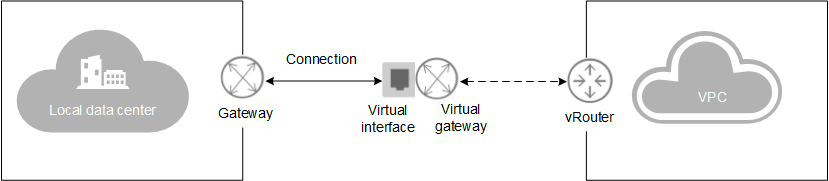

# Direct Connect

Direct Connect establishes a high-speed, low-latency, stable, and secure dedicated network connection that connects your local data center to a Virtual Private Cloud \(VPC\) on a cloud.

A connection links a public cloud and your data centers or work environments. The virtual gateway is bound to the VPC that you need to access. The virtual interface connects the local gateway to the virtual gateway to enable the local data center to access the VPC on the cloud and construct a hybrid cloud.  [Figure 1](#fig1045461015279)  shows the networking diagram of a direct connection.

**Figure  1**  Direct Connect networking  

Direct connections can be requested through email or call or by self-service.

-   Through email or call
    -   You need to submit an application to our customer service personnel or sales personnel. The public cloud administrator will establish the required direct connection for you offline. Wait for the notification from our customer service personnel or sales personnel.
    -   Direct Connect can access only one VPC. However, you can contact the administrator to modify VPCs for you so that you can access different VPCs during different time periods.
    -   You need to submit an application to disable Direct Connect.

-   Self-service mode
    -   To enable Direct Connect, you need to create a connection, a virtual gateway, and a virtual interface on the Direct Connect console.
    -   Direct Connect allows you to access multiple VPCs. You can use the VPC peering function to share one same direct connection and bandwidth between VPCs.
    -   You can delete a direct connection on the Direct Connect console at any time.

