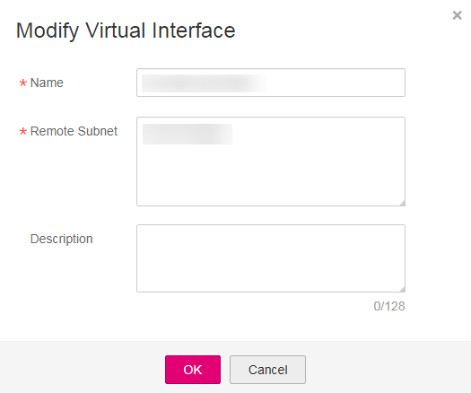

# Modifying a Virtual Interface

## Scenarios

After creating a virtual interface, you can modify its information.

## Procedure

1.  Log in to the management console.
2.  Click    in the upper left corner and select a region and a project.
3.  Under  **Network**, click  **Direct Connect**.
4.  In the navigation pane on the left, choose  **Direct Connect**  \>  **Virtual Interfaces**.
5.  In the virtual interface list, locate the row containing the target virtual interface and click  **Modify**  under  **Operation**.
6.  Modify the values of parameter  **Name**,  **Remote Subnet**, or  **Description**  of the virtual interface as prompted.

    **Figure  1**  Modify Virtual Interface  
    

7.  Click  **OK**.

