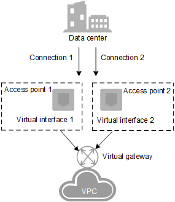
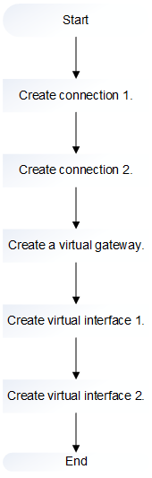

# Redundant Connection Access

## Scenarios

A local data center is connected to a VPC through a connection. To prevent a single connection failure from affecting services, you are advised to create two connections with different access locations. If a connection fails, services are switched to the other connection quickly. Therefore, the communication between the local data center and the VPC is of high quality and high reliability.

**Figure  1**  Redundant connection access  

## Operation Flowchart

You need to create two connections, with one connecting to Biere and the other to Magdeburg. Create a virtual gateway and access the VPC to which the services belong. Create two virtual interfaces and connect them to the same virtual gateway associated with the target VPC.  [Figure 2](#fig159261841102013)  shows how to create a redundant connection.

**Figure  2**  Flowchart for creating a redundant connection  

## Procedure

**Creating a Connection**

1.  Log in to the management console.
2.  Click    in the upper left corner and select a region and a project.
3.  Under  **Network**, click  **Direct Connect**.
4.  In the navigation pane of  **Network Console**, choose  **Direct Connect**  \>  **Connections**.
5.  On the displayed  **Connections**  page, click  **Create Connection**  in the upper right corner to create the first connection.
6.  Follow the prompts to set the following parameters.

    **Table  1**  Connection parameters

    
    <table><thead align="left"><tr id="row20729321173236"><th class="cellrowborder" valign="top" width="22.869999999999997%" id="mcps1.2.4.1.1">
<strong id="b11294882173236">Parameter</strong>

    </th>
    <th class="cellrowborder" valign="top" width="41.48%" id="mcps1.2.4.1.2">
<strong id="b46688243173236">Description</strong>

    </th>
    <th class="cellrowborder" valign="top" width="35.65%" id="mcps1.2.4.1.3">
<strong id="b11535442173236">Example Value</strong>

    </th>
    </tr>
    </thead>
    <tbody><tr id="row1536018810501"><td class="cellrowborder" valign="top" width="22.869999999999997%" headers="mcps1.2.4.1.1 ">
Region

    </td>
    <td class="cellrowborder" valign="top" width="41.48%" headers="mcps1.2.4.1.2 ">
Specifies the region in which the services will be handled.

    
If you already selected a region and a project on the management console, you do not need to select the region here.

    </td>
    <td class="cellrowborder" valign="top" width="35.65%" headers="mcps1.2.4.1.3 ">
eu-de

    </td>
    </tr>
    <tr id="row49534062173236"><td class="cellrowborder" valign="top" width="22.869999999999997%" headers="mcps1.2.4.1.1 ">
Name

    </td>
    <td class="cellrowborder" valign="top" width="41.48%" headers="mcps1.2.4.1.2 ">
Specifies the connection name.

    
It can contain 1 to 64 characters.

    
Only digits, letters, underscores (_), and hyphens (-) are allowed.

    </td>
    <td class="cellrowborder" valign="top" width="35.65%" headers="mcps1.2.4.1.3 ">
dc-123

    </td>
    </tr>
    <tr id="row23456554173236"><td class="cellrowborder" valign="top" width="22.869999999999997%" headers="mcps1.2.4.1.1 ">
Location

    </td>
    <td class="cellrowborder" valign="top" width="41.48%" headers="mcps1.2.4.1.2 ">
Specifies the connection access location.

    
You can select <strong id="b1588611264550">Biere</strong> or <strong id="b19412112918555">Magdeburg</strong>. The access location of the first connection must be different from that of the second connection.

    </td>
    <td class="cellrowborder" valign="top" width="35.65%" headers="mcps1.2.4.1.3 ">
Biere

    </td>
    </tr>
    <tr id="row13638511173236"><td class="cellrowborder" valign="top" width="22.869999999999997%" headers="mcps1.2.4.1.1 ">
Peering Position

    </td>
    <td class="cellrowborder" valign="top" width="41.48%" headers="mcps1.2.4.1.2 ">
Specifies the physical location of the connection. The address is an identifier.

    
Only letters, digits, underscores (_), and hyphens (-) are allowed.

    
It can contain 0 to 64 characters.

    </td>
    <td class="cellrowborder" valign="top" width="35.65%" headers="mcps1.2.4.1.3 ">
"Marderbug-DC01"

    </td>
    </tr>
    <tr id="row22377693173236"><td class="cellrowborder" valign="top" width="22.869999999999997%" headers="mcps1.2.4.1.1 ">
Bandwidth

    </td>
    <td class="cellrowborder" valign="top" width="41.48%" headers="mcps1.2.4.1.2 ">
Specifies the bandwidth size in the unit of Mbit/s.

    
You can select one of the bandwidths provided on the scroll bar by dragging it. Also, typing a value in the input field is allowed. It is automatically changed to the next allowed value shown on the slider bar.

    </td>
    <td class="cellrowborder" valign="top" width="35.65%" headers="mcps1.2.4.1.3 ">
100

    </td>
    </tr>
    <tr id="row19093454173236"><td class="cellrowborder" valign="top" width="22.869999999999997%" headers="mcps1.2.4.1.1 ">
Description

    </td>
    <td class="cellrowborder" valign="top" width="41.48%" headers="mcps1.2.4.1.2 ">
Provides supplementary information about the connection.

    
It can contain 0 to 128 characters.

    </td>
    <td class="cellrowborder" valign="top" width="35.65%" headers="mcps1.2.4.1.3 ">
This is a connection.

    </td>
    </tr>
    </tbody>
    </table>

7.  Click  **Create Now**, confirm the connection details, and click  **Submit**.

    > **NOTE:**   
    >-   Click  **Back to Connection List**  to view the created connections.  
    >-   After clicking  **Submit**, you will be automatically redirected to the connection list after a timeout.  

8.  Repeat step  [4](#li1734982310613)  to step  [7](#li111521031181317)  to create the second connection.

**Creating a Virtual Gateway**

1.  In the navigation pane on the left, choose  **Direct Connect**  \>  **Virtual Gateways**.
2.  In the upper right corner of the  **Virtual Gateways**  page, click  **Create Virtual Gateway**.
3.  Follow the prompts to set the following parameters.

    **Table  2**  Virtual gateway parameters

    
    <table><thead align="left"><tr id="row1089915918275"><th class="cellrowborder" valign="top" width="23%" id="mcps1.2.4.1.1">
<strong id="b1590149112720">Parameter</strong>

    </th>
    <th class="cellrowborder" valign="top" width="41%" id="mcps1.2.4.1.2">
<strong id="b1290379112710">Description</strong>

    </th>
    <th class="cellrowborder" valign="top" width="36%" id="mcps1.2.4.1.3">
<strong id="b990559102710">Example Value</strong>

    </th>
    </tr>
    </thead>
    <tbody><tr id="row29061998270"><td class="cellrowborder" valign="top" width="23%" headers="mcps1.2.4.1.1 ">
Name

    </td>
    <td class="cellrowborder" valign="top" width="41%" headers="mcps1.2.4.1.2 ">
Specifies the virtual gateway name.

    
It can contain 1 to 64 characters.

    
Only digits, letters, underscores (_), and hyphens (-) are allowed.

    </td>
    <td class="cellrowborder" valign="top" width="36%" headers="mcps1.2.4.1.3 ">
vgw-123

    </td>
    </tr>
    <tr id="row1891549102716"><td class="cellrowborder" valign="top" width="23%" headers="mcps1.2.4.1.1 ">
VPC

    </td>
    <td class="cellrowborder" valign="top" width="41%" headers="mcps1.2.4.1.2 ">
Specifies the VPC that you need to access.

    </td>
    <td class="cellrowborder" valign="top" width="36%" headers="mcps1.2.4.1.3 ">
VPC-001

    </td>
    </tr>
    <tr id="row39191392274"><td class="cellrowborder" valign="top" width="23%" headers="mcps1.2.4.1.1 ">
CIDR Block

    </td>
    <td class="cellrowborder" valign="top" width="41%" headers="mcps1.2.4.1.2 ">
Specifies the CIDR network segment of the VPC to be accessed by the connection.

    
You can add a maximum of 50 CIDR blocks. Each pair must be unique. Separate every two CIDR blocks with commas (,).

    </td>
    <td class="cellrowborder" valign="top" width="36%" headers="mcps1.2.4.1.3 ">
192.168.0.0/16

    </td>
    </tr>
    <tr id="row20923797279"><td class="cellrowborder" valign="top" width="23%" headers="mcps1.2.4.1.1 ">
Description

    </td>
    <td class="cellrowborder" valign="top" width="41%" headers="mcps1.2.4.1.2 ">
Provides supplementary information about the virtual gateway.

    
It can contain 0 to 128 characters.

    </td>
    <td class="cellrowborder" valign="top" width="36%" headers="mcps1.2.4.1.3 ">
This is a virtual gateway.

    </td>
    </tr>
    </tbody>
    </table>

4.  Click  **OK**.

**Creating a Virtual Interface**

1.  In the navigation pane on the left, choose  **Direct Connect**  \>  **Virtual Interfaces**.
2.  On the displayed  **Virtual Interfaces**  page, click  **Create Virtual Interface**  in the upper right corner to create the first virtual interface.
3.  Follow the prompts to set the following parameters.

    **Table  3**  Virtual interface parameters

    
    <table><thead align="left"><tr id="row13422292417"><th class="cellrowborder" valign="top" width="23%" id="mcps1.2.4.1.1">
<strong id="b1942329204113">Parameter</strong>

    </th>
    <th class="cellrowborder" valign="top" width="41%" id="mcps1.2.4.1.2">
<strong id="b14422029174116">Description</strong>

    </th>
    <th class="cellrowborder" valign="top" width="36%" id="mcps1.2.4.1.3">
<strong id="b1542172918414">Example Value</strong>

    </th>
    </tr>
    </thead>
    <tbody><tr id="row712103912510"><td class="cellrowborder" valign="top" width="23%" headers="mcps1.2.4.1.1 ">
Region

    </td>
    <td class="cellrowborder" valign="top" width="41%" headers="mcps1.2.4.1.2 ">
Specifies the region in which the services will be handled.

    
If you already selected a region and a project on the management console, you do not need to select the region here.

    </td>
    <td class="cellrowborder" valign="top" width="36%" headers="mcps1.2.4.1.3 ">
eu-de

    </td>
    </tr>
    <tr id="row1943142944110"><td class="cellrowborder" valign="top" width="23%" headers="mcps1.2.4.1.1 ">
Name

    </td>
    <td class="cellrowborder" valign="top" width="41%" headers="mcps1.2.4.1.2 ">
Specifies the virtual interface name.

    
It can contain 1 to 64 characters.

    
Only digits, letters, underscores (_), and hyphens (-) are allowed.

    </td>
    <td class="cellrowborder" valign="top" width="36%" headers="mcps1.2.4.1.3 ">
vif-123

    </td>
    </tr>
    <tr id="row943192918410"><td class="cellrowborder" valign="top" width="23%" headers="mcps1.2.4.1.1 ">
Connection

    </td>
    <td class="cellrowborder" valign="top" width="41%" headers="mcps1.2.4.1.2 ">
Specifies the connection to be associated.

    
Select the connection that is connected to Biere or Magdeburg. The access locations of the two connections must be different.

    </td>
    <td class="cellrowborder" valign="top" width="36%" headers="mcps1.2.4.1.3 ">
dc-123

    </td>
    </tr>
    <tr id="row11441729104110"><td class="cellrowborder" valign="top" width="23%" headers="mcps1.2.4.1.1 ">
Virtual Gateway

    </td>
    <td class="cellrowborder" valign="top" width="41%" headers="mcps1.2.4.1.2 ">
Select the virtual gateway to be associated.

    </td>
    <td class="cellrowborder" valign="top" width="36%" headers="mcps1.2.4.1.3 ">
vgw-123

    </td>
    </tr>
    <tr id="row194419295418"><td class="cellrowborder" valign="top" width="23%" headers="mcps1.2.4.1.1 ">
VLAN

    </td>
    <td class="cellrowborder" valign="top" width="41%" headers="mcps1.2.4.1.2 ">
Specifies the virtual interface VLAN ID.

    
The system automatically allocates a VLAN ID. You do not need to set this parameter.

    </td>
    <td class="cellrowborder" valign="top" width="36%" headers="mcps1.2.4.1.3 ">
30

    </td>
    </tr>
    <tr id="row17505103482518"><td class="cellrowborder" valign="top" width="23%" headers="mcps1.2.4.1.1 ">
Bandwidth

    </td>
    <td class="cellrowborder" valign="top" width="41%" headers="mcps1.2.4.1.2 ">
Specifies the virtual interface bandwidth in the unit of Mbit/s.

    
If the selected connection is a hosting connection, the virtual interface exclusively uses the connection bandwidth. That is, the connection bandwidth is the bandwidth of the virtual interface.

    </td>
    <td class="cellrowborder" valign="top" width="36%" headers="mcps1.2.4.1.3 ">
100

    </td>
    </tr>
    <tr id="row64516291414"><td class="cellrowborder" valign="top" width="23%" headers="mcps1.2.4.1.1 ">
Remote Subnet

    </td>
    <td class="cellrowborder" valign="top" width="41%" headers="mcps1.2.4.1.2 ">
Specifies the remote subnet and mask. You can enter a maximum of 50 remote subnets. Each pair must be unique. Separate every two remote subnets with commas (,).

    
The remote subnet of the virtual interface cannot be the same as the VPC CIDR block of the virtual gateway.

    </td>
    <td class="cellrowborder" valign="top" width="36%" headers="mcps1.2.4.1.3 ">
192.168.51.0/24

    </td>
    </tr>
    <tr id="row15452029174112"><td class="cellrowborder" valign="top" width="23%" headers="mcps1.2.4.1.1 ">
Description

    </td>
    <td class="cellrowborder" valign="top" width="41%" headers="mcps1.2.4.1.2 ">
Provides supplementary information about the virtual interface.

    
It can contain 0 to 128 characters.

    </td>
    <td class="cellrowborder" valign="top" width="36%" headers="mcps1.2.4.1.3 ">
This is a virtual interface.

    </td>
    </tr>
    </tbody>
    </table>

4.  Click  **Create Now**.
5.  Repeat step  [1](#li1022162832914)  to step  [4](#li13735165074810)  to create the second virtual interface.

