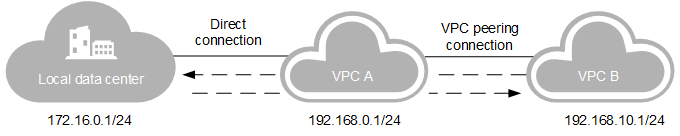

# Using a Direct Connection to Access Multiple VPCs

## Scenarios

You can access multiple VPCs using one direct connection. If you have created a direct connection between your local data center \(172.16.0.1/24\) and VPC A \(192.168.0.1/24\) and want to access VPC B \(192.168.0.1/24\), you can use a VPC peer connection to implement the connection. For details, see  [Figure 1](#fig15720121517218).

**Figure  1**  A direct connection accessing to multiple VPCs  

> **NOTE:**   
>Before creating a VPC peer connection, if your direct connection is requested through email or call, you need to notify the customer manager of the network segments that are to be connected to VPC B. If your direct connection is created in self-service mode, you need to add the network segments that are to be connected to VPC B to the  **CIDR Block**  parameter of the virtual gateway.  

## Procedure

1.  Create the peering connection  **peering-001**  between VPC A and VPC B. If VPC A and VPC B belong to the same tenant, see  **Creating a VPC Peering Connection**  in  [Creating a VPC Peering Connection with Another VPC in Your Account](https://docs.otc.t-systems.com/en-us/usermanual/vpc/en-us_topic_0046655037.html). If VPC A and VPC B belong to different tenants, see  **Creating a VPC Peering Connection**  in  [Creating a VPC Peering Connection with a VPC in Another Account](https://docs.otc.t-systems.com/en-us/usermanual/vpc/en-us_topic_0046655038.html).
2.  Add routes for the VPC peering connection. If VPC A and VPC B belong to the same tenant, see  **Adding Routes for the VPC Peering Connection**  in  [Creating a VPC Peering Connection with Another VPC in Your Account](https://docs.otc.t-systems.com/en-us/usermanual/vpc/en-us_topic_0046655037.html). If VPC A and VPC B belong to different tenants, see  **Adding Routes for the VPC Peering Connection**  in  [Creating a VPC Peering Connection with a VPC in Another Account](https://docs.otc.t-systems.com/en-us/usermanual/vpc/en-us_topic_0046655038.html).
3.  Add a route that points to the remote subnet of the customer local data center for the peering connection.

    When VPC A and VPC B belong to the same tenant, and VPC A is the peer VPC in  **peering-001**, you need to add a local route for the peer connection.

    **Figure  2**  VPC A being the peer VPC in the peer connection  
    

    1.  On the  **VPC Peering**  page, click  **peering-001**  to view the peering connection details.
    2.  On the displayed page, click the  **Local Routes**  tab.
    3.  Click  **Add Local Route**. Set  **Destination**  to the remote subnet of the direct connection, that is,  **172.16.0.1/24**. The next hop address is the default value.
    4.  Click  **OK**. 

    When VPC A and VPC B belong to the same tenant, and VPC A is the local VPC in  **peering-001**, you need to add a peer route for the peer connection.

    **Figure  3**  VPC A being the local VPC in the peering connection  
    

    1.  On the  **VPC Peering**  page, click  **peering-001**  to view the peering connection details.
    2.  On the displayed page, click the  **Peer Routes**  tab.
    3.  Click  **Add Peer Route**. Set  **Destination**  to the remote subnet of the direct connection, that is,  **172.16.0.1/24**. The next hop address is the default value.
    4.  Click  **OK**. 

    When VPC A and VPC B belong to different tenants, the tenant that has VPC B needs to perform the following operations:

    1.  On the  **VPC Peering**  page, click  **peering-001**  to view the peering connection details.
    2.  On the displayed page, click  **Add Local Route**  under the  **Local Routes**  tab. Set  **Destination**  to the remote subnet of the direct connection, that is,  **172.16.0.1/24**. The next hop address is the default value.
    3.  Click  **OK**.

