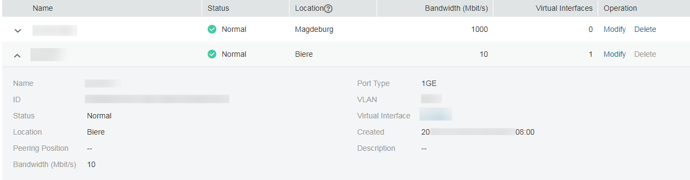

# Viewing a Connection

## Scenarios

After creating a connection, you can view its basic information.

## Procedure

1.  Log in to the management console.
2.  Click    in the upper left corner and select a region and a project.
3.  Under  **Network**, click  **Direct Connect**.
4.  In the navigation pane on the left, choose  **Direct Connect**  \>  **Connections**.
5.  In the connection list, click    on the left of the target connection to view its details.

    **Figure  1**  Connection details  
    

