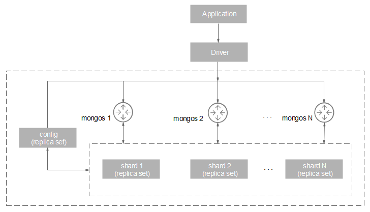

# Cluster Architecture

Each DDS cluster is an independent document database. A sharded cluster consists of mongos, config, and shard.

Data read and write requests are forwarded by mongos. A mongos reads configuration settings from configs and allocates the read and write requests to shards, making it easy to cope with high concurrency scenarios. In addition, each config and shard is a replica set that provides high availability. The following figure shows the DDS cluster architecture.

**Figure  1**  Cluster architecture  

-   Each mongos is deployed on a single node. To realize load balancing and automatic failover, you can provision multiple mongos. A single cluster supports 2 to 12 mongos.
-   Each shard is a three-node replica set. A single cluster supports 2 to 12 shards.
-   config is mandatory in a cluster instance. It stores instance configuration information and consists of one replica set.
-   mongos and shards cannot be added using native commands but can be scaled out on the DDS console.
-   You cannot connect to a config and shard. Data operations can only be delivered by connecting to mongos.
-   Currently, a three-node replica set cannot be directly upgraded to a cluster.

