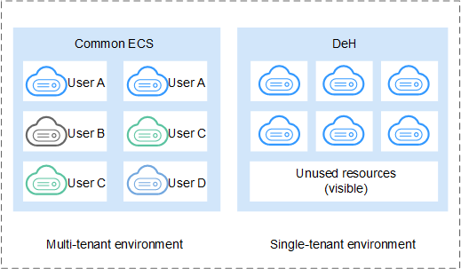

# Dedicated Host

Dedicated Host \(DeH\) is a service that provides dedicated physical hosts. You can create ECSs on a DeH to enhance isolation, security, and performance of your ECSs. When you migrate services to a DeH, you can continue to use your server software licenses used before the migration. That is, you can use the Bring Your Own License \(BYOL\) feature on the DeH to reduce costs and independently manage your ECSs.

[Figure 1](#fig184871050515)  shows the differences between DeHs and common ECSs.

**Figure  1**  Differences between DeHs and common ECSs  

As the unique user of a specific DeH, you do not need to share the physical resources of the DeH with other users. You can also obtain the physical attributes of the DeH, such as information about sockets, physical cores, CPU type, and memory size. So, you can create ECSs of specified flavors based on the DeH flavor.

## Customized Placement

You can use your DeH resources by the following two methods:

-   Specify a DeH to create ECSs.

    You can select a DeH to create ECSs on the DeH console; alternatively, you can specify a DeH to place the ECS you are creating.

-   Enable the system to automatically select a DeH to place ECSs.

    When you create an ECS, select  **Auto Placement**  for  **DeH**.

    Then, the system automatically selects a DeH with maximum available memory size from the DeHs that meet specifications requirements to create the ECS, thereby balancing load of the DeHs.

The combination of these two methods can address your demands on isolation, hardened security, and strict regulation compliance for deployed applications, improve resource utilization, and optimize the ECS performance.

