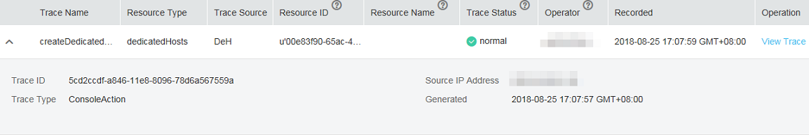

# Viewing CTS Traces

1.  Log in to the management console.
2.  Click    in the upper left corner and select the desired region and project.
3.  Click  **Service List**  and select  **Cloud Trace Service**  under  **Management & Deployment**.
4.  Choose  **Trace List**  in the navigation pane on the left.
5.  Use filters to query traces. The following four filters are available:
    -   **Trace Source**,  **Resource Type**, and  **Search By**

        Select a filter criterion from the drop-down list.

        When you select  **Trace name**  for  **Search By**, you also need to select a specific trace name. When you select  **Resource ID**  for  **Search By**, you also need to select or enter a specific resource ID. When you select  **Resource name**  for  **Search By**, you also need to select or enter a specific resource name.

    -   **Operator**: Select a specific operator \(at user level rather than tenant level\).
    -   **Trace Status**: Available options include  **All trace statuses**,  **normal**,  **warning**, and  **incident**. You can only select one of them.
    -   Start time and end time: You can specify the time period to query traces.

6.  Click    on the left of the record to be queried to extend its details.

    **Figure  1**  Trace details  
    

7.  Locate a trace and click  **View Trace**  in the  **Operation**  column.

    **Figure  2** **View Trace**  
    

    For details about the key fields in the CTS trace structure, see the  _Cloud Trace Service User Guide_.

