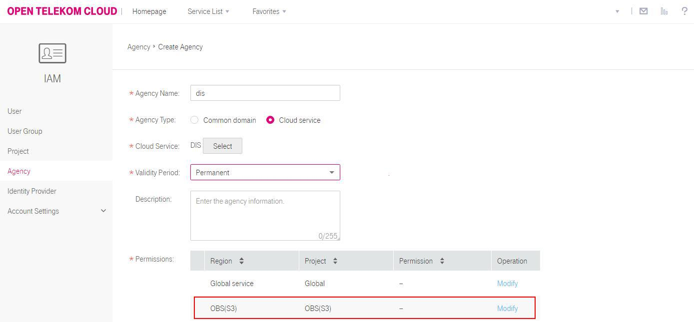

# Creating an IAM Agency

## Introduction

If you choose to dump data from DIS to OBS, create an IAM agency that grants DIS permissions to access OBS.

## Creating an IAM Agency

1.  Log in to the management console.
2.  Click  **Service List**. Under  **Management & Deployment**, select  **Identify and Access Management**.
3.  Select  **Agencies**  in the navigation tree pane, and click  **Create Agency**.

    **Figure  1**  Creating an IAM agency  
    

4.  Configure agency parameters and click  **OK**. 

    **Figure  2**  Configuring agency parameters  
    

    **Table  1**  Agency parameter description

    
    <table><thead align="left"><tr id="row32490906111910"><th class="cellrowborder" valign="top" width="30%" id="mcps1.2.3.1.1">
Parameter

    </th>
    <th class="cellrowborder" valign="top" width="70%" id="mcps1.2.3.1.2">
Description

    </th>
    </tr>
    </thead>
    <tbody><tr id="row23170149111910"><td class="cellrowborder" valign="top" width="30%" headers="mcps1.2.3.1.1 ">
Agency Name

    </td>
    <td class="cellrowborder" valign="top" width="70%" headers="mcps1.2.3.1.2 ">
Name of the agency to be created. The value of this parameter is 1 to 64 characters long and cannot be left unspecified.

    </td>
    </tr>
    <tr id="row25754953111910"><td class="cellrowborder" valign="top" width="30%" headers="mcps1.2.3.1.1 ">
Agency Type

    </td>
    <td class="cellrowborder" valign="top" width="70%" headers="mcps1.2.3.1.2 ">
Type of the agency to be created. This parameter must be set to <strong id="b147241335189">Cloud service</strong>.

    </td>
    </tr>
    <tr id="row50308989111910"><td class="cellrowborder" valign="top" width="30%" headers="mcps1.2.3.1.1 ">
Cloud Service

    </td>
    <td class="cellrowborder" valign="top" width="70%" headers="mcps1.2.3.1.2 ">
Click <strong id="b10448144191416">Select</strong> next to <strong id="b194031287144">Cloud Service</strong>. In the <strong id="b1195624117142">Select Cloud Service</strong> dialog box, select <strong id="b17685194915144">DIS</strong> and click <strong id="b13767105151419">OK</strong>.

    </td>
    </tr>
    <tr id="row54541740111910"><td class="cellrowborder" valign="top" width="30%" headers="mcps1.2.3.1.1 ">
Validity Period

    </td>
    <td class="cellrowborder" valign="top" width="70%" headers="mcps1.2.3.1.2 ">
Select <strong id="b113861320101513">Permanent</strong>.

    
 NOTE: 

Currently, this parameter must be set to <strong id="b133691353153">Permanent</strong>. Using another value may result in authorization failures.

    

    </td>
    </tr>
    <tr id="row13771277111910"><td class="cellrowborder" valign="top" width="30%" headers="mcps1.2.3.1.1 ">
Description

    </td>
    <td class="cellrowborder" valign="top" width="70%" headers="mcps1.2.3.1.2 ">
Agency description. The entered description cannot exceed 255 characters.

    </td>
    </tr>
    <tr id="row22071196111910"><td class="cellrowborder" valign="top" width="30%" headers="mcps1.2.3.1.1 ">
Permissions

    </td>
    <td class="cellrowborder" valign="top" width="70%" headers="mcps1.2.3.1.2 ">
If <strong id="b1547196153414">Dump Destination</strong> is <strong id="b119971512143416">OBS</strong>, policy settings are as follows: Region: Global service
    Project: OBS
    Policy: Tenant Administrator

    
To modify agency policies, click <strong id="b5521810203614">Modify</strong> in the <strong id="b37780128367">Operation</strong> column. In the <strong id="b1322185853711">Available Policies</strong> area, select your required policy and click <strong id="b4977111643810">OK</strong>.

    
 NOTE: 

After an agency is created, its policies cannot be modified.

    

    </td>
    </tr>
    </tbody>
    </table>

