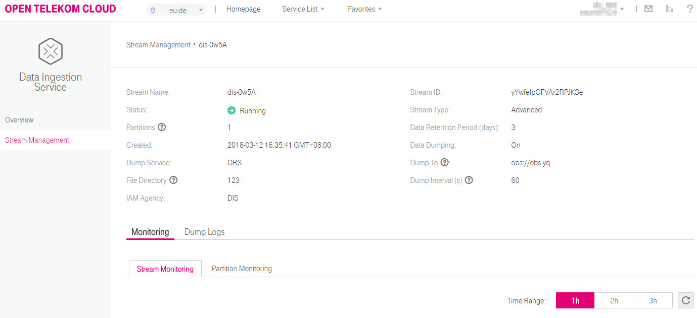

# Viewing Stream Monitoring Metrics

You can view stream monitoring metrics on the DIS console.

1.  Use the account to log in to the DIS console.
2.  Click    in the upper left corner and select  **Region**  and  **Project**.
3.  In the navigation tree on the left, choose  **Ingestion Management**  \>  **Stream Management**.
4.  In the stream list, click the name of the DIS stream whose monitoring metrics will be viewed. The monitoring page is displayed.

    **Figure  1**  Monitoring page  
    

5.  On the  **Monitoring**  page, click the  **Streams**  or  **Partitions**  tab to view stream or partition monitoring metrics.  [Table 1](#table2942144318834)  describes the monitoring parameters. For details about basic stream information, see  [3](step-1-creating-a-dis-stream.md#li23032735111458).

    **Table  1**  DIS monitoring information

    
    <table><thead align="left"><tr id="row6686704018834"><th class="cellrowborder" valign="top" width="30%" id="mcps1.2.3.1.1">
Parameter

    </th>
    <th class="cellrowborder" valign="top" width="70%" id="mcps1.2.3.1.2">
Description

    </th>
    </tr>
    </thead>
    <tbody><tr id="row5291185918834"><td class="cellrowborder" valign="top" width="30%" headers="mcps1.2.3.1.1 ">
Time Range

    </td>
    <td class="cellrowborder" valign="top" width="70%" headers="mcps1.2.3.1.2 "><ul id="ul210231152417"><li>Monitoring time range.
Values:

    <ul id="ul4520229418834"><li>1h</li><li>2h</li><li>3h</li></ul>
    </li></ul>
    </td>
    </tr>
    <tr id="row1818369818834"><td class="cellrowborder" colspan="2" valign="top" headers="mcps1.2.3.1.1 mcps1.2.3.1.2 ">
<strong id="b55711300181416">Partitions</strong>

    </td>
    </tr>
    <tr id="row5079608118834"><td class="cellrowborder" valign="top" width="30%" headers="mcps1.2.3.1.1 ">
Partition ID

    </td>
    <td class="cellrowborder" valign="top" width="70%" headers="mcps1.2.3.1.2 ">
ID of the partition. It starts from 0 by default.

    
Select any of the following values from the <strong id="b15659981181416">Partition ID</strong> drop-down.

    </td>
    </tr>
    <tr id="row4437627918834"><td class="cellrowborder" valign="top" width="30%" headers="mcps1.2.3.1.1 ">
Data Rate (KB/s)

    </td>
    <td class="cellrowborder" valign="top" width="70%" headers="mcps1.2.3.1.2 ">
Rates at which data is sent to and retrieved from the chosen partition within the specified time range.

    
Unit: KB/s

    </td>
    </tr>
    <tr id="row4467607118834"><td class="cellrowborder" valign="top" width="30%" headers="mcps1.2.3.1.1 ">
Records Per Second

    </td>
    <td class="cellrowborder" valign="top" width="70%" headers="mcps1.2.3.1.2 ">
The number of records sent to and retrieved from the chosen partition within the specified time range.

    
  

    </td>
    </tr>
    <tr id="row4997660018834"><td class="cellrowborder" colspan="2" valign="top" headers="mcps1.2.3.1.1 mcps1.2.3.1.2 ">
<strong id="b12291253161026">Streams</strong>

    </td>
    </tr>
    <tr id="row256515918834"><td class="cellrowborder" valign="top" width="30%" headers="mcps1.2.3.1.1 ">
Data Rate (KB/s)

    </td>
    <td class="cellrowborder" valign="top" width="70%" headers="mcps1.2.3.1.2 ">
Rates at which data is sent to and retrieved from the chosen DIS stream within the specified time range.

    
Unit: KB/s

    </td>
    </tr>
    <tr id="row4837715518834"><td class="cellrowborder" valign="top" width="30%" headers="mcps1.2.3.1.1 ">
Records Per Second

    </td>
    <td class="cellrowborder" valign="top" width="70%" headers="mcps1.2.3.1.2 ">
The number of records sent to and retrieved from the chosen DIS stream within the specified time range.

    
   

    </td>
    </tr>
    <tr id="row6366508718834"><td class="cellrowborder" valign="top" width="30%" headers="mcps1.2.3.1.1 ">
Successful Requests Per Second

    </td>
    <td class="cellrowborder" valign="top" width="70%" headers="mcps1.2.3.1.2 ">
The number of PutRecords and GetRecords requests successfully fulfilled within the specified time range.

    
    

    </td>
    </tr>
    <tr id="row2894632418834"><td class="cellrowborder" valign="top" width="30%" headers="mcps1.2.3.1.1 ">
Throttled Requests Per Second

    </td>
    <td class="cellrowborder" valign="top" width="70%" headers="mcps1.2.3.1.2 ">
The number of PutRecords and GetRecords requests rejected within the specified time range due to flow control.

    
 

    </td>
    </tr>
    <tr id="row3297925818834"><td class="cellrowborder" valign="top" width="30%" headers="mcps1.2.3.1.1 ">
Average Request Processing Time (ms)

    </td>
    <td class="cellrowborder" valign="top" width="70%" headers="mcps1.2.3.1.2 ">
The average amount of time spent in processing a PutRecords or GetRecords request.

    
  

    </td>
    </tr>
    </tbody>
    </table>

