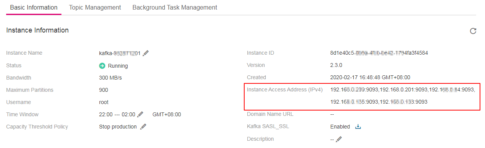
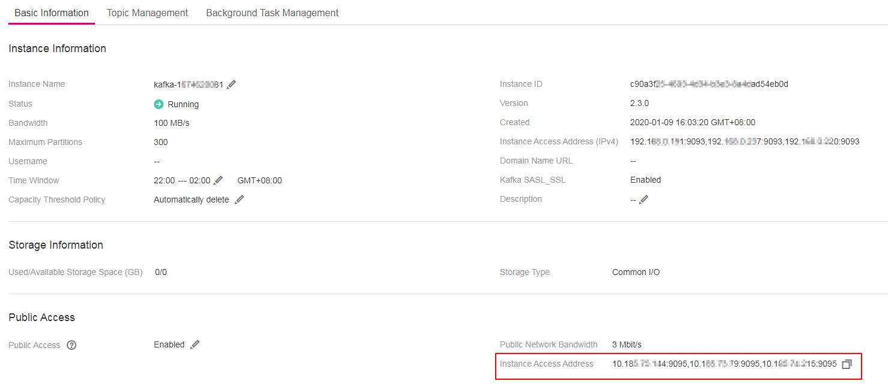

# Accessing a Kafka Premium Instance with SASL<a name="EN-US_TOPIC_0143117217"></a>

If you enable SASL\_SSL when creating an instance, data will be encrypted before transmission for enhanced security.

This section describes how to use an open-source Kafka client to access a Kafka premium instance if SASL has been enabled for the instance.

> **NOTE:**   
>When accessing a Kafka instance using SASL, map hosts to IP addresses to facilitate instance broker domain name resolution. Otherwise, latency may occur.  
>Set the IP address to the connection address of the instance. Set hosts to the names of instance hosts. Specify a unique name for each host. Examples:  
>10.154.48.120 server01  
>10.154.48.121 server02  
>10.154.48.122 server03  
>To map hosts to IP addresses, go to the  **C:\\Windows\\System32\\drivers\\etc**  directory in Windows OS, or go to the  **/etc/hosts**  directory in Mac OS or Linux.  

## Prerequisites<a name="section17830048113810"></a>

1.  Security group rules have been correctly configured.

    A Kafka premium instance with SASL enabled can be accessed within a VPC or over public networks.

    -   For intra-VPC access, ensure that the ECS and the Kafka premium instance are in the same VPC and that security group rules have been correctly configured for the instance. For details on how to configure a security group, see  [How to Select and Configure a Security Group?](how-to-select-and-configure-a-security-group.md)
    -   For public access, there are no specific requirements on the VPC. However, you still need to ensure that security group rules have been correctly configured for the Kafka premium instance.

        To access the instance with SASL, allow inbound access through port 9095.

2.  <a name="li1422895833615"></a>The instance connection address has been obtained.
    -   For intra-VPC access, use port 9093. Obtain the instance connection address on the instance details page.

        **Figure  1**  Obtaining Kafka instance connection address for intra-VPC access<a name="fig9502163010256"></a>  
        

    -   For intra-VPC access, use port 9095. Obtain the instance access address on the instance details page.

        **Figure  2**  Obtaining Kafka instance access address for public access<a name="fig175741447152015"></a>  
        

3.  At least one topic has been created for the Kafka premium instance.
4.  The  **client.truststore.jks**  certificate has been installed. The certificate can be obtained by performing the following procedure.

    Download the certificate from  [https://dms-demo.obs.eu-de.otc.t-systems.com/cert.zip](https://dms-demo.obs.eu-de.otc.t-systems.com/cert.zip).  Then, Decompress the package to obtain the client certificate file  **client.truststore.jks**.

5.  The ECS has been correctly configured and an open-source Kafka client has been installed. If the configuration or the installation has not been completed, perform the following procedure.
    1.  Log in to the ECS.

        The following uses a Linux ECS as an example. For more information on how to install JDK and configure the environment variables for a Windows ECS, please search the Internet.

    2.  Install JDK or JRE, and add the following lines to  **.bash\_profile**  in the home directory to configure the environment variables  **JAVA\_HOME **and  **PATH**:

        ```
        export JAVA_HOME=/opt/java/jdk1.8.0_151 
        export PATH=$JAVA_HOME/bin:$PATH
        ```

        Run the  **source .bash\_profile**  command for the modification to take effect.

        > **NOTE:**   
        >Use Oracle JDK instead of ECS's default JDK \(for example, OpenJDK\), because ECS's default JDK may not be suitable for the sample project. Obtain Oracle JDK 1.8.111 or later from  [Oracle](https://www.oracle.com/technetwork/java/javase/downloads/index.html).  

    3.  Download an open-source Kafka client at  [https://archive.apache.org/dist/kafka/2.3.1/kafka\_2.11-2.3.1.tgz](http://mirror.bit.edu.cn/apache/kafka/2.3.1/kafka_2.12-2.3.1.tgz)  for an instance of Kafka 2.3.1.

        **wget https://archive.apache.org/dist/kafka/2.3.1/kafka\_2.11-2.3.1.tgz**

        If you use the Windows OS, the package contains a  **Windows**  folder which has the CLI for connecting to the Kafka client. The usage is similar to that in the Linux OS.

    4.  Run the following command to decompress the package:

        **tar -zxf  _\[kafka\_tar\]_**

        In the preceding command,  _\[kafka\_tar\]_  indicates the name of the client package.

        For example:

        **tar -zxf kafka\_2.11-2.3.1.tgz**


## Accessing the Instance Using CLI<a name="section189213202426"></a>

1.  Log in to the ECS.
2.  Add the following lines to end of the  **consumer.properties**  and  **producer.properties**  files:

    ```
    sasl.jaas.config=org.apache.kafka.common.security.plain.PlainLoginModule required \
    username="**********" \
    password="**********";        
    sasl.mechanism=PLAIN
    
    security.protocol=SASL_SSL
    ssl.truststore.location=/opt/kafka_2.11-2.3.1/config/client.truststore.jks
    ssl.truststore.password=dms@kafka
    ssl.endpoint.identification.algorithm=
    ```

    In the preceding lines,  **username**  and  **password**  indicate the username and password specified when SASL\_SSL is enabled, and  **ssl.trustore.location**  indicates the path for storing the certificate file.

3.  Access the  **\[base\_dir\]/kafka\_2.11-2.3.1/bin**  directory.

    _\[base\_dir\]_  indicates the installation directory of the Kafka client.

4.  Run the following command to create messages:

    **_./kafka-console-producer.sh --broker-list \[_**_connection-address_**_\] --topic \[_**_topic-name_**_\]_**_** --producer.config ../config/producer.properties**_

    Parameter description:

    -   _\[connection-address\]_  is the address obtained in  [2](#li1422895833615).
    -   _\[topic-name\]_  is the name of the topic created for the Kafka instance.

    The following example uses connection addresses  **10.xxx.xxx.202:9095,10.xxx.xxx.197:9095,10.xxx.xxx.68:9095**.

    After running the preceding command, you can send a message to the Kafka instance by writing it and pressing  **Enter**. Each line of content is sent as a message.

    ```
    [root@ecs-heru bin]#./kafka-console-producer.sh --broker-list 10.xxx.xxx.202:9095,10.xxx.xxx.197:9095,10.xxx.xxx.68:9095  --topic topic-heru --producer.config ../config/producer.properties
    >hello
    >DMS
    >Kafka!
    >^C[root@ecs-heru bin]# 
    ```

    To stop creating messages, press  **Ctrl**+**C**  to exit.

5.  Run the following commands to retrieve messages:

    > **NOTE:**   
    >Messages do not need to be on the same ECS to be created and retrieved, as long as the client and the server are connected.  

    _**./kafka-console-consumer.sh --bootstrap-server \[**_connection-address_**\] --topic \[**_topic-name_**\] --from-beginning**__**  --_**consumer**_.config ../config/_**consumer**_.properties**_

    ```
    [root@ecs-heru bin]#  ./kafka-console-consumer.sh --bootstrap-server 10.xxx.xxx.202:9095,10.xxx.xxx.197:9095,10.xxx.xxx.68:9095 --topic topic-heru --from-beginning --consumer.config ../config/consumer.properties
    hello
    Kafka!
    abcd
    DMS
    heuu
    hello
    ^CProcessed a total of 6 messages
    [root@ecs-heru bin]# 
    ```

    To stop retrieving messages, press  **Ctrl**+**C**  to exit.


