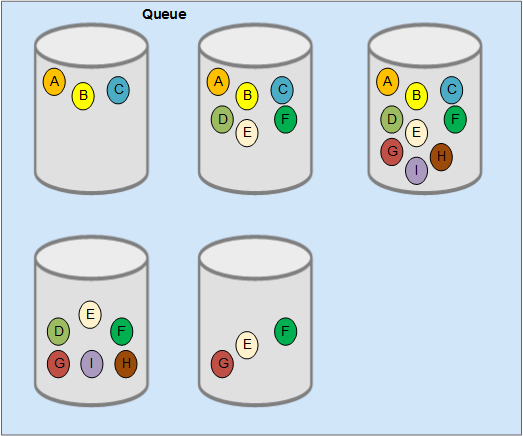

# DMS Overview

DMS is a fully-managed, high-performance message queuing service that supports normal queues, first-in-first-out \(FIFO\) queues, Kafka queues, and Kafka premium instances. It is compatible with HTTP and TCP, and provides a flexible and reliable asynchronous communication mechanism for distributed applications.

Normal and FIFO queues feature low-latency and high reliability. They support dead letter messages for handling exceptions. In normal queues, partitions ensure higher concurrency.

Kafka queues support high-throughput and high-reliability modes. A Kafka queue is equivalent to a topic. The storage space and network bandwidth resources are allocated by the system, without requiring you to make choices.

Kafka premium instances use physically isolated computing, storage, and bandwidth resources. You can customize partitions and replicas for Kafka topics in the instances, and configure the network bandwidth as required. The instances can be used right out of the box, taking off the deployment and O&M pressure for you so that you can focus on developing your services.

For details about Kafka premium instances and Kafka queues, see  [Comparing Kafka Queues and Kafka Premium Instances](comparing-kafka-queues-and-kafka-premium-instances.md).

[Figure 1](#fig1370624315018)  illustrates the process of creating and retrieving a message.

**Figure  1**  Flowchart for creating and retrieving a message  

**Table  1**  Steps for creating and retrieving a message

<table><thead align="left"><tr id="row1916014231709"><th class="cellrowborder" valign="top" width="8%" id="mcps1.2.3.1.1">
Step

</th>
<th class="cellrowborder" valign="top" width="92%" id="mcps1.2.3.1.2">
Description

</th>
</tr>
</thead>
<tbody><tr id="row12161223007"><td class="cellrowborder" valign="top" width="8%" headers="mcps1.2.3.1.1 ">
1

</td>
<td class="cellrowborder" valign="top" width="92%" headers="mcps1.2.3.1.2 ">
The producer sends message M to a queue.

Message M is redundantly distributed in the queue.

</td>
</tr>
<tr id="row1516118236015"><td class="cellrowborder" valign="top" width="8%" headers="mcps1.2.3.1.1 ">
2

</td>
<td class="cellrowborder" valign="top" width="92%" headers="mcps1.2.3.1.2 ">
A consumer retrieves message M from the queue.

While message M is being retrieved, it remains in the queue. It cannot be retrieved again within 30s since the start of retrieval. If message M fails to be acknowledged within this period, it can be retrieved again.

</td>
</tr>
<tr id="row11161623709"><td class="cellrowborder" valign="top" width="8%" headers="mcps1.2.3.1.1 ">
3

</td>
<td class="cellrowborder" valign="top" width="92%" headers="mcps1.2.3.1.2 ">
Once message M is acknowledged, it can no longer be retrieved by consumers from the same consumer group.

However, it can still be retrieved by consumers from other consumer groups. It remains in the queue for at least 72 hours (unless the queue is deleted) and will be deleted after this period.

</td>
</tr>
</tbody>
</table>

> **NOTE:**   
>If messages are retrieved using APIs, they must then be acknowledged using the ACK API. If messages are retrieved using the DMS console, they are automatically acknowledged.  

As shown in  [Figure 2](#fig16851144592920), DMS stores messages of a queue on different servers, and each message has multiple replicas, achieving high reliability and availability.

**Figure  2**  Distribution of messages from a queue  

Message queues have the following characteristics:

-   Ordered message delivery

    Normal queues support higher concurrency, but cannot guarantee that messages are retrieved in the exact sequence as how they are received. If you want to preserve the message sequence, put sequence information in each message, so that messages can be sequenced after they are received.

    FIFO queues support FIFO message delivery and are applicable to scenarios with high sequence requirements.

-   At-least-once delivery

    In rare cases, a server storing message replicas may be unavailable when you request or delete messages. If this happens, the message replicas will not be deleted from that server and may be sent when the connection is restored.

    This is called "at-least-once" delivery. To avoid any adverse impact from processing the same message multiple times, ensure that your application processes messages idempotently.

-   A specified number of messages cannot be obtained at a time when there are only a few messages in a queue.

    When there are only a few messages in a queue, the number of messages retrieved at a time may be less than the message quantity specified in the retrieval request. However, all messages in the queue will eventually be obtained by the consumer after multiple rounds of retrieval.

