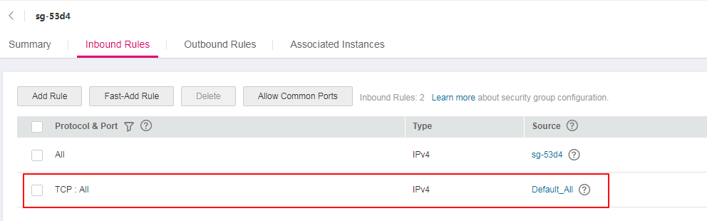
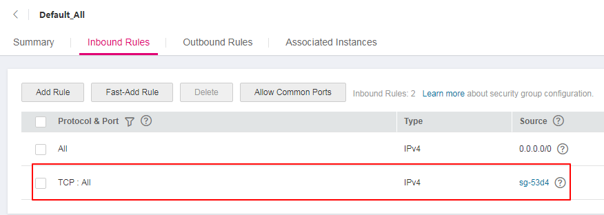

# How to Select and Configure a Security Group?

To access a Kafka premium instance within a VPC or over public networks, configure the security group rules as follows.

## Intra-VPC Access

To access a Kafka premium instance, you must deploy your client on an ECS in the same VPC and subnet as the instance.

In addition, before you can access the instance through your client, you must configure correct rules for the security groups of both the ECS and the Kafka premium instance.

1.  You are advised to configure the same security group for the ECS and the Kafka premium instance. After a security group is created, network access in the group is not restricted by default.
2.  If the ECS and the instance belong to different security groups, add security group rules to ensure that the ECS and the instance can access each other.

    > **NOTE:**   
    >-   Assume that security groups  **sg-53d4**  and  **Default\_All**  are configured respectively for your ECS and Kafka premium instance.  
    >-   You can specify a security group or IP address as the remote end in the following rules.  

    To ensure that your client can access the instance, add the following rule to the security group configured for the ECS.

    **Figure  1**  Configuring rules for the security group of the ECS  
    

    To ensure that your client can access the Kafka premium instance, add the following rule to the security group configured for the instance:

    **Figure  2**  Configuring rules for the security group of the Kafka premium instance  
    

## Public Access

A client can access a Kafka premium instance only if rules have been correctly configured for the security group of the instance.

For example, for security group  **sg-Kafka**, you need to configure either of the following rules in the inbound direction:

-   Protocol:  **TCP**; port number:  **9094**; source IP address:  **0.0.0.0/0**
-   Protocol:  **Any**; source IP address:  **0.0.0.0/0**

The following figures show the rules.

**Figure  3**  Rule 1 for the security group  

**Figure  4**  Rule 2 for the security group  

