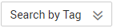

# Searching for Queues by Tag

## Scenario

Search for DMS queues by tag after adding tags to the queues.

Multiple tags can share the same key but have different values.

You can add a maximum of 10 tags to search for queues.

If you add more than one tag, the queues containing all specified tags will be returned.

## Prerequisites

A queue has been created and tags have been added to the queue.

## Procedure

1.  Log in to the management console.
2.  Click    in the upper left corner to select a region and a project.
3.  Click  **Service List**, and choose  **Application **\>** Distributed Message Service**  to open the DMS console.
4.  In the navigation pane, choose  **Queue Manager**.
5.  Click    in the upper right corner of the page.
6.  Specify the tag key and value to search for queues.

