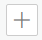
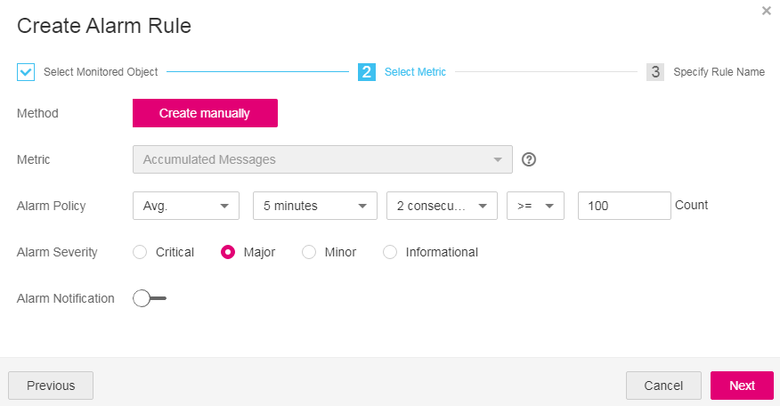

# Setting DMS Alarm Rules

## Scenario

Setting DMSalarm rules enables you to be informed of the running status of your DMS services at any time by customizing the monitored objects and notification policies.

This section describes how to set DMS alarm rules, including alarm rule names, monitored objects, metrics, alarm thresholds, monitoring intervals, and notifications.

## Prerequisites

-   To set alarm rules for queues, ensure that you have available queues.
-   To set alarm rules for Kafka premium instances, ensure that you have available Kafka premium instances.

## Procedure

1.  Log in to the management console.
2.  Click    in the upper left corner to select a region and a project.
3.  Click  **Service List**, and choose  **Application**  \>  **Distributed Message Service**  to open the DMS console.
4.  Create an alarm rule for a queue.

    This step is for creating an alarm rule for a queue. To learn how to create an alarm rule for a Kafka premium instance, see  [5](#li7309816152319). The following describes how to configure an alarm rule for the  **Accumulated Messages**  \(**dead\_avail\_messages**\) metric of a consumer group.

    1.  In the navigation pane, choose  **Queue Manager**.
    2.  Click a queue name. On the queue details page that is displayed, click  **More**  \>  **View Metric**  in the same row as a consumer group.

        You are redirected to the Cloud Eye console page displaying metrics of the selected consumer group.

    3.  Locate the  **Accumulated Messages**  metric. Hover over the metric and click    to create an alarm rule for the metric.

        The  **Create Alarm Rule**  page is displayed. 

    4.  Specify the alarm details.
        1.  Specify the alarm policy and alarm severity.

            For example, if the alarm is set as shown in  [Figure 1](#fig112961424225), an alarm will be triggered if the average number of accumulated messages exceeds 100 for two consecutive periods of five minutes and no actions are taken to handle the exception. Set these parameters based on your requirements.

            **Figure  1**  Setting the alarm policy and alarm severity for dead\_avail\_messages  
            

        2.  Set the alarm notification configurations. If you enable  **Alarm Notification**, set the validity period, notification object, and trigger condition.
        3.  Click  **Next**  to set the alarm name and description.
        4.  Click  **Finish**.

5.  Create an alarm rule for a Kafka premium instance.

    The following describes how to configure an alarm rule for the  **group\_msgs**  metric of an instance.

    1.  In the navigation pane, choose  **Kafka Premium**.
    2.  Click  **More**  \>  **View Metric**  in the same row as an instance.
    3.  Locate the  **group\_msgs**  metric. Hover over the metric and click    to create an alarm rule for the metric.

        The  **Create Alarm Rule**  page is displayed.

    4.  Specify the alarm details.
        1.  Specify the alarm policy and alarm severity.

            For example, if the alarm is set as shown in  [Figure 2](#fig187882032812), an alarm will be triggered if the average number of accumulated messages exceeds 100 for three consecutive periods of five minutes and no actions are taken to handle the exception. Set these parameters based on your requirements.

            **Figure  2**  Setting the alarm policy and alarm severity for group\_msgs  
            

        2.  Set the alarm notification configurations. If you enable  **Alarm Notification**, set the validity period, notification object, and trigger condition.
        3.  Click  **Next**  to set the alarm name and description.
        4.  Click  **Finish**.

