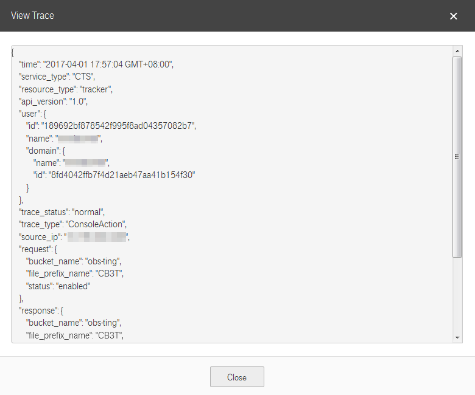

# Viewing Traces on the CTS Console

## Scenario

This section describes how to view operation records for the last 7 days on the CTS console.

## Procedure

1.  Log in to the management console.
2.  Click    in the upper left corner to select a region and a project.
3.  Click  **Service List**, and choose  **Management & Deployment**  \>  **Cloud Trace Service**.
4.  In the navigation pane, choose  **Trace List**.
5.  On the  **Trace List**  page, query traces based on a combination of the following querying dimensions:
    -   **Trace Source**: Select  **DMS**.
    -   **Resource Type**: Select  **group**,  **queue**, or  **kafka**.
    -   **Search By**: Select an option from the drop-down list.

        When you select  **Trace name**, you also need to select a specific trace name.

        When you select  **Resource ID**, you also need to select a specific resource ID.

        When you select  **Resource name**, you also need to select a specific resource name.

    -   **Operator**: Select a specific operator \(a user other than tenant\).
    -   **Trace Status**: Available options include  **All trace status**,  **normal**,  **warning**, and  **incident**. You can only select one of them.
    -   Start time and end time: You can specify the time period to query traces.

6.  Click    on the left of a trace to expand its details, as shown in  [Figure 1](#fig820731418111).

    **Figure  1**  Expanding trace details  
    

7.  Click  **View Trace**  in the  **Operation**  column. In the displayed  **View Trace**  dialog box, the trace structure details are displayed, as shown in  [Figure 2](#fig1620891412115).

    **Figure  2**  View Trace  
    

