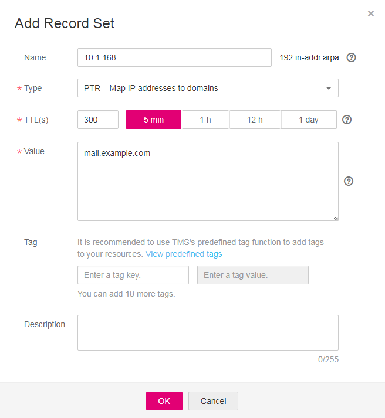

# How Can I Configure a PTR Record for an ECS Private IP Address?

PTR records enable visitors to query domain names based on IP addresses.

On the **PTR Records** page on the DNS console, you can configure PTR records for EIPs. If you want to add PTR records for ECS private IP addresses, create a private zone and create PTR records in the zone.

The domain name in a PTR record is specified in the ***x.x.x.x*.in-addr.arpa** format.

>  **NOTE:** 

> **in-addr.arpa** is the top-level domain for reverse resolution.

> For example, if the private IP address is **192.168.1.10**, its domain name in the PTR record is **10.1.168.192.in-addr.arpa**.

> In this case, you need to create a private zone **192.in-addr.arpa** and add a PTR record **10.1.168.192.in-addr.arpa**.

## Creating a Private Zone

1.  Log in to the management console.
2.  In the **Network** category, click **Domain Name Service**.

    The DNS console is displayed.

3.  In the navigation pane, Choose **Private Zones**.

    The **Private Zones** page is displayed.

4.  Click  on the upper left and select the desired region and project.
5.  Click **Create Private Zone**.

    **Figure 1** Create Private Zone
    

6.  Configure the parameters according to [Table 1](#table12455154165118).**Table 1** Parameters required for creating a private zone

    <table><thead align="left"><tr id="row54556485113"><th class="cellrowborder" valign="top" width="33.33333333333333%" id="mcps1.2.4.1.1">
<strong id="b84235270695255">Parameter</strong>

    </th>
    <th class="cellrowborder" valign="top" width="33.33333333333333%" id="mcps1.2.4.1.2">
<strong id="en-us_topic_0035268497_b8423527061433">Description</strong>

    </th>
    <th class="cellrowborder" valign="top" width="33.33333333333333%" id="mcps1.2.4.1.3">
<strong id="b84235270617114">Example Value</strong>

    </th>
    </tr>
    </thead>
    <tbody><tr id="row144553495114"><td class="cellrowborder" valign="top" width="33.33333333333333%" headers="mcps1.2.4.1.1 ">
Name

    </td>
    <td class="cellrowborder" valign="top" width="33.33333333333333%" headers="mcps1.2.4.1.2 ">
Domain name

    
Set the top-level domain to <strong id="b84235270692248">in-addr.arpa</strong>.

    </td>
    <td class="cellrowborder" valign="top" width="33.33333333333333%" headers="mcps1.2.4.1.3 ">
192.in-addr.arpa

    </td>
    </tr>
    <tr id="row5456845517"><td class="cellrowborder" valign="top" width="33.33333333333333%" headers="mcps1.2.4.1.1 ">
VPC

    </td>
    <td class="cellrowborder" valign="top" width="33.33333333333333%" headers="mcps1.2.4.1.2 ">
VPC to be associated with the private zone

    </td>
    <td class="cellrowborder" valign="top" width="33.33333333333333%" headers="mcps1.2.4.1.3 ">
-

    </td>
    </tr>
    <tr id="row145614175118"><td class="cellrowborder" valign="top" width="33.33333333333333%" headers="mcps1.2.4.1.1 ">
Email

    </td>
    <td class="cellrowborder" valign="top" width="33.33333333333333%" headers="mcps1.2.4.1.2 ">
(Optional) Email address of the administrator managing the private zone

    
It is recommended that you set the email address to <strong id="b842352706182128">HOSTMASTER@<em id="i842352697182143">Domain name</em></strong>.

    
For more details about the email address, see <a href="why-is-the-email-address-format-changed-in-the-soa-record.html">Why Is the Email Address Format Changed in the SOA Record?</a>

    </td>
    <td class="cellrowborder" valign="top" width="33.33333333333333%" headers="mcps1.2.4.1.3 ">
HOSTMASTER@example.com

    </td>
    </tr>
    <tr id="row18748159183818"><td class="cellrowborder" valign="top" width="33.33333333333333%" headers="mcps1.2.4.1.1 ">
Tag

    </td>
    <td class="cellrowborder" valign="top" width="33.33333333333333%" headers="mcps1.2.4.1.2 ">
(Optional) Identifier of a resource. Each tag contains a key and a value. You can add 10 tags at most to a zone.

    
For details about tag key and value requirements, see <a href="#dns_faq_031__table114584301390">Table 2</a>.

    </td>
    <td class="cellrowborder" valign="top" width="33.33333333333333%" headers="mcps1.2.4.1.3 ">
example_key1

    
example_value1

    </td>
    </tr>
    <tr id="row64563417519"><td class="cellrowborder" valign="top" width="33.33333333333333%" headers="mcps1.2.4.1.1 ">
Description

    </td>
    <td class="cellrowborder" valign="top" width="33.33333333333333%" headers="mcps1.2.4.1.2 ">
(Optional) Description of the domain name, which cannot exceed 255 characters

    </td>
    <td class="cellrowborder" valign="top" width="33.33333333333333%" headers="mcps1.2.4.1.3 ">
This is a private zone.

    </td>
    </tr>
    </tbody>
    </table>

    **Table 2** Tag key and value requirements

    <table><thead align="left"><tr id="en-us_topic_0057777026_en-us_topic_0035467699_row72901535141713"><th class="cellrowborder" valign="top" width="18.181818181818183%" id="mcps1.2.4.1.1">
<strong id="en-us_topic_0057777026_en-us_topic_0035467699_b8423527069525">Parameter</strong>

    </th>
    <th class="cellrowborder" valign="top" width="50.505050505050505%" id="mcps1.2.4.1.2">
<strong id="en-us_topic_0057777026_en-us_topic_0035467699_b842352706171418">Requirement</strong>

    </th>
    <th class="cellrowborder" valign="top" width="31.313131313131315%" id="mcps1.2.4.1.3">
Example Value

    </th>
    </tr>
    </thead>
    <tbody><tr id="en-us_topic_0057777026_en-us_topic_0035467699_row52906354176"><td class="cellrowborder" valign="top" width="18.181818181818183%" headers="mcps1.2.4.1.1 ">
Key

    </td>
    <td class="cellrowborder" valign="top" width="50.505050505050505%" headers="mcps1.2.4.1.2 "><ul id="en-us_topic_0057777026_en-us_topic_0035467699_ul46253231183"><li id="en-us_topic_0057777026_en-us_topic_0035467699_li176251123141812">Cannot be left blank.</li><li id="en-us_topic_0057777026_en-us_topic_0035467699_li86261923201810">Must be unique for each resource.</li><li id="en-us_topic_0057777026_en-us_topic_0035467699_li162620231180">Consists of at most 36 characters.</li><li id="en-us_topic_0057777026_en-us_topic_0035467699_li5389246102911">Contains only letters, digits, hyphens (-), and underscores (_).</li></ul>
    </td>
    <td class="cellrowborder" valign="top" width="31.313131313131315%" headers="mcps1.2.4.1.3 ">
example_key1

    </td>
    </tr>
    <tr id="en-us_topic_0057777026_en-us_topic_0035467699_row132900355172"><td class="cellrowborder" valign="top" width="18.181818181818183%" headers="mcps1.2.4.1.1 ">
Value

    </td>
    <td class="cellrowborder" valign="top" width="50.505050505050505%" headers="mcps1.2.4.1.2 "><ul id="en-us_topic_0057777026_en-us_topic_0035467699_ul19648123161815"><li id="en-us_topic_0057777026_en-us_topic_0035467699_li15648193110182">Cannot be left blank.</li><li id="en-us_topic_0057777026_en-us_topic_0035467699_li3648143181813">Consists of at most 43 characters.</li><li id="en-us_topic_0057777026_en-us_topic_0035467699_li64561823123015">Contains only letters, digits, hyphens (-), and underscores (_).</li></ul>
    </td>
    <td class="cellrowborder" valign="top" width="31.313131313131315%" headers="mcps1.2.4.1.3 ">
example_value1

    </td>
    </tr>
    </tbody>
    </table>

7.  Click **OK**.

    You can query information about the private zone you created on the **Private Zones** page.

    >  **NOTE:** 

    > Click the zone name to query detailed zone information. The system has created record sets of the SOA type and NS type in the zone.

    > -   The SOA record set determines the DNS server that is the authoritative information source for a particular domain name.
    > -   The NS record set defines authoritative DNS servers for a zone.

## Adding a PTR Record

1.  In the zone list on the **Private Zones** page, click the name of the private zone you created.

    The record set page is displayed.

2.  Click **Add Record Set**.

    The **Add Record Set** box is displayed.

    **Figure 2** Add Record Set
    

3.  Configure the parameters according to [Table 3](#table2068616914271).**Table 3** Parameters required for adding a record set of the PTR type

    <table><thead align="left"><tr id="row14687398277"><th class="cellrowborder" valign="top" width="18.18181818181818%" id="mcps1.2.4.1.1">
<strong id="b84235270695255_1">Parameter</strong>

    </th>
    <th class="cellrowborder" valign="top" width="48.484848484848484%" id="mcps1.2.4.1.2">
<strong id="en-us_topic_0035268497_b8423527061433_1">Description</strong>

    </th>
    <th class="cellrowborder" valign="top" width="33.33333333333333%" id="mcps1.2.4.1.3">
<strong id="b84235270617114_1">Example Value</strong>

    </th>
    </tr>
    </thead>
    <tbody><tr id="row46871799274"><td class="cellrowborder" valign="top" width="18.18181818181818%" headers="mcps1.2.4.1.1 ">
Name

    </td>
    <td class="cellrowborder" valign="top" width="48.484848484848484%" headers="mcps1.2.4.1.2 ">
IP address in the PTR record (typed in reverse order)

    </td>
    <td class="cellrowborder" valign="top" width="33.33333333333333%" headers="mcps1.2.4.1.3 ">
10.1.168

    
For example, if the IP address is <strong id="b842352706145136">192.168.1.10</strong>, the name of the PTR record is <strong id="b84235270615344">10.1.168.192.in-addr.arpa</strong>.

    <ul id="ul772510438411"><li id="li16725124312418">If the private zone name is <strong id="b84235270615732">192.in-addr.arpa</strong>, enter <strong id="b84235270615827">10.1.168</strong> in the box.</li><li id="li16272201077">If the private zone name is <strong id="b84235270615732_1">1.168.192.in-addr.arpa</strong>, enter <strong id="b84235270615827_1">10</strong> in the box.</li></ul>
    </td>
    </tr>
    <tr id="row186872093277"><td class="cellrowborder" valign="top" width="18.18181818181818%" headers="mcps1.2.4.1.1 ">
Type

    </td>
    <td class="cellrowborder" valign="top" width="48.484848484848484%" headers="mcps1.2.4.1.2 ">
Type of the record

    </td>
    <td class="cellrowborder" valign="top" width="33.33333333333333%" headers="mcps1.2.4.1.3 ">

    
PTR – Map IP addresses to domains

    </td>
    </tr>
    <tr id="row17687395279"><td class="cellrowborder" valign="top" width="18.18181818181818%" headers="mcps1.2.4.1.1 ">
TTL (s)

    </td>
    <td class="cellrowborder" valign="top" width="48.484848484848484%" headers="mcps1.2.4.1.2 ">
Caching period of the record set (in seconds)

    </td>
    <td class="cellrowborder" valign="top" width="33.33333333333333%" headers="mcps1.2.4.1.3 ">
The default value is 300s, that is, <strong id="b842352706183837">5 min</strong>.

    </td>
    </tr>
    <tr id="row176881399271"><td class="cellrowborder" valign="top" width="18.18181818181818%" headers="mcps1.2.4.1.1 ">
Value

    </td>
    <td class="cellrowborder" valign="top" width="48.484848484848484%" headers="mcps1.2.4.1.2 ">
Domain name mapped to the IP address

    
You can enter only one name at a time.

    </td>
    <td class="cellrowborder" valign="top" width="33.33333333333333%" headers="mcps1.2.4.1.3 ">
mail.example.com

    </td>
    </tr>
    <tr id="row10389125919409"><td class="cellrowborder" valign="top" width="18.18181818181818%" headers="mcps1.2.4.1.1 ">
Tag

    </td>
    <td class="cellrowborder" valign="top" width="48.484848484848484%" headers="mcps1.2.4.1.2 ">
(Optional) Identifier of a resource. Each tag contains a key and a value. You can add 10 tags at most to a record set.

    
For details about tag key and value requirements, see <a href="#dns_faq_031__table114584301390">Table 2</a>.

    </td>
    <td class="cellrowborder" valign="top" width="33.33333333333333%" headers="mcps1.2.4.1.3 ">
example_key1

    
example_value1

    </td>
    </tr>
    <tr id="row17688109192713"><td class="cellrowborder" valign="top" width="18.18181818181818%" headers="mcps1.2.4.1.1 ">
Description

    </td>
    <td class="cellrowborder" valign="top" width="48.484848484848484%" headers="mcps1.2.4.1.2 ">
(Optional) Description of the PTR record

    </td>
    <td class="cellrowborder" valign="top" width="33.33333333333333%" headers="mcps1.2.4.1.3 ">
The PTR record is for reverse resolution.

    </td>
    </tr>
    </tbody>
    </table>

4.  Click **OK**.

