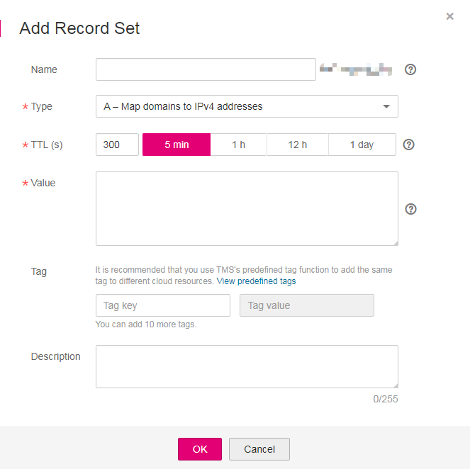

# Managing Record Sets

## Querying Record Set Details

1.  Log in to the management console.
2.  In the **Network** category, click **Domain Name Service**.

    The DNS console is displayed.

3.  On the **Dashboard** page, click **Public Zones** or **Private Zones** under **My Resources**.

    The zone list is displayed.

4.  \(Optional\) If you have selected **Private Zones**, click  on the upper left to select the region and project.
5.  Click a zone name.

    The record set page is displayed.

6.  View the record set details.

## Adding a Record Set

The DNS service supports multiple types of record sets. Each record set type applies to a specified application scenario. You can choose the record set types as needed. For details, see section [Record Set](record-set.md).

1.  Log in to the management console.
2.  In the **Network** category, click **Domain Name Service**.

    The DNS console is displayed.

3.  In the navigation pane, click **Public Zones** or **Private Zones**.

    The zone list is displayed.

4.  \(Optional\) If you have selected **Private Zones**, click  on the upper left to select the region and project.
5.  Click the name of a zone.
6.  Click **Add Record Set**.

    The **Add Record Set** box is displayed.

    **Figure 1** Add Record Set
    

7.  Set the required parameters.
    -   [Table 1](#table298011311249) lists the parameters required for adding a record set of the A type.**Table 1** Parameters required for adding a record set of the A type

        <table><thead align="left"><tr id="row798141382414"><th class="cellrowborder" valign="top" width="20.549999999999997%" id="mcps1.2.4.1.1">
<strong id="b8423527069525">Parameter</strong>

        </th>
        <th class="cellrowborder" valign="top" width="46.12%" id="mcps1.2.4.1.2">
<strong id="en-us_topic_0035268497_b8423527061433">Description</strong>

        </th>
        <th class="cellrowborder" valign="top" width="33.33%" id="mcps1.2.4.1.3">
<strong id="b84235270617114">Example Value</strong>

        </th>
        </tr>
        </thead>
        <tbody><tr id="row3986161312249"><td class="cellrowborder" valign="top" width="20.549999999999997%" headers="mcps1.2.4.1.1 ">
Name

        </td>
        <td class="cellrowborder" valign="top" width="46.12%" headers="mcps1.2.4.1.2 ">
Domain name (You do not need to manually add the suffix.)

        
The default value is the zone name.

        </td>
        <td class="cellrowborder" valign="top" width="33.33%" headers="mcps1.2.4.1.3 ">
www

        </td>
        </tr>
        <tr id="row1098871317246"><td class="cellrowborder" valign="top" width="20.549999999999997%" headers="mcps1.2.4.1.1 ">
Type

        </td>
        <td class="cellrowborder" valign="top" width="46.12%" headers="mcps1.2.4.1.2 ">
Type of the record set

        </td>
        <td class="cellrowborder" valign="top" width="33.33%" headers="mcps1.2.4.1.3 ">

        
A – Map domains to IPv4 addresses

        </td>
        </tr>
        <tr id="row1699071313249"><td class="cellrowborder" valign="top" width="20.549999999999997%" headers="mcps1.2.4.1.1 ">
TTL (s)

        </td>
        <td class="cellrowborder" valign="top" width="46.12%" headers="mcps1.2.4.1.2 ">
Caching period of the record set (in seconds)

        </td>
        <td class="cellrowborder" valign="top" width="33.33%" headers="mcps1.2.4.1.3 ">
The default value is 300s, that is, <strong id="b842352706183837">5 min</strong>.

        </td>
        </tr>
        <tr id="row2990513122419"><td class="cellrowborder" valign="top" width="20.549999999999997%" headers="mcps1.2.4.1.1 ">
Value

        </td>
        <td class="cellrowborder" valign="top" width="46.12%" headers="mcps1.2.4.1.2 ">
IPv4 addresses mapped to the domain name

        
Every two IPv4 addresses are separated using a line break.

        </td>
        <td class="cellrowborder" valign="top" width="33.33%" headers="mcps1.2.4.1.3 ">
192.168.12.2

        
192.168.12.3

        </td>
        </tr>
        <tr id="row59921913132420"><td class="cellrowborder" valign="top" width="20.549999999999997%" headers="mcps1.2.4.1.1 ">
Tag

        </td>
        <td class="cellrowborder" valign="top" width="46.12%" headers="mcps1.2.4.1.2 ">
(Optional) Identifier of a resource. Each tag contains a key and a value. You can add 10 tags at most to a record set.

        
For details about tag key and value requirements, see <a href="#en-us_topic_0035467703__table26050509163">Table 2</a>.

        </td>
        <td class="cellrowborder" valign="top" width="33.33%" headers="mcps1.2.4.1.3 ">
example_key1

        
example_value1

        </td>
        </tr>
        <tr id="row799419131241"><td class="cellrowborder" valign="top" width="20.549999999999997%" headers="mcps1.2.4.1.1 ">
Description

        </td>
        <td class="cellrowborder" valign="top" width="46.12%" headers="mcps1.2.4.1.2 ">
(Optional) Description of the domain name

        </td>
        <td class="cellrowborder" valign="top" width="33.33%" headers="mcps1.2.4.1.3 ">
-

        </td>
        </tr>
        </tbody>
        </table>

        **Table 2** Tag key and value requirements

        <table><thead align="left"><tr id="en-us_topic_0035467699_row72901535141713"><th class="cellrowborder" valign="top" width="18.181818181818183%" id="mcps1.2.4.1.1">
<strong id="en-us_topic_0035467699_b8423527069525">Parameter</strong>

        </th>
        <th class="cellrowborder" valign="top" width="50.505050505050505%" id="mcps1.2.4.1.2">
<strong id="en-us_topic_0035467699_b842352706171418">Requirement</strong>

        </th>
        <th class="cellrowborder" valign="top" width="31.313131313131315%" id="mcps1.2.4.1.3">
Example Value

        </th>
        </tr>
        </thead>
        <tbody><tr id="en-us_topic_0035467699_row52906354176"><td class="cellrowborder" valign="top" width="18.181818181818183%" headers="mcps1.2.4.1.1 ">
Key

        </td>
        <td class="cellrowborder" valign="top" width="50.505050505050505%" headers="mcps1.2.4.1.2 "><ul id="en-us_topic_0035467699_ul46253231183"><li id="en-us_topic_0035467699_li176251123141812">Cannot be left blank.</li><li id="en-us_topic_0035467699_li86261923201810">Must be unique for each resource.</li><li id="en-us_topic_0035467699_li162620231180">Consists of at most 36 characters.</li><li id="en-us_topic_0035467699_li5389246102911">Contains only letters, digits, hyphens (-), and underscores (_).</li></ul>
        </td>
        <td class="cellrowborder" valign="top" width="31.313131313131315%" headers="mcps1.2.4.1.3 ">
example_key1

        </td>
        </tr>
        <tr id="en-us_topic_0035467699_row132900355172"><td class="cellrowborder" valign="top" width="18.181818181818183%" headers="mcps1.2.4.1.1 ">
Value

        </td>
        <td class="cellrowborder" valign="top" width="50.505050505050505%" headers="mcps1.2.4.1.2 "><ul id="en-us_topic_0035467699_ul19648123161815"><li id="en-us_topic_0035467699_li15648193110182">Cannot be left blank.</li><li id="en-us_topic_0035467699_li3648143181813">Consists of at most 43 characters.</li><li id="en-us_topic_0035467699_li64561823123015">Contains only letters, digits, hyphens (-), and underscores (_).</li></ul>
        </td>
        <td class="cellrowborder" valign="top" width="31.313131313131315%" headers="mcps1.2.4.1.3 ">
example_value1

        </td>
        </tr>
        </tbody>
        </table>

    -   [Table 3](#table3171006112739) lists the parameters required for adding a record set of the AAAA type.**Table 3** Parameters required for adding a record set of the AAAA type

        <table><thead align="left"><tr id="row3069844212739"><th class="cellrowborder" valign="top" width="20.549999999999997%" id="mcps1.2.4.1.1">
Parameter

        </th>
        <th class="cellrowborder" valign="top" width="46.12%" id="mcps1.2.4.1.2">
Description

        </th>
        <th class="cellrowborder" valign="top" width="33.33%" id="mcps1.2.4.1.3">
Example Value

        </th>
        </tr>
        </thead>
        <tbody><tr id="row2712386512739"><td class="cellrowborder" valign="top" width="20.549999999999997%" headers="mcps1.2.4.1.1 ">
Name

        </td>
        <td class="cellrowborder" valign="top" width="46.12%" headers="mcps1.2.4.1.2 ">
Domain name (You do not need to manually add the suffix.)

        
The default value is the zone name.

        </td>
        <td class="cellrowborder" valign="top" width="33.33%" headers="mcps1.2.4.1.3 ">
www

        </td>
        </tr>
        <tr id="row3782375412739"><td class="cellrowborder" valign="top" width="20.549999999999997%" headers="mcps1.2.4.1.1 ">
Type

        </td>
        <td class="cellrowborder" valign="top" width="46.12%" headers="mcps1.2.4.1.2 ">
Type of the record set

        </td>
        <td class="cellrowborder" valign="top" width="33.33%" headers="mcps1.2.4.1.3 ">

        
AAAA – Map domains to IPv6 addresses

        </td>
        </tr>
        <tr id="row5115242612739"><td class="cellrowborder" valign="top" width="20.549999999999997%" headers="mcps1.2.4.1.1 ">
TTL (s)

        </td>
        <td class="cellrowborder" valign="top" width="46.12%" headers="mcps1.2.4.1.2 ">
Caching period of the record set (in seconds)

        </td>
        <td class="cellrowborder" valign="top" width="33.33%" headers="mcps1.2.4.1.3 ">
The default value is 300s, that is, <strong id="b842352706183837_1">5 min</strong>.

        </td>
        </tr>
        <tr id="row3916732112739"><td class="cellrowborder" valign="top" width="20.549999999999997%" headers="mcps1.2.4.1.1 ">
Value

        </td>
        <td class="cellrowborder" valign="top" width="46.12%" headers="mcps1.2.4.1.2 ">
IPv6 addresses mapped to the domain name

        
Every two IPv6 addresses are separated using a line break.

        </td>
        <td class="cellrowborder" valign="top" width="33.33%" headers="mcps1.2.4.1.3 ">
ff03:0db8:85a3:0:0:8a2e:0370:7334

        </td>
        </tr>
        <tr id="row158111406234"><td class="cellrowborder" valign="top" width="20.549999999999997%" headers="mcps1.2.4.1.1 ">
Tag

        </td>
        <td class="cellrowborder" valign="top" width="46.12%" headers="mcps1.2.4.1.2 ">
(Optional) Identifier of a resource. Each tag contains a key and a value. You can add 10 tags at most to a record set.

        
For details about tag key and value requirements, see <a href="#en-us_topic_0035467703__table26050509163">Table 2</a>.

        </td>
        <td class="cellrowborder" valign="top" width="33.33%" headers="mcps1.2.4.1.3 ">
example_key1

        
example_value1

        </td>
        </tr>
        <tr id="row5602640133247"><td class="cellrowborder" valign="top" width="20.549999999999997%" headers="mcps1.2.4.1.1 ">
Description

        </td>
        <td class="cellrowborder" valign="top" width="46.12%" headers="mcps1.2.4.1.2 ">
(Optional) Description of the domain name, which cannot exceed 255 characters

        </td>
        <td class="cellrowborder" valign="top" width="33.33%" headers="mcps1.2.4.1.3 ">
The description of the hostname.

        </td>
        </tr>
        </tbody>
        </table>

    -   [Table 4](#table51864159122254) lists the parameters required for adding a record set of the NS type.

        >  **NOTE:** 

        > You can create NS record sets only in public zones.

        **Table 4** Parameters required for adding a record set of the NS type

        <table><thead align="left"><tr id="en-us_topic_0035467703_row3069844212739"><th class="cellrowborder" valign="top" width="20.549999999999997%" id="mcps1.2.4.1.1">
Parameter

        </th>
        <th class="cellrowborder" valign="top" width="46.12%" id="mcps1.2.4.1.2">
Description

        </th>
        <th class="cellrowborder" valign="top" width="33.33%" id="mcps1.2.4.1.3">
Example Value

        </th>
        </tr>
        </thead>
        <tbody><tr id="en-us_topic_0035467703_row2712386512739"><td class="cellrowborder" valign="top" width="20.549999999999997%" headers="mcps1.2.4.1.1 ">
Name

        </td>
        <td class="cellrowborder" valign="top" width="46.12%" headers="mcps1.2.4.1.2 ">
Domain name (You do not need to manually add the suffix.)

        </td>
        <td class="cellrowborder" valign="top" width="33.33%" headers="mcps1.2.4.1.3 ">
abc

        </td>
        </tr>
        <tr id="en-us_topic_0035467703_row3782375412739"><td class="cellrowborder" valign="top" width="20.549999999999997%" headers="mcps1.2.4.1.1 ">
Type

        </td>
        <td class="cellrowborder" valign="top" width="46.12%" headers="mcps1.2.4.1.2 ">
Type of the record set

        </td>
        <td class="cellrowborder" valign="top" width="33.33%" headers="mcps1.2.4.1.3 ">
NS – Delegate subdomains to other name servers

        </td>
        </tr>
        <tr id="en-us_topic_0035467703_row5115242612739"><td class="cellrowborder" valign="top" width="20.549999999999997%" headers="mcps1.2.4.1.1 ">
TTL (s)

        </td>
        <td class="cellrowborder" valign="top" width="46.12%" headers="mcps1.2.4.1.2 ">
Caching period of the record set (in seconds)

        </td>
        <td class="cellrowborder" valign="top" width="33.33%" headers="mcps1.2.4.1.3 ">
The default value is 300s, that is, <strong id="b842352706183837_2">5 min</strong>.

        </td>
        </tr>
        <tr id="en-us_topic_0035467703_row3916732112739"><td class="cellrowborder" valign="top" width="20.549999999999997%" headers="mcps1.2.4.1.1 ">
Value

        </td>
        <td class="cellrowborder" valign="top" width="46.12%" headers="mcps1.2.4.1.2 ">
NS address (DNS server domain name)

        
Two domain names are separated using a line break.

        </td>
        <td class="cellrowborder" valign="top" width="33.33%" headers="mcps1.2.4.1.3 ">
ns1.example.net

        
ns2.example.net

        </td>
        </tr>
        <tr id="row097221322518"><td class="cellrowborder" valign="top" width="20.549999999999997%" headers="mcps1.2.4.1.1 ">
Tag

        </td>
        <td class="cellrowborder" valign="top" width="46.12%" headers="mcps1.2.4.1.2 ">
(Optional) Identifier of a resource. Each tag contains a key and a value. You can add 10 tags at most to a record set.

        
For details about tag key and value requirements, see <a href="#en-us_topic_0035467703__table26050509163">Table 2</a>.

        </td>
        <td class="cellrowborder" valign="top" width="33.33%" headers="mcps1.2.4.1.3 ">
example_key1

        
example_value1

        </td>
        </tr>
        <tr id="row21315254133345"><td class="cellrowborder" valign="top" width="20.549999999999997%" headers="mcps1.2.4.1.1 ">
Description

        </td>
        <td class="cellrowborder" valign="top" width="46.12%" headers="mcps1.2.4.1.2 ">
(Optional) Description of the domain name, which cannot exceed 255 characters

        </td>
        <td class="cellrowborder" valign="top" width="33.33%" headers="mcps1.2.4.1.3 ">
The description of the hostname.

        </td>
        </tr>
        </tbody>
        </table>

    -   [Table 5](#en-us_topic_0035467703_table51864159122254) lists the parameters required for adding a record set of the CNAME type.**Table 5** Parameters required for adding a record set of the CNAME type

        <table><thead align="left"><tr id="en-us_topic_0035467703_en-us_topic_0035467703_row3069844212739"><th class="cellrowborder" valign="top" width="20.549999999999997%" id="mcps1.2.4.1.1">
Parameter

        </th>
        <th class="cellrowborder" valign="top" width="44.99%" id="mcps1.2.4.1.2">
Description

        </th>
        <th class="cellrowborder" valign="top" width="34.46%" id="mcps1.2.4.1.3">
Example Value

        </th>
        </tr>
        </thead>
        <tbody><tr id="en-us_topic_0035467703_en-us_topic_0035467703_row2712386512739"><td class="cellrowborder" valign="top" width="20.549999999999997%" headers="mcps1.2.4.1.1 ">
Name

        </td>
        <td class="cellrowborder" valign="top" width="44.99%" headers="mcps1.2.4.1.2 ">
Domain name alias (You do not need to manually add the suffix.)

        </td>
        <td class="cellrowborder" valign="top" width="34.46%" headers="mcps1.2.4.1.3 ">
alias

        </td>
        </tr>
        <tr id="en-us_topic_0035467703_en-us_topic_0035467703_row3782375412739"><td class="cellrowborder" valign="top" width="20.549999999999997%" headers="mcps1.2.4.1.1 ">
Type

        </td>
        <td class="cellrowborder" valign="top" width="44.99%" headers="mcps1.2.4.1.2 ">
Type of the record set

        </td>
        <td class="cellrowborder" valign="top" width="34.46%" headers="mcps1.2.4.1.3 ">
CNAME – Map one domain to another

        </td>
        </tr>
        <tr id="en-us_topic_0035467703_en-us_topic_0035467703_row5115242612739"><td class="cellrowborder" valign="top" width="20.549999999999997%" headers="mcps1.2.4.1.1 ">
TTL (s)

        </td>
        <td class="cellrowborder" valign="top" width="44.99%" headers="mcps1.2.4.1.2 ">
Caching period of the record set (in seconds)

        </td>
        <td class="cellrowborder" valign="top" width="34.46%" headers="mcps1.2.4.1.3 ">
The default value is 300s, that is, <strong id="b842352706183837_3">5 min</strong>.

        </td>
        </tr>
        <tr id="en-us_topic_0035467703_en-us_topic_0035467703_row3916732112739"><td class="cellrowborder" valign="top" width="20.549999999999997%" headers="mcps1.2.4.1.1 ">
Value

        </td>
        <td class="cellrowborder" valign="top" width="44.99%" headers="mcps1.2.4.1.2 ">
Domain name mapped to the alias

        </td>
        <td class="cellrowborder" valign="top" width="34.46%" headers="mcps1.2.4.1.3 ">
webserver01.example.com

        </td>
        </tr>
        <tr id="row14781155652511"><td class="cellrowborder" valign="top" width="20.549999999999997%" headers="mcps1.2.4.1.1 ">
Tag

        </td>
        <td class="cellrowborder" valign="top" width="44.99%" headers="mcps1.2.4.1.2 ">
(Optional) Identifier of a resource. Each tag contains a key and a value. You can add 10 tags at most to a record set.

        
For details about tag key and value requirements, see <a href="#en-us_topic_0035467703__table26050509163">Table 2</a>.

        </td>
        <td class="cellrowborder" valign="top" width="34.46%" headers="mcps1.2.4.1.3 ">
example_key1

        
example_value1

        </td>
        </tr>
        <tr id="row17850451133421"><td class="cellrowborder" valign="top" width="20.549999999999997%" headers="mcps1.2.4.1.1 ">
Description

        </td>
        <td class="cellrowborder" valign="top" width="44.99%" headers="mcps1.2.4.1.2 ">
(Optional) Description of the domain name, which cannot exceed 255 characters

        </td>
        <td class="cellrowborder" valign="top" width="34.46%" headers="mcps1.2.4.1.3 ">
The description of the alias name.

        </td>
        </tr>
        </tbody>
        </table>

    -   [Table 6](#en-us_topic_0035467703_table3171006112739) lists the parameters required for adding a record set of the MX type.**Table 6** Parameters required for adding a record set of the MX type

        <table><thead align="left"><tr id="row40985647123146"><th class="cellrowborder" valign="top" width="19.05%" id="mcps1.2.4.1.1">
Parameter

        </th>
        <th class="cellrowborder" valign="top" width="47.620000000000005%" id="mcps1.2.4.1.2">
Description

        </th>
        <th class="cellrowborder" valign="top" width="33.33%" id="mcps1.2.4.1.3">
Example Value

        </th>
        </tr>
        </thead>
        <tbody><tr id="row933533123146"><td class="cellrowborder" valign="top" width="19.05%" headers="mcps1.2.4.1.1 ">
Name

        </td>
        <td class="cellrowborder" valign="top" width="47.620000000000005%" headers="mcps1.2.4.1.2 ">
Domain name (You do not need to manually add the suffix.)

        
The default value is the zone name.

        </td>
        <td class="cellrowborder" valign="top" width="33.33%" headers="mcps1.2.4.1.3 ">
Usually, the value is blank.

        </td>
        </tr>
        <tr id="row26983954123146"><td class="cellrowborder" valign="top" width="19.05%" headers="mcps1.2.4.1.1 ">
Type

        </td>
        <td class="cellrowborder" valign="top" width="47.620000000000005%" headers="mcps1.2.4.1.2 ">
Type of the record set

        </td>
        <td class="cellrowborder" valign="top" width="33.33%" headers="mcps1.2.4.1.3 ">
MX – Map domains to email servers

        </td>
        </tr>
        <tr id="row52690765123146"><td class="cellrowborder" valign="top" width="19.05%" headers="mcps1.2.4.1.1 ">
TTL (s)

        </td>
        <td class="cellrowborder" valign="top" width="47.620000000000005%" headers="mcps1.2.4.1.2 ">
Caching period of the record set (in seconds)

        </td>
        <td class="cellrowborder" valign="top" width="33.33%" headers="mcps1.2.4.1.3 ">
The default value is 300s, that is, <strong id="b842352706183837_4">5 min</strong>.

        </td>
        </tr>
        <tr id="row17058403123146"><td class="cellrowborder" valign="top" width="19.05%" headers="mcps1.2.4.1.1 ">
Value

        </td>
        <td class="cellrowborder" valign="top" width="47.620000000000005%" headers="mcps1.2.4.1.2 ">
Mail server domain name

        
Format: <strong id="b842352706185121">[priority] [mail server host name]</strong>

        
<strong id="b842352706185127">priority</strong> specifies the priority for a mail server to receive emails. A smaller value indicates a higher priority.

        
Set this parameter to the domain name provided by the email service provider.

        </td>
        <td class="cellrowborder" valign="top" width="33.33%" headers="mcps1.2.4.1.3 ">
10 mailserver.example.com

        </td>
        </tr>
        <tr id="row17185193111276"><td class="cellrowborder" valign="top" width="19.05%" headers="mcps1.2.4.1.1 ">
Tag

        </td>
        <td class="cellrowborder" valign="top" width="47.620000000000005%" headers="mcps1.2.4.1.2 ">
(Optional) Identifier of a resource. Each tag contains a key and a value. You can add 10 tags at most to a record set.

        
For details about tag key and value requirements, see <a href="#en-us_topic_0035467703__table26050509163">Table 2</a>.

        </td>
        <td class="cellrowborder" valign="top" width="33.33%" headers="mcps1.2.4.1.3 ">
example_key1

        
example_value1

        </td>
        </tr>
        <tr id="row31966209133453"><td class="cellrowborder" valign="top" width="19.05%" headers="mcps1.2.4.1.1 ">
Description

        </td>
        <td class="cellrowborder" valign="top" width="47.620000000000005%" headers="mcps1.2.4.1.2 ">
(Optional) Description of the domain name, which cannot exceed 255 characters

        </td>
        <td class="cellrowborder" valign="top" width="33.33%" headers="mcps1.2.4.1.3 ">
The description of the hostname.

        </td>
        </tr>
        </tbody>
        </table>

    -   [Table 7](#table5740910174810) lists the parameters required for adding a record set of the TXT type.**Table 7** Parameters required for adding a record set of the TXT type

        <table><thead align="left"><tr id="row118734174810"><th class="cellrowborder" valign="top" width="18.86%" id="mcps1.2.4.1.1">
Parameter

        </th>
        <th class="cellrowborder" valign="top" width="47.81%" id="mcps1.2.4.1.2">
Description

        </th>
        <th class="cellrowborder" valign="top" width="33.33%" id="mcps1.2.4.1.3">
Example Value

        </th>
        </tr>
        </thead>
        <tbody><tr id="row33282000174810"><td class="cellrowborder" valign="top" width="18.86%" headers="mcps1.2.4.1.1 ">
Name

        </td>
        <td class="cellrowborder" valign="top" width="47.81%" headers="mcps1.2.4.1.2 ">
Domain name (You do not need to manually add the suffix.)

        
The default value is the zone name.

        </td>
        <td class="cellrowborder" valign="top" width="33.33%" headers="mcps1.2.4.1.3 ">
abc

        </td>
        </tr>
        <tr id="row5056388174810"><td class="cellrowborder" valign="top" width="18.86%" headers="mcps1.2.4.1.1 ">
Type

        </td>
        <td class="cellrowborder" valign="top" width="47.81%" headers="mcps1.2.4.1.2 ">
Type of the record set

        </td>
        <td class="cellrowborder" valign="top" width="33.33%" headers="mcps1.2.4.1.3 ">
TXT – Specify text records

        </td>
        </tr>
        <tr id="row58449804174810"><td class="cellrowborder" valign="top" width="18.86%" headers="mcps1.2.4.1.1 ">
TTL (s)

        </td>
        <td class="cellrowborder" valign="top" width="47.81%" headers="mcps1.2.4.1.2 ">
Caching period of the record set (in seconds)

        </td>
        <td class="cellrowborder" valign="top" width="33.33%" headers="mcps1.2.4.1.3 ">
The default value is 300s, that is, <strong id="b842352706183837_5">5 min</strong>.

        </td>
        </tr>
        <tr id="row19149080174810"><td class="cellrowborder" valign="top" width="18.86%" headers="mcps1.2.4.1.1 ">
Value

        </td>
        <td class="cellrowborder" valign="top" width="47.81%" headers="mcps1.2.4.1.2 ">
Enter the text content based on requirements:

        <ul id="ul32037609181232"><li id="li58018380101436">One or more text records are supported. Every two text records are separated with a line break.</li><li id="li63305313203922">A single text record can contain multiple text character strings, each of which is double quoted and separated from others using a space.</li><li id="li5689491181232">Each text character string within a pair of double quotation marks contains a maximum of 255 characters.</li><li id="li37390633181239">One text record must not exceed 4096 characters.</li><li id="li2600389318132">The text value cannot be left empty.</li><li id="li51504955181315">The text cannot contain a backslash (\).</li><li id="li39026303103757">The text only supports English characters.</li></ul>
        </td>
        <td class="cellrowborder" valign="top" width="33.33%" headers="mcps1.2.4.1.3 ">
"aaa"

        
"bbb" "ccc" "ddd"

        
<strong id="b842352706194848">"bbb" "ccc" "ddd"</strong>&nbsp;indicates a text record, and&nbsp;<strong id="b842352706194913">"bbb"</strong> is a text character string.

        </td>
        </tr>
        <tr id="row168631717132812"><td class="cellrowborder" valign="top" width="18.86%" headers="mcps1.2.4.1.1 ">
Tag

        </td>
        <td class="cellrowborder" valign="top" width="47.81%" headers="mcps1.2.4.1.2 ">
(Optional) Identifier of a resource. Each tag contains a key and a value. You can add 10 tags at most to a record set.

        
For details about tag key and value requirements, see <a href="#en-us_topic_0035467703__table26050509163">Table 2</a>.

        </td>
        <td class="cellrowborder" valign="top" width="33.33%" headers="mcps1.2.4.1.3 ">
example_key1

        
example_value1

        </td>
        </tr>
        <tr id="row54183889133522"><td class="cellrowborder" valign="top" width="18.86%" headers="mcps1.2.4.1.1 ">
Description

        </td>
        <td class="cellrowborder" valign="top" width="47.81%" headers="mcps1.2.4.1.2 ">
(Optional) Description of the domain name, which cannot exceed 255 characters

        </td>
        <td class="cellrowborder" valign="top" width="33.33%" headers="mcps1.2.4.1.3 ">
The description of the hostname.

        </td>
        </tr>
        </tbody>
        </table>

    -   [Table 8](#table28439303171815) lists the parameters required for adding a record set of the SRV type.**Table 8** Parameters required for adding a record set of the SRV type

        <table><thead align="left"><tr id="row7964149171815"><th class="cellrowborder" valign="top" width="18.86%" id="mcps1.2.4.1.1">
<strong id="b84235270695255">Parameter</strong>

        </th>
        <th class="cellrowborder" valign="top" width="47.81%" id="mcps1.2.4.1.2">
Description

        </th>
        <th class="cellrowborder" valign="top" width="33.33%" id="mcps1.2.4.1.3">
Example Value

        </th>
        </tr>
        </thead>
        <tbody><tr id="row7736918171815"><td class="cellrowborder" valign="top" width="18.86%" headers="mcps1.2.4.1.1 ">
Name

        </td>
        <td class="cellrowborder" valign="top" width="47.81%" headers="mcps1.2.4.1.2 ">
Service (for example, FTP, SSH, or SIP) provided over the specified protocol (for example, TCP or UDP) on a host

        
The format is _<em id="i61518104214227">Service name</em>._<em id="i48790082214232">Protocol</em>.

        </td>
        <td class="cellrowborder" valign="top" width="33.33%" headers="mcps1.2.4.1.3 ">
<strong id="b84235270612936">_ftp._tcp</strong>: indicates that the host provides the FTP service over TCP.

        </td>
        </tr>
        <tr id="row3202766171815"><td class="cellrowborder" valign="top" width="18.86%" headers="mcps1.2.4.1.1 ">
Type

        </td>
        <td class="cellrowborder" valign="top" width="47.81%" headers="mcps1.2.4.1.2 ">
Type of the record set

        </td>
        <td class="cellrowborder" valign="top" width="33.33%" headers="mcps1.2.4.1.3 ">
SRV – Record servers providing specific services

        </td>
        </tr>
        <tr id="row59149642171815"><td class="cellrowborder" valign="top" width="18.86%" headers="mcps1.2.4.1.1 ">
TTL (s)

        </td>
        <td class="cellrowborder" valign="top" width="47.81%" headers="mcps1.2.4.1.2 ">
Caching period of the record set (in seconds)

        </td>
        <td class="cellrowborder" valign="top" width="33.33%" headers="mcps1.2.4.1.3 ">
The default value is 300s, that is, <strong id="b842352706183837_6">5 min</strong>.

        </td>
        </tr>
        <tr id="row3093139171815"><td class="cellrowborder" valign="top" width="18.86%" headers="mcps1.2.4.1.1 ">
Value

        </td>
        <td class="cellrowborder" valign="top" width="47.81%" headers="mcps1.2.4.1.2 ">
The value is composed of the priority, weight, port number, and host domain name.

        <ul id="ul61715031214652"><li id="li13383858214652">The priority, weight, and port number are a digit ranging from 0 to 65535.</li><li id="li4365262921482">The system checks the priority first. Only when the priority values are the same does the system check the weight values.</li><li id="li60047294214834">A smaller priority value indicates a higher priority.</li><li id="li3933924821491">The larger weight value indicates a larger weight.</li><li id="li44091146214942">The host domain name must be mapped to a functional host.</li></ul>
        </td>
        <td class="cellrowborder" valign="top" width="33.33%" headers="mcps1.2.4.1.3 ">
2 1 2355 example_server.test.com

        </td>
        </tr>
        <tr id="row126157642916"><td class="cellrowborder" valign="top" width="18.86%" headers="mcps1.2.4.1.1 ">
Tag

        </td>
        <td class="cellrowborder" valign="top" width="47.81%" headers="mcps1.2.4.1.2 ">
(Optional) Identifier of a resource. Each tag contains a key and a value. You can add 10 tags at most to a record set.

        
For details about tag key and value requirements, see <a href="#en-us_topic_0035467703__table26050509163">Table 2</a>.

        </td>
        <td class="cellrowborder" valign="top" width="33.33%" headers="mcps1.2.4.1.3 ">
example_key1

        
example_value1

        </td>
        </tr>
        <tr id="row41001399171815"><td class="cellrowborder" valign="top" width="18.86%" headers="mcps1.2.4.1.1 ">
Description

        </td>
        <td class="cellrowborder" valign="top" width="47.81%" headers="mcps1.2.4.1.2 ">
(Optional) Description of the SRV record set

        </td>
        <td class="cellrowborder" valign="top" width="33.33%" headers="mcps1.2.4.1.3 ">
The description of SRV Server.

        </td>
        </tr>
        </tbody>
        </table>

    -   [Table 9](#table676063732817) lists the parameters required for adding a record set of the CAA type.

        >  **NOTE:** 

        > You can create CAA record sets only in public zones.

        **Table 9** Parameters required for adding a record set of the CAA type

        <table><thead align="left"><tr id="row5778037182810"><th class="cellrowborder" valign="top" width="18.86%" id="mcps1.2.4.1.1">
<strong id="b84235270695255_1">Parameter</strong>

        </th>
        <th class="cellrowborder" valign="top" width="47.81%" id="mcps1.2.4.1.2">
<strong id="en-us_topic_0035268497_b8423527061433_1">Description</strong>

        </th>
        <th class="cellrowborder" valign="top" width="33.33%" id="mcps1.2.4.1.3">
<strong id="b84235270617114_1">Example Value</strong>

        </th>
        </tr>
        </thead>
        <tbody><tr id="row207951137172810"><td class="cellrowborder" valign="top" width="18.86%" headers="mcps1.2.4.1.1 ">
Name

        </td>
        <td class="cellrowborder" valign="top" width="47.81%" headers="mcps1.2.4.1.2 ">
Domain name (You do not need to manually add the suffix.)

        
The default value is the zone name.

        </td>
        <td class="cellrowborder" valign="top" width="33.33%" headers="mcps1.2.4.1.3 ">
Usually, the value is blank.

        </td>
        </tr>
        <tr id="row13819837192816"><td class="cellrowborder" valign="top" width="18.86%" headers="mcps1.2.4.1.1 ">
Type

        </td>
        <td class="cellrowborder" valign="top" width="47.81%" headers="mcps1.2.4.1.2 ">
Type of the record

        </td>
        <td class="cellrowborder" valign="top" width="33.33%" headers="mcps1.2.4.1.3 ">
CAA – Grant certificate issuing permissions to CAs

        </td>
        </tr>
        <tr id="row3866173712813"><td class="cellrowborder" valign="top" width="18.86%" headers="mcps1.2.4.1.1 ">
TTL (s)

        </td>
        <td class="cellrowborder" valign="top" width="47.81%" headers="mcps1.2.4.1.2 ">
Caching period of the record set (in seconds)

        </td>
        <td class="cellrowborder" valign="top" width="33.33%" headers="mcps1.2.4.1.3 ">
The default value is 300s, that is, <strong id="b842352706183837_7">5 min</strong>.

        </td>
        </tr>
        <tr id="row9887737162813"><td class="cellrowborder" valign="top" width="18.86%" headers="mcps1.2.4.1.1 ">
Value

        </td>
        <td class="cellrowborder" valign="top" width="47.81%" headers="mcps1.2.4.1.2 ">
Format: <strong id="b84235270615728">[flag] [tag] [value]</strong>

        <ul id="ul4929101919515"><li id="li119293195518"><strong id="b84235270615756">Flag</strong>: certificate authority (CA) identifier, which is an unsigned character ranging from 0 to 255. Usually, it is specified to&nbsp;<strong id="b842352706105143">0</strong>.</li><li id="li1649132215511"><strong id="b8423527061587">Tag</strong>: a string of 1 to 15 characters composed of upper- and lower-case letters and digits from 0 to 9. The tag can be the following:<ul id="ul359754482613"><li id="li959784482616"><strong id="b84235270695322">issue</strong>: authorizes a CA to issue all types of certificates.</li><li id="li959734418266"><strong id="b84235270695328">issuewild</strong>: authorizes a CA to issue a wildcard certificate.</li><li id="li7597114418262"><strong id="b84235270695332">iodef</strong>: requests notification once the CA receives invalid certificate requests.</li></ul>
        </li></ul>
        <ul id="ul445910264513"><li id="li124587266518"><strong id="b84235270615101">Value</strong>: authorized CA or email address/URL for notification once the CA receives an invalid certificate request, depending on the setting of the tag. The value must be enclosed in quotation marks (""). It is a string of 1 to 255 characters, including letters, digits, spaces, and special characters -#*?&amp;_~=:;.@+^/!%.</li></ul>
        </td>
        <td class="cellrowborder" valign="top" width="33.33%" headers="mcps1.2.4.1.3 ">
domain.com. CAA 0 issue "ca.abc.com"

        
domain.com. CAA 0 issuewild "ca.def.com"

        
domain.com. CAA 0 iodef "mailto:admin@domain.com"

        
domain.com. CAA 0 iodef "http:// domain.com/log/"

        </td>
        </tr>
        <tr id="row1844134819292"><td class="cellrowborder" valign="top" width="18.86%" headers="mcps1.2.4.1.1 ">
Tag

        </td>
        <td class="cellrowborder" valign="top" width="47.81%" headers="mcps1.2.4.1.2 ">
(Optional) Identifier of a resource. Each tag contains a key and a value. You can add 10 tags at most to a record set.

        
For details about tag key and value requirements, see <a href="#en-us_topic_0035467703__table26050509163">Table 2</a>.

        </td>
        <td class="cellrowborder" valign="top" width="33.33%" headers="mcps1.2.4.1.3 ">
example_key1

        
example_value1

        </td>
        </tr>
        <tr id="row179379378281"><td class="cellrowborder" valign="top" width="18.86%" headers="mcps1.2.4.1.1 ">
Description

        </td>
        <td class="cellrowborder" valign="top" width="47.81%" headers="mcps1.2.4.1.2 ">
(Optional) Description of the domain name

        
The value cannot exceed 255 characters.

        </td>
        <td class="cellrowborder" valign="top" width="33.33%" headers="mcps1.2.4.1.3 ">
Description of the CAA record set

        </td>
        </tr>
        </tbody>
        </table>

    -   [Table 10](#table6260239895544) lists the parameters required for adding a record set of the PTR type.

        >  **NOTE:** 

        > PTR records sets take effect only in a private zone whose top-level domain name is **in-addr.arpa**. For details about how to add a PTR record in a public zone, see section [Managing PTR Records](managing-ptr-records.md).

        **Table 10** Parameters required for adding a record set of the PTR type

        <table><thead align="left"><tr id="row897191795544"><th class="cellrowborder" valign="top" width="18.86%" id="mcps1.2.4.1.1">
<strong id="b84235270695255_2">Parameter</strong>

        </th>
        <th class="cellrowborder" valign="top" width="47.81%" id="mcps1.2.4.1.2">
Description

        </th>
        <th class="cellrowborder" valign="top" width="33.33%" id="mcps1.2.4.1.3">
<strong id="b84235270617114_2">Example Value</strong>

        </th>
        </tr>
        </thead>
        <tbody><tr id="row5818398995544"><td class="cellrowborder" valign="top" width="18.86%" headers="mcps1.2.4.1.1 ">
Name

        </td>
        <td class="cellrowborder" valign="top" width="47.81%" headers="mcps1.2.4.1.2 ">
Name of the PTR record

        </td>
        <td class="cellrowborder" valign="top" width="33.33%" headers="mcps1.2.4.1.3 ">
10.1.168

        
For example, if the IP address is <strong id="b842352706145136">192.168.1.10</strong>, the name of the PTR record is&nbsp;<strong id="b84235270615344">10.1.168.192.in-addr.arpa</strong>.

        <ul id="ul772510438411"><li id="li16725124312418">If the private zone name is <strong id="b84235270615732">192.in-addr.arpa</strong>, enter&nbsp;<strong id="b84235270615827">10.1.168</strong> in the box.</li><li id="li16272201077">If the private zone name is <strong id="b84235270615732_1">1.168.192.in-addr.arpa</strong>, enter&nbsp;<strong id="b84235270615827_1">10</strong> in the box.</li></ul>
        </td>
        </tr>
        <tr id="row5967416095544"><td class="cellrowborder" valign="top" width="18.86%" headers="mcps1.2.4.1.1 ">
Type

        </td>
        <td class="cellrowborder" valign="top" width="47.81%" headers="mcps1.2.4.1.2 ">
Type of the record

        </td>
        <td class="cellrowborder" valign="top" width="33.33%" headers="mcps1.2.4.1.3 ">

        
PTR – Map IP addresses to domains

        </td>
        </tr>
        <tr id="row2576416995544"><td class="cellrowborder" valign="top" width="18.86%" headers="mcps1.2.4.1.1 ">
TTL (s)

        </td>
        <td class="cellrowborder" valign="top" width="47.81%" headers="mcps1.2.4.1.2 ">
Caching period of the record set (in seconds)

        </td>
        <td class="cellrowborder" valign="top" width="33.33%" headers="mcps1.2.4.1.3 ">
The default value is 300s, that is, <strong id="b842352706183837_8">5 min</strong>.

        </td>
        </tr>
        <tr id="row3669394995544"><td class="cellrowborder" valign="top" width="18.86%" headers="mcps1.2.4.1.1 ">
Value

        </td>
        <td class="cellrowborder" valign="top" width="47.81%" headers="mcps1.2.4.1.2 ">
Domain name mapped to the host name

        
You can enter only one name at a time.

        </td>
        <td class="cellrowborder" valign="top" width="33.33%" headers="mcps1.2.4.1.3 ">
host.example.com.

        </td>
        </tr>
        <tr id="row257814332309"><td class="cellrowborder" valign="top" width="18.86%" headers="mcps1.2.4.1.1 ">
Tag

        </td>
        <td class="cellrowborder" valign="top" width="47.81%" headers="mcps1.2.4.1.2 ">
(Optional) Identifier of a resource. Each tag contains a key and a value. You can add 10 tags at most to a record set.

        
For details about tag key and value requirements, see <a href="#en-us_topic_0035467703__table26050509163">Table 2</a>.

        </td>
        <td class="cellrowborder" valign="top" width="33.33%" headers="mcps1.2.4.1.3 ">
example_key1

        
example_value1

        </td>
        </tr>
        <tr id="row3233016395544"><td class="cellrowborder" valign="top" width="18.86%" headers="mcps1.2.4.1.1 ">
Description

        </td>
        <td class="cellrowborder" valign="top" width="47.81%" headers="mcps1.2.4.1.2 ">
(Optional) Description of the PTR record

        </td>
        <td class="cellrowborder" valign="top" width="33.33%" headers="mcps1.2.4.1.3 ">
The description of PTR record.

        </td>
        </tr>
        </tbody>
        </table>

## Modifying a Record Set

If you find that the original configuration of a record set does not meet your service requirements, you can adjust its TTL, value, and description as needed.

1.  Log in to the management console.
2.  In the **Network** category, click **Domain Name Service**.

    The DNS console is displayed.

3.  On the **Dashboard** page, click **Public Zones** or **Private Zones** under **My Resources**.

    The zone list is displayed.

4.  \(Optional\) If you have selected **Private Zones**, click  on the upper left to select the region and project.
5.  Click a zone name.

    The record set page is displayed.

6.  Locate the record set to be modified and click **Modify** under **Operation**.

    The **Modify Record Set** page is displayed.

7.  Change the TTL, value, and description of the record set as required.
8.  Click **OK** to save the change.

## Deleting a Record Set

A record set can be deleted if it is not required. After the record set is deleted, the function of this type of record set will become invalid. For example, if a record set of the A type is deleted, the specified domain name cannot be resolved into an IPv4 address. If a record set of the CNAME type is deleted, the domain alias cannot be mapped to the specified domain name.

1.  Log in to the management console.
2.  In the **Network** category, click **Domain Name Service**.

    The DNS console is displayed.

3.  On the **Dashboard** page, click **Public Zones** or **Private Zones** under **My Resources**.

    The zone list is displayed.

4.  \(Optional\) If you have selected **Private Zones**, click  on the upper left to select the region and project.
5.  Click a zone name.

    The record set page is displayed.

6.  Locate the record set to be deleted and click **Delete** under **Operation**.
7.  Click **OK**.

