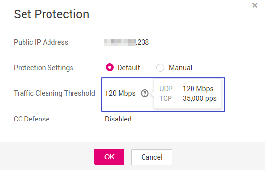

# How to Use Anti-DDoS

Description:

-   Anti-DDoS defends IP addresses against DDoS attacks after you enable it.
    -   After you purchase an elastic IP address, the Anti-DDoS service automatically enables the protection for this IP address.  [Figure 1](#fig1187371918561)  shows the default protection settings. When the service UDP \(User Datagram Protocol\) traffic is greater than 120 Mbps or the TCP \(Transmission Control Protocol\) traffic is greater than 35,000 pps, traffic scrubbing is triggered and Anti-DDoS will automatically intercept the attack traffic.

        If you delete an elastic IP address, Anti-DDoS automatically disables the protection for the IP address, which is recorded in Cloud Trace Service \(CTS\).

        **Figure  1**  Default protection settings  
        

        > **NOTE:**   
        >-   Mbps = Mbit/s \(short for 1,000,000 bit/s\). It is a unit of transmission rate and refers to the number of bits transmitted per second.  
        >-   PPS, short for Packets Per Second, is a measure of throughput for network devices. It means the number of packets sent per second.  

    -   If protection is not enabled for an elastic IP address, enable the protection by referring to  [Enabling Anti-DDoS](enabling-anti-ddos.md).

-   Enable alarm notification, which sends notifications by SMS or email when an IP address is under a DDoS attack.
-   Adjust security settings based on service needs during defense.
-   View monitoring and interception reports after the defense is enabled to check network security situations.

