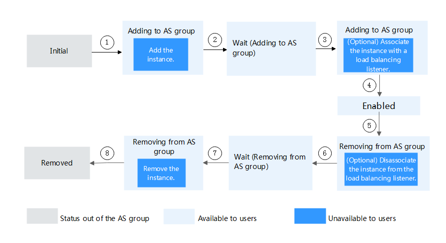

# Lifecycle

The lifecycle of an instance in an AS group starts when it is created and ends when it is removed from the AS group.

If you have not added a lifecycle hook to the AS group, the instance lifecycle changes as shown in  [Figure 1](#en-us_topic_0190954031_fig9892349365).

**Figure  1**  Instance lifecycle  

In trigger conditions 2 and 4, a scaling action is automatically triggered to change the instance status.

**Table  1**  Instance status

<table><thead align="left"><tr id="en-us_topic_0190954031_row2761988122115"><th class="cellrowborder" valign="top" width="14.888511148885112%" id="mcps1.2.5.1.1">
<strong id="b4449180193214">Status</strong>

</th>
<th class="cellrowborder" valign="top" width="17.328267173282672%" id="mcps1.2.5.1.2">
<strong id="b191102081324">Sub-item</strong>

</th>
<th class="cellrowborder" valign="top" width="32.03679632036797%" id="mcps1.2.5.1.3">
<strong id="b17720540123219">Status Description</strong>

</th>
<th class="cellrowborder" valign="top" width="35.746425357464254%" id="mcps1.2.5.1.4">
<strong id="b12838104683211">Trigger Condition</strong>

</th>
</tr>
</thead>
<tbody><tr id="en-us_topic_0190954031_row3086574154529"><td class="cellrowborder" valign="top" width="14.888511148885112%" headers="mcps1.2.5.1.1 ">
Initial

</td>
<td class="cellrowborder" valign="top" width="17.328267173282672%" headers="mcps1.2.5.1.2 ">
N/A

</td>
<td class="cellrowborder" valign="top" width="32.03679632036797%" headers="mcps1.2.5.1.3 ">
The instance has not been added to an AS group.

</td>
<td class="cellrowborder" rowspan="3" valign="top" width="35.746425357464254%" headers="mcps1.2.5.1.4 ">
The status of an instance is changed to <strong id="en-us_topic_0190954031_b84235270614229">Adding to AS group</strong> when either of the following operations is performed:<ul id="en-us_topic_0190954031_ul4210447915580"><li>When you manually change the expected number of instances or a scaling condition is met, a scaling action is triggered to expand resources.</li><li>You manually add instances to the AS group.</li></ul>

</td>
</tr>
<tr id="en-us_topic_0190954031_row43008980122115"><td class="cellrowborder" rowspan="2" valign="top" headers="mcps1.2.5.1.1 ">
Adding to AS group

</td>
<td class="cellrowborder" valign="top" headers="mcps1.2.5.1.2 ">
Add an instance.

</td>
<td class="cellrowborder" valign="top" headers="mcps1.2.5.1.3 ">
When trigger condition 1 is met, AS adds the instance to expand the AS group capacity.

</td>
</tr>
<tr id="en-us_topic_0190954031_row6209240122115"><td class="cellrowborder" valign="top" headers="mcps1.2.5.1.1 ">
(Optional) Associate the instance with a load balancing listener.

</td>
<td class="cellrowborder" valign="top" headers="mcps1.2.5.1.2 ">
When trigger condition 1 is met, AS associates the created instance with the load balancing listener.

</td>
</tr>
<tr id="en-us_topic_0190954031_row46459564122115"><td class="cellrowborder" valign="top" width="14.888511148885112%" headers="mcps1.2.5.1.1 ">
Enabled

</td>
<td class="cellrowborder" valign="top" width="17.328267173282672%" headers="mcps1.2.5.1.2 ">
N/A

</td>
<td class="cellrowborder" valign="top" width="32.03679632036797%" headers="mcps1.2.5.1.3 ">
The instance is added to the AS group and starts to process service traffic.

</td>
<td class="cellrowborder" rowspan="3" valign="top" width="35.746425357464254%" headers="mcps1.2.5.1.4 ">
The instance status is changed from <strong id="en-us_topic_0190954031_b8423527061438">Enabled</strong> to <strong id="en-us_topic_0190954031_b84235270614312">Removing from AS group</strong> when any of the following operations are performed:<ul id="en-us_topic_0190954031_ul51227112161151"><li>When you manually change the expected number of instances or a scaling condition is met, a scaling action is triggered to reduce resources.</li><li>When a health check shows that an enabled instance is unhealthy, the instance is removed from the AS group.</li><li>You manually remove an instance from an AS group.</li></ul>

</td>
</tr>
<tr id="en-us_topic_0190954031_row29538368122115"><td class="cellrowborder" rowspan="2" valign="top" headers="mcps1.2.5.1.1 ">
Removing from AS group

</td>
<td class="cellrowborder" valign="top" headers="mcps1.2.5.1.2 ">
(Optional) Disassociate the instance from the load balancing listener.

</td>
<td class="cellrowborder" valign="top" headers="mcps1.2.5.1.3 ">
When trigger condition 3 is met, the AS group starts to reduce resources and disassociate the instance from the load balancing listener.

</td>
</tr>
<tr id="en-us_topic_0190954031_row63808889123150"><td class="cellrowborder" valign="top" headers="mcps1.2.5.1.1 ">
Remove the instance.

</td>
<td class="cellrowborder" valign="top" headers="mcps1.2.5.1.2 ">
After the instance is unbound from the load balancing listener, it is removed from the AS group.

</td>
</tr>
<tr id="en-us_topic_0190954031_row44493857154932"><td class="cellrowborder" valign="top" width="14.888511148885112%" headers="mcps1.2.5.1.1 ">
Removed

</td>
<td class="cellrowborder" valign="top" width="17.328267173282672%" headers="mcps1.2.5.1.2 ">
N/A

</td>
<td class="cellrowborder" valign="top" width="32.03679632036797%" headers="mcps1.2.5.1.3 ">
The instance lifecycle in the AS group ends.

</td>
<td class="cellrowborder" valign="top" width="35.746425357464254%" headers="mcps1.2.5.1.4 ">
N/A

</td>
</tr>
</tbody>
</table>

Instances are added to an AS group manually or through a scaling action. Then, they go through the  **Adding to AS group**,  **Enabled**, and  **Removing from AS group**  statuses, and are finally removed from the AS group.

If you have not added a lifecycle hook to the AS group, the instance lifecycle changes as shown in  [Figure 2](#en-us_topic_0190954031_fig32791162165412). When the AS group is performing a scaling action, instances are suspended by the lifecycle hook and remain in the waiting state until the timeout period ends or the user manually calls back the instances. You can perform desired operations during the waiting. For example, you can install or configure software on a newly added instance or download log files from an instance before it is removed. 

**Figure  2**  Instance lifecycle  

In trigger conditions 2, 4, 6, and 8, a scaling action is automatically triggered to change the instance status.

**Table  2**  Instance status

<table><thead align="left"><tr id="en-us_topic_0190954031_row12488715123523"><th class="cellrowborder" valign="top" width="17.32%" id="mcps1.2.5.1.1">
<strong id="b1111728175919">Status</strong>

</th>
<th class="cellrowborder" valign="top" width="17.7%" id="mcps1.2.5.1.2">
<strong id="b4595103615919">Sub-status</strong>

</th>
<th class="cellrowborder" valign="top" width="29.549999999999997%" id="mcps1.2.5.1.3">
<strong id="b177271242185913">Status Description</strong>

</th>
<th class="cellrowborder" valign="top" width="35.43%" id="mcps1.2.5.1.4">
<strong id="b2212352175918">Trigger Description</strong>

</th>
</tr>
</thead>
<tbody><tr id="en-us_topic_0190954031_row44048139155326"><td class="cellrowborder" valign="top" width="17.32%" headers="mcps1.2.5.1.1 ">
Initial

</td>
<td class="cellrowborder" valign="top" width="17.7%" headers="mcps1.2.5.1.2 ">
N/A

</td>
<td class="cellrowborder" valign="top" width="29.549999999999997%" headers="mcps1.2.5.1.3 ">
The instance has not been added to an AS group.

</td>
<td class="cellrowborder" rowspan="2" valign="top" width="35.43%" headers="mcps1.2.5.1.4 ">
The status of an instance is changed to <strong id="b564662505">Adding to AS group</strong> when either of the following operations is performed:<ul id="en-us_topic_0190954031_ul2790743316349"><li>When you manually change the expected number of instances or a scaling condition is met, a scaling action is triggered to expand resources.</li><li>You manually add instances to the AS group.</li></ul>

</td>
</tr>
<tr id="en-us_topic_0190954031_row36403380123523"><td class="cellrowborder" valign="top" headers="mcps1.2.5.1.1 ">
Adding to AS group

</td>
<td class="cellrowborder" valign="top" headers="mcps1.2.5.1.2 ">
Add the instance.

</td>
<td class="cellrowborder" valign="top" headers="mcps1.2.5.1.3 ">
When trigger condition 1 is met, AS adds the instance to expand the AS group capacity.

</td>
</tr>
<tr id="en-us_topic_0190954031_row63642540123523"><td class="cellrowborder" valign="top" width="17.32%" headers="mcps1.2.5.1.1 ">
Wait (Adding to AS group)

</td>
<td class="cellrowborder" valign="top" width="17.7%" headers="mcps1.2.5.1.2 ">
N/A

</td>
<td class="cellrowborder" valign="top" width="29.549999999999997%" headers="mcps1.2.5.1.3 ">
The lifecycle hook suspends the instance that is being added to the AS group and sets the instance to be in waiting state.

</td>
<td class="cellrowborder" rowspan="2" valign="top" width="35.43%" headers="mcps1.2.5.1.4 ">
The instance status is changed from <strong id="b1807733970">Wait (Adding to AS group)</strong> to <strong id="b715365286">Adding to AS group</strong> when either of the following operations is performed:<ul id="en-us_topic_0190954031_ul5016346818818"><li>The default callback action is performed.</li><li>You manually perform the callback action.</li></ul>

</td>
</tr>
<tr id="en-us_topic_0190954031_row61532733123523"><td class="cellrowborder" valign="top" headers="mcps1.2.5.1.1 ">
Adding to AS group

</td>
<td class="cellrowborder" valign="top" headers="mcps1.2.5.1.2 ">
(Optional) Associate the instance with a load balancing listener.

</td>
<td class="cellrowborder" valign="top" headers="mcps1.2.5.1.3 ">
When trigger condition 3 is met, AS associates the instance with the load balancing listener.

</td>
</tr>
<tr id="en-us_topic_0190954031_row5043122123523"><td class="cellrowborder" valign="top" width="17.32%" headers="mcps1.2.5.1.1 ">
Enabled

</td>
<td class="cellrowborder" valign="top" width="17.7%" headers="mcps1.2.5.1.2 ">
N/A

</td>
<td class="cellrowborder" valign="top" width="29.549999999999997%" headers="mcps1.2.5.1.3 ">
The instance is added to the AS group and starts to process service traffic.

</td>
<td class="cellrowborder" rowspan="2" valign="top" width="35.43%" headers="mcps1.2.5.1.4 ">
The instance status is changed from <strong id="b1625953503">Enabled</strong> to <strong id="b27763235">Removing from AS group</strong> when any of the following operations are performed:<ul id="en-us_topic_0190954031_ul44815551163440"><li>When you manually change the expected number of instances or a scaling condition is met, a scaling action is triggered to reduce resources.</li><li>When a health check shows that an enabled instance is unhealthy, the instance is removed from the AS group.</li><li>You manually remove an instance from an AS group.</li></ul>

</td>
</tr>
<tr id="en-us_topic_0190954031_row4457222412386"><td class="cellrowborder" valign="top" headers="mcps1.2.5.1.1 ">
Removing from AS group

</td>
<td class="cellrowborder" valign="top" headers="mcps1.2.5.1.2 ">
(Optional) Disassociate the instance from the load balancing listener.

</td>
<td class="cellrowborder" valign="top" headers="mcps1.2.5.1.3 ">
When trigger condition 5 is met, the AS group starts to reduce resources and disassociate the instance from the load balancing listener.

</td>
</tr>
<tr id="en-us_topic_0190954031_row13234780123848"><td class="cellrowborder" valign="top" width="17.32%" headers="mcps1.2.5.1.1 ">
Wait (Removing from AS group)

</td>
<td class="cellrowborder" valign="top" width="17.7%" headers="mcps1.2.5.1.2 ">
N/A

</td>
<td class="cellrowborder" valign="top" width="29.549999999999997%" headers="mcps1.2.5.1.3 ">
The lifecycle hook suspends the instance that is being removed from the AS group and sets the instance to be in waiting state.

</td>
<td class="cellrowborder" rowspan="2" valign="top" width="35.43%" headers="mcps1.2.5.1.4 ">
The instance status is changed from <strong id="b1942795081">Wait (Removing from AS group)</strong> to <strong id="b948639311">Removing from AS group</strong> when either of the following operations is performed:<ul id="en-us_topic_0190954031_ul4346242181746"><li>The default callback action is performed.</li><li>You manually perform the callback action.</li></ul>

</td>
</tr>
<tr id="en-us_topic_0190954031_row17111799123913"><td class="cellrowborder" valign="top" headers="mcps1.2.5.1.1 ">
Removing from AS group

</td>
<td class="cellrowborder" valign="top" headers="mcps1.2.5.1.2 ">
Remove the instance.

</td>
<td class="cellrowborder" valign="top" headers="mcps1.2.5.1.3 ">
When trigger condition 7 is met, AS removes the instance from the AS group.

</td>
</tr>
<tr id="en-us_topic_0190954031_row8482253155454"><td class="cellrowborder" valign="top" width="17.32%" headers="mcps1.2.5.1.1 ">
Removed

</td>
<td class="cellrowborder" valign="top" width="17.7%" headers="mcps1.2.5.1.2 ">
N/A

</td>
<td class="cellrowborder" valign="top" width="29.549999999999997%" headers="mcps1.2.5.1.3 ">
The instance lifecycle in the AS group ends.

</td>
<td class="cellrowborder" valign="top" width="35.43%" headers="mcps1.2.5.1.4 ">
N/A

</td>
</tr>
</tbody>
</table>

Instances are added to an AS group manually or through a scaling action. Then, they go through the  **Adding to AS group**,  **Wait \(Adding to AS group\)**,  **Adding to AS group**,  **Enabled**,  **Removing from AS group**,  **Wait \(Removing from the AS group\)**, and  **Removing from AS group**  and are finally removed from the AS group.

