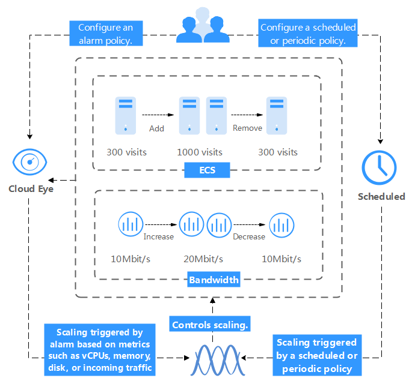

# What Is AS?

Auto Scaling \(AS\) is a service that automatically adjusts resources based on your service requirements and configured AS policies. You can specify AS policies based on service requirements. These policies free you from having to repeatedly adjust resources to keep up with service changes and demand spikes, helping you reduce the resources and manpower required. AS can automatically adjust ECS and bandwidth resources.  [Figure 1](#en-us_topic_0190954081_fig16841689103)  shows the AS architecture.

**Figure  1**  AS architecture  

