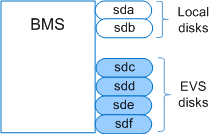
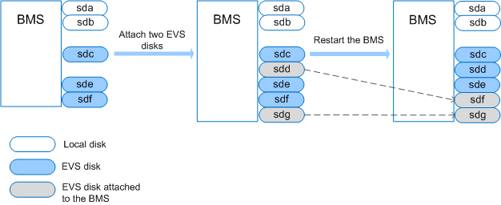
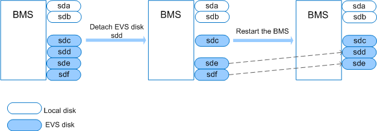

# Are the EVS Disk Device Names on the Console and the Device Names in BMS OSs Consistent?

## Local System Disk

The EVS disk device names displayed on the BMS details page on the VPC console are inconsistent with the device names displayed in the BMS OS. To prevent impact of device name changes on services, you are advised to use EVS disks by UUID.

If EVS disks are specified during BMS allocation, the EVS disk device names displayed on the BMS details page start from  **/dev/sdb**  and the device names displayed in the BMS OS start after the BMS local disk names, as shown in  [Figure 1](#fig1769278111120).

**Figure  1**  Device names in the BMS OS  

If EVS disks are attached to an allocated BMS, the device names displayed on the BMS details page are those specified by the tenant during disk attaching. After the EVS disks are detached from the BMS, the disks will not be displayed on the BMS details page, and the device names will be released.

If EVS disks are detached from an allocated BMS, the device names displayed in the BMS OS vary depending on whether the BMS OS restarts.

After EVS disks are attached to a BMS, if the BMS OS does not restart, the device names displayed in the BMS OS start from the smallest device name that is not used by other devices. For example, if device names  **/dev/sda**  and  **/dev/sdc**  are in use, the device names will start from  **dev/sdb**. After EVS disks are detached from the BMSs, if the BMS OS does not restart, the BMS OS will release the device names.

If the BMS OS restarts, the device names displayed in the BMS OS will change based on the number of disks the BMS has and the disk attaching sequence.  [Figure 2](#fig125556971412)  shows the device names displayed in the BMS OS after EVS disks are attached to the BMS \(before and after BMS restart\).  [Figure 3](#fig571093113146)  shows the device names displayed in the BMS OS after EVS disks are detached from the BMS \(before and after BMS restart\).

**Figure  2**  Attaching EVS disks to a BMS  

**Figure  3**  Detaching EVS disks from a BMS  

## EVS System Disk

The EVS disk device names displayed on the BMS details page on the VPC console may be inconsistent with the device names displayed in the BMS OS.

If EVS disks are specified during BMS allocation, the EVS disk device names displayed on the BMS details page start from  **/dev/sda**  and the device names in the BMS OS are displayed in a sequence determined by system scanning. There are two situations as shown in  [Figure 4](#fig73716231158)  and  [Figure 5](#fig17464143631512), and the EVS system disk always has the smallest drive letter of all the EVS disks.

**Figure  4**  Device names in the BMS OS \(situation 1\)  
.png "device-names-in-the-bms-os-(situation-1)")

**Figure  5**  Device names in the BMS OS \(situation 2\)  
.png "device-names-in-the-bms-os-(situation-2)")

If EVS disks are attached to an allocated BMS, the device names displayed on the BMS details page are those specified by the tenant during disk attaching. After the EVS disks are detached from the BMS, the disks will not be displayed on the BMS details page, and the device names will be released.

If EVS disks are detached from an allocated BMS, the device names displayed in the BMS OS vary depending on whether the BMS OS restarts.

After EVS disks are attached to a BMS, if the BMS OS does not restart, the device names displayed in the BMS OS start from the smallest device name that is not used by other devices. For example, if device names  **/dev/sda**  and  **/dev/sdc**  are in use, the device names will start from  **dev/sdb**. After EVS disks are detached from the BMSs, if the BMS OS does not restart, the BMS OS will release the device names.

If the BMS OS restarts, the device names displayed in the BMS OS will change based on the number of disks the BMS has and the disk attaching sequence.  [Figure 6](#fig2951141791613)  and  [Figure 7](#fig167631251101615)  show the device names displayed in the BMS OS after EVS disks are attached to the BMS \(before and after BMS restart\).  [Figure 8](#fig1773821141716)  and  [Figure 9](#fig107095363171)  show the device names displayed in the BMS OS after EVS disks are detached from the BMS \(before and after BMS restart\).

**Figure  6**  Attaching an EVS disk \(before the BMS restart\)  
.png "attaching-an-evs-disk-(before-the-bms-restart)")

**Figure  7**  Attaching an EVS disk \(after the BMS restart\)  
.png "attaching-an-evs-disk-(after-the-bms-restart)")

**Figure  8**  Detaching an EVS disk \(before the BMS restart\)  
.png "detaching-an-evs-disk-(before-the-bms-restart)")

**Figure  9**  Detaching an EVS disk \(after the BMS restart\)  
.png "detaching-an-evs-disk-(after-the-bms-restart)")

