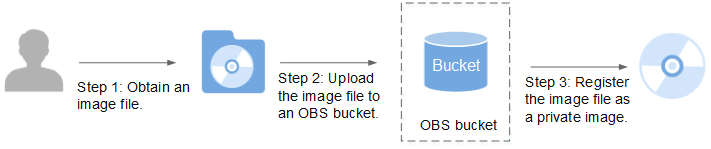

# Creating a Private Image from an External Image File

## Scenarios

You can create and register a private image using an external image file.  [Figure 1](#fig7431140101516)  shows the procedure.

**Figure  1**  Image creation procedure  

The procedure contains the following steps:

1.  For how to obtain an image file, see  _Bare Metal Server Private Image Creation Guide_.
2.  Upload the image file to your OBS bucket. For details, see  [Upload an External Image File](#section175082275342).
3.  On the management console, select the uploaded image file and register it as a private image. For details, see  [Register a Private Image](#section17202836566).

## Upload an External Image File

You can import an image file in VHD, VMDK, QCOW2, RAW, VHDX, QCOW, VDI, QED, ZVHD, or ZVHD2 format to create a private image. QCOW2 image files are recommended. If you need to import an image file in other formats, use the qemu-img tool to convert the image format before importing the image file. For details, see  [Convert Image File Formats](convert-image-file-formats.md).

Use OBS Browser to upload external image files. For details, see  _Object Storage Service User Guide_.

When uploading the external image file, you must select an OBS bucket with standard storage.

## Register a Private Image

1.  Log in to the management console.
2.  Under  **Computing**, click  **Image Management Service**.

    The IMS console is displayed. 

3.  Click  **Create Private Image**  in the upper right corner and configure the following parameters:

    **Image Type and Source**

    -   **Type**: Select  **System disk image**.
    -   **Source**: Select  **Image file**.

        In the bucket list, select the bucket that stores the image file and select the image file.

    **Image Information**

    -   **Function**: Select  **BMS system disk image**.

        Ensure that you have completed initialization configuration on the image file by following the instructions in  _Bare Metal Server Private Image Creation Guide_.

    -   **OS**: \(Optional\) Select the OS of the image file.

        To ensure that the image can be created and used properly, select the OS consistent with that of the image file.

    -   **System Disk \(GB\)**: Set the system disk size. You are advised to set the value to the image system disk size plus 2 GB.
    -   **Name**: Enter a name for the image to be created. The value can contain only letters, digits, spaces, hyphens \(-\), underscores \(\_\), and periods \(.\), and cannot start or end with a space.
    -   **Enterprise Project**: Select an enterprise project from the drop-down list. This parameter is available only when you have enabled the enterprise project function, or your account is an enterprise account. To enable this function, contact your customer manager.
    -   **Tag**: \(Optional\) Add a tag to the image to identify and manage the image more easily.
    -   **Description**: \(Optional\) Enter description of the image.

4.  Click  **Create Now**.

    On the displayed page, confirm the specifications and click  **Submit**.

    > **NOTE:**   
    >The time required for registering a private image varies depending on the size of the image file.  

5.  The page that contains private images is displayed. The private image is being created. After its status changes to  **Normal**, the image is registered successfully.

## Follow-up Operations

You can use the private image to create a BMS by following the instructions in  [Creating a BMS Using a Private Image](creating-a-bms-using-a-private-image.md).

