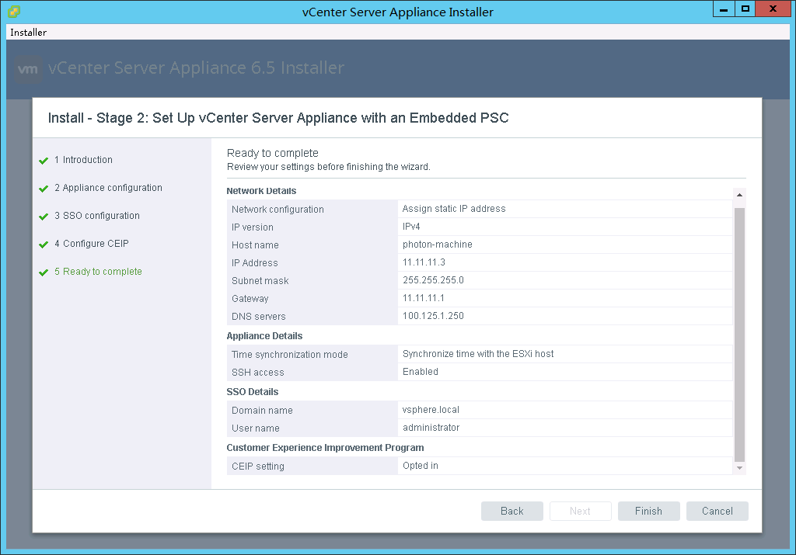

# Deploying vCenter Server Appliance

1.  Deploy vCenter Server Appliance on the ESXi host. For details, see section "Deploying the vCenter Server Appliance and Platform Services Controller Appliance" in  [vSphere Installation and Setup](https://docs.vmware.com/en/VMware-vSphere/6.5/com.vmware.vsphere.install.doc/GUID-F06BA415-66D8-42CD-9151-701BBBCE8D65.html).
2.  Some example configurations are as follows:
    1.  When importing the OVA file during the first installation phase, set a static IP address 11.11.11.3 for vCenter Server Appliance, and set the subnet mask to 255.255.255.0, default gateway to 11.11.11.1, and DNS to 11.11.11.6.
    2.  In phase 2, set the username and password of the new vCenter Single Sign-on domain. Assume that the username is  **administrator**, domain name is  **vsphere.local**, and site name is  **photon-machine**.

        

3.  Log in to vCenter Web Client and create a data center and a cluster.
4.  On the vCenter Web Client, create three distributed virtual switches \(DVSs\), create one or more distributed port groups on each DVS, and configure VLAN IDs for the distributed port groups based on DPortGroup-mgmt, DPortGroup-vxlan, DPortGroup-edge-internal, and DPortGroup-vsan.  [Table 1](#table47011255194512)  lists the DVSs and distributed port groups.

    **Table  1**  Configuration information

    
    <table><thead align="left"><tr id="row50855279"><th class="cellrowborder" valign="top" width="33.33333333333333%" id="mcps1.2.4.1.1">
DVS

    </th>
    <th class="cellrowborder" valign="top" width="33.33333333333333%" id="mcps1.2.4.1.2">
Distributed Port Group

    </th>
    <th class="cellrowborder" valign="top" width="33.33333333333333%" id="mcps1.2.4.1.3">
VLAN ID

    </th>
    </tr>
    </thead>
    <tbody><tr id="row7929439"><td class="cellrowborder" valign="top" width="33.33333333333333%" headers="mcps1.2.4.1.1 ">
dvSwitch-0

    </td>
    <td class="cellrowborder" valign="top" width="33.33333333333333%" headers="mcps1.2.4.1.2 ">
DPortGroup-mgmt

    </td>
    <td class="cellrowborder" valign="top" width="33.33333333333333%" headers="mcps1.2.4.1.3 ">
0

    </td>
    </tr>
    <tr id="row24604138"><td class="cellrowborder" valign="top" width="33.33333333333333%" headers="mcps1.2.4.1.1 ">
dvSwitch-1

    </td>
    <td class="cellrowborder" valign="top" width="33.33333333333333%" headers="mcps1.2.4.1.2 ">
DPortGroup-vxlan

    </td>
    <td class="cellrowborder" valign="top" width="33.33333333333333%" headers="mcps1.2.4.1.3 ">
200

    </td>
    </tr>
    <tr id="row4827645"><td class="cellrowborder" valign="top" width="33.33333333333333%" headers="mcps1.2.4.1.1 ">
dvSwitch-1

    </td>
    <td class="cellrowborder" valign="top" width="33.33333333333333%" headers="mcps1.2.4.1.2 ">
DPortGroup-edge-internal

    </td>
    <td class="cellrowborder" valign="top" width="33.33333333333333%" headers="mcps1.2.4.1.3 ">
300

    </td>
    </tr>
    <tr id="row62983758"><td class="cellrowborder" valign="top" width="33.33333333333333%" headers="mcps1.2.4.1.1 ">
dvSwitch-2

    </td>
    <td class="cellrowborder" valign="top" width="33.33333333333333%" headers="mcps1.2.4.1.2 ">
DPortGroup-vsan

    </td>
    <td class="cellrowborder" valign="top" width="33.33333333333333%" headers="mcps1.2.4.1.3 ">
400

    </td>
    </tr>
    </tbody>
    </table>

5.  Create the VMkernel NIC on the hb-vsan port group. Select  **Virtual SAN traffic**  for the port attribute and configure the IP address based on  [Table 3](environment-preparations.md#table5655194511448).

    Migrate the VMkernel NIC and uplink on vSwitch1 to the distributed port group and DVS of dpg-hb-mgmt.

6.  Add the first ESXi host to vCenter through IP address 11.11.11.101.

    Configure a distributed switch and migrate the vmknic, DNS/NTP, vCenter, and jump VM to the switch. For details, see section  [Setting Up Networking with vSphere Distributed Switches](https://docs.vmware.com/en/VMware-vSphere/6.5/com.vmware.vsphere.networking.doc/GUID-375B45C7-684C-4C51-BA3C-70E48DFABF04.html).

7.  Add the ESXi host to the DVSs dvSwitch-1 and dvSwitch-2. Use uplinks vmnic4/vmnic5 and vmnic6/vmnic7 in active/standby mode.
8.  Add the ESXi host to the distributed switch dvSwitch-0 using the uplink vmnic3.
9.  Migrate the VMkernel NIC vmk1 to the distributed port group dpg-hb-mgmt.
10. Connect the DNS/NTP on the ESXi host and the vNIC of the vCenter VM to the distributed port group dpg-hb-mgmt.
11. Migrate the Windows jump VM on the ESXi host and connect the vNIC that connects to vSwitch1/hb-mgmt to the port group dpg-hb-mgmt on dvSwitch0.
12. Add vmnic2 to dvSwitch-0 and delete the vSwitch1 VM.

    Configurations of the vSwitch on the first ESXi host are as follows.

    **Table  2**  vSwitch configuration \(first ESXi host\)

    
    <table><thead align="left"><tr id="row14294113"><th class="cellrowborder" valign="top" width="20%" id="mcps1.2.6.1.1">
Port Group

    </th>
    <th class="cellrowborder" valign="top" width="20%" id="mcps1.2.6.1.2">
vSwitch

    </th>
    <th class="cellrowborder" valign="top" width="20%" id="mcps1.2.6.1.3">
Uplink

    </th>
    <th class="cellrowborder" valign="top" width="20%" id="mcps1.2.6.1.4">
vlan ID

    </th>
    <th class="cellrowborder" valign="top" width="20%" id="mcps1.2.6.1.5">
vmkernel NIC

    </th>
    </tr>
    </thead>
    <tbody><tr id="row32033984"><td class="cellrowborder" valign="top" width="20%" headers="mcps1.2.6.1.1 ">
management network

    </td>
    <td class="cellrowborder" valign="top" width="20%" headers="mcps1.2.6.1.2 ">
vSwitch0

    </td>
    <td class="cellrowborder" valign="top" width="20%" headers="mcps1.2.6.1.3 ">
vmnic0

    
vmnic1

    </td>
    <td class="cellrowborder" valign="top" width="20%" headers="mcps1.2.6.1.4 ">
-

    </td>
    <td class="cellrowborder" valign="top" width="20%" headers="mcps1.2.6.1.5 ">
vmk0

    </td>
    </tr>
    <tr id="row43779810"><td class="cellrowborder" valign="top" width="20%" headers="mcps1.2.6.1.1 ">
hb-mgmt

    </td>
    <td class="cellrowborder" valign="top" width="20%" headers="mcps1.2.6.1.2 ">
dvSwitch-0

    </td>
    <td class="cellrowborder" valign="top" width="20%" headers="mcps1.2.6.1.3 ">
vmnic2

    
vmnic3

    </td>
    <td class="cellrowborder" valign="top" width="20%" headers="mcps1.2.6.1.4 ">
0

    </td>
    <td class="cellrowborder" valign="top" width="20%" headers="mcps1.2.6.1.5 ">
vmk1

    </td>
    </tr>
    <tr id="row25215798"><td class="cellrowborder" valign="top" width="20%" headers="mcps1.2.6.1.1 ">
DPortGroup -vxlan

    </td>
    <td class="cellrowborder" rowspan="2" valign="top" width="20%" headers="mcps1.2.6.1.2 ">
dvSwitch-1

    </td>
    <td class="cellrowborder" rowspan="2" valign="top" width="20%" headers="mcps1.2.6.1.3 ">
vmnic4

    
vmnic5

    </td>
    <td class="cellrowborder" valign="top" width="20%" headers="mcps1.2.6.1.4 ">
100

    </td>
    <td class="cellrowborder" valign="top" width="20%" headers="mcps1.2.6.1.5 ">
-

    </td>
    </tr>
    <tr id="row16047484"><td class="cellrowborder" valign="top" headers="mcps1.2.6.1.1 ">
hb-edge-internal

    </td>
    <td class="cellrowborder" valign="top" headers="mcps1.2.6.1.2 ">
300

    </td>
    <td class="cellrowborder" valign="top" headers="mcps1.2.6.1.3 ">
-

    </td>
    </tr>
    <tr id="row64539365"><td class="cellrowborder" valign="top" width="20%" headers="mcps1.2.6.1.1 ">
DPortGroup -vsan

    </td>
    <td class="cellrowborder" valign="top" width="20%" headers="mcps1.2.6.1.2 ">
dvSwitch-2

    </td>
    <td class="cellrowborder" valign="top" width="20%" headers="mcps1.2.6.1.3 ">
vmnic6

    
vmnic7

    </td>
    <td class="cellrowborder" valign="top" width="20%" headers="mcps1.2.6.1.4 ">
400

    </td>
    <td class="cellrowborder" valign="top" width="20%" headers="mcps1.2.6.1.5 ">
vmk2

    </td>
    </tr>
    </tbody>
    </table>

