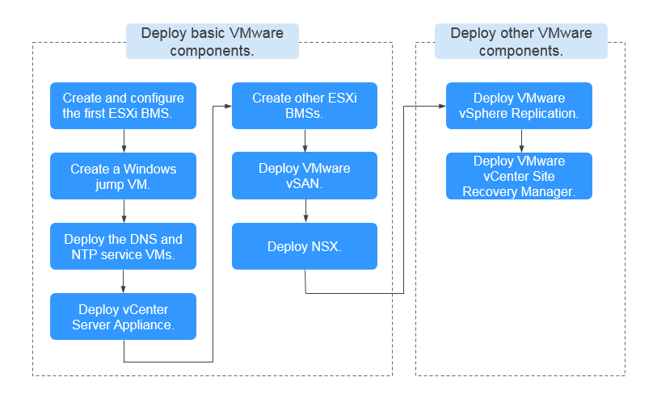

# Deployment Process

To deploy VMware in the BMS cluster and configure public cloud services and VMware, perform the following operations:

**Figure  1**  Deployment process of VMware on BMS  

Basic VMware components are mandatory, including vCenter Server Appliance, VMware vSAN, and NSX. Deploy them as instructed. Other VMware components are optional, including VMware vSphere Replication and VMware vCenter Site Recovery Manager. You can deploy them as needed.

