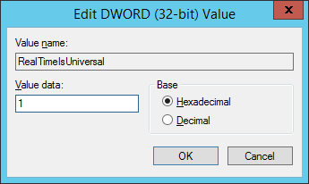

# How Can I Handle the Eight-Hour Difference Between the Windows BMS and Local Time

## Cause

Linux uses the time of the motherboard CMOS chip as the Coordinated Universal Time \(UTC\) and determines the system time based on the configured time zone. However, Windows uses the CMOS time as the system time directly without converting it based on the time zone.

## Solution

1.  Log in to the Windows BMS.
2.  Click    in the lower left corner, choose  **Windows PowerShell**, and enter  **regedit.exe**  to open the registry.
3.  In the displayed  **Registry Editor**  window, choose  **HKEY\_LOCAL\_MACHINE**  \>  **SYSTEM**  \>  **CurrentControlSet**  \>  **Control**  \>  **TimeZoneInformation**.
4.  In the right pane, right-click a blank area and choose  **New**  \>  **DWORD \(32-bit\) Value**  to add a REG\_DWORD code. Set its name to  **RealTimeIsUniversal**  and value to  **1**.

    **Figure  1**  Adding a code  
    

5.  After the modification, restart the BMS.

    After the BMS restarts, its system time is consistent with the local time.

