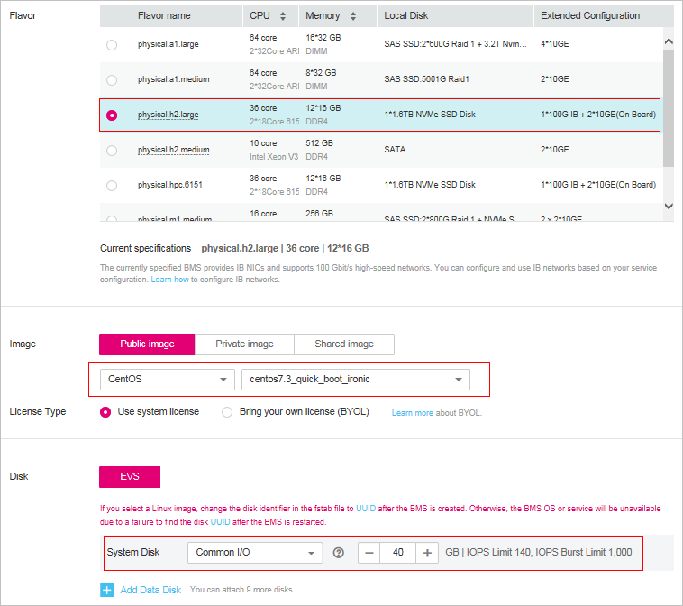

# How Can I Quickly Provision BMSs Using EVS Disks?

When provisioning a common BMS, you need to download its OS from the cloud and install it. The download costs a long time. BMSs using EVS disks as system disks can be provisioned quickly.

On the page for creating a BMS, select a flavor that supports quick BMS provisioning, set the system disk type and capacity, and configure other required parameters to obtain a BMS.

**Figure  1**  Creating a BMS  

