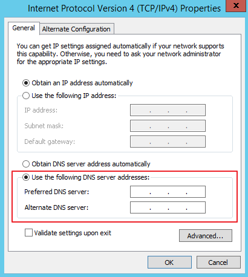

# How Do I Configure the DNS Server?<a name="EN-US_TOPIC_0118945920"></a>

When installing Agent on a BMS, ensure that the DNS server of the BMS runs properly. This section describes how to configure the DNS server and how to verify the DNS server status.

## Linux<a name="section030617195617"></a>

1.  Log in to the BMS as user  **root**.
2.  Run the following command to edit the  **resolv.conf**  file:

    **vi /etc/resolv.conf**

3.  Press  **i**  to enter editing mode and enter  **nameserver** _DNS server IP address_  before existing  **nameserver**  configurations.

    The format is as follows:

    ```
    nameserver 100.125.4.25
    ```

4.  Press  **Esc**  and enter  **:wq**  to save the change and exit.
5.  Run the following commands to restart the network:

    **rcnetwork restart**

    **service network restart**

    **/etc/init.d/network restart**


## Windows<a name="section161531581814"></a>

The following steps use Windows Server 2012 R2 as an example to describe how to configure the DNS server for Windows:

1.  Log in to the BMS as user  **Administrator**.
2.  Click    in the lower left corner to start  **Control Panel**.
3.  Choose  **Network and Internet**  \>  **Network and Sharing Center**. Then click the NIC for which you are to configure the DNS server, such as  **Ethernet 3**.

    **Figure  1**  Network and Sharing Center<a name="fig377203019581"></a>  
    

4.  Click  **Properties**.  [Figure 2](#fig18672112218013)  shows the  **Ethernet 3 Status**.

    **Figure  2**  Ethernet 3 Status<a name="fig18672112218013"></a>  
    

5.  In the displayed  **Ethernet 3 Status**  dialog box, select  **Internet Protocol Version 4 \(TCP/IPv4\)**  and click  **Properties**.

    **Figure  3**  Ethernet 3 Properties<a name="fig187071162047"></a>  
    

6.  In the displayed  **Internet Protocol Version 4 \(TCP/IPv4\) Properties**  dialog box, select  **Use the following DNS server addresses:**  and configure the required parameters shown in  [Figure 4](#fig5487194145010).

    The DNS server IP address is 100.125.4.25. After completing the configuration, click  **OK**.

    **Figure  4**  Configuring the DNS server<a name="fig5487194145010"></a>  
    

7.  After completing the configuration, click  , select  **Windows PowerShell**, and enter the  **ipconfig /all**  command. The configured IP address is displayed in  **DNS Servers**.

