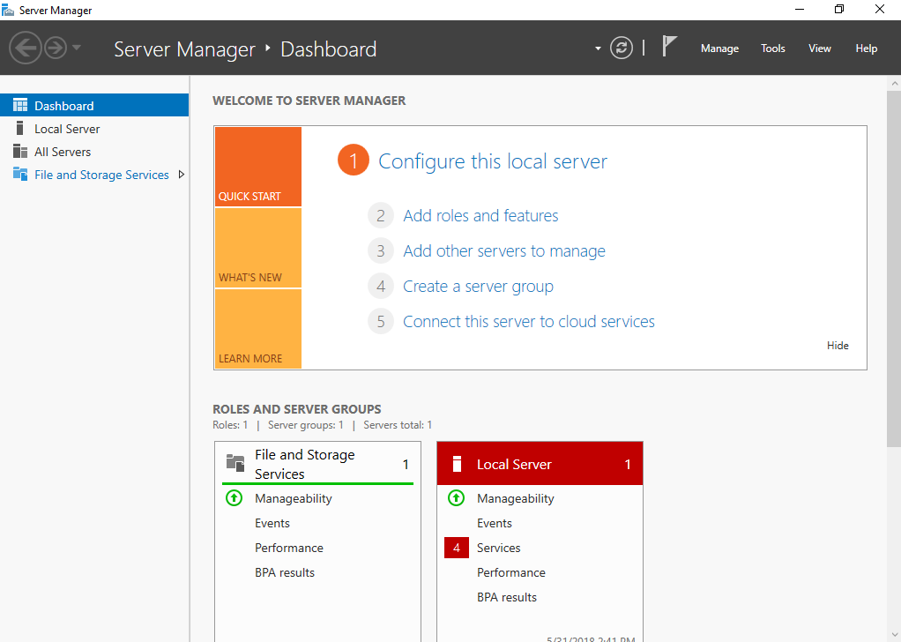
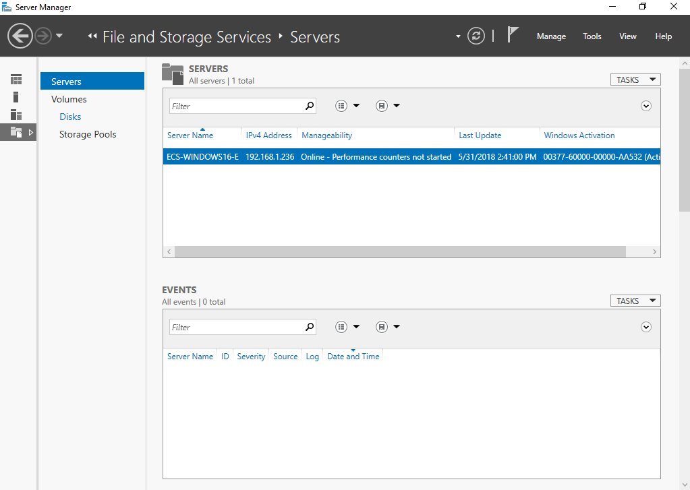
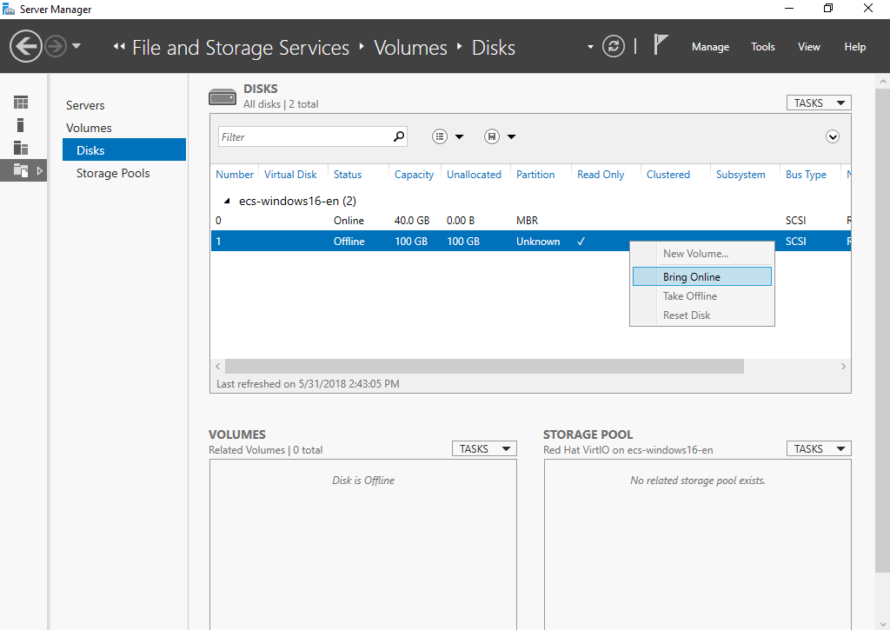
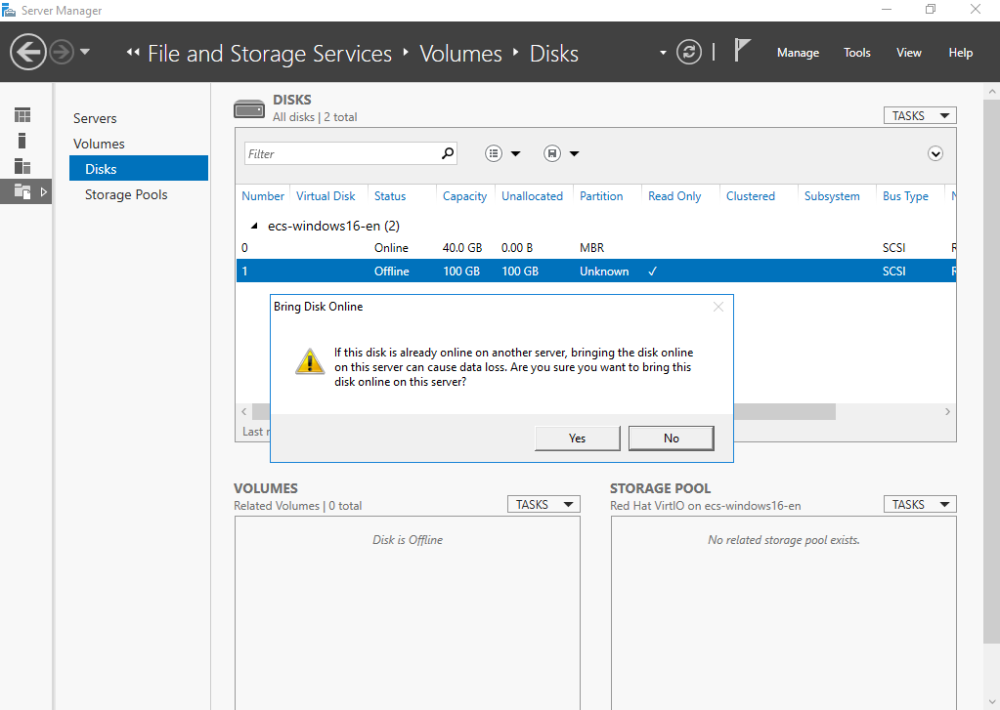
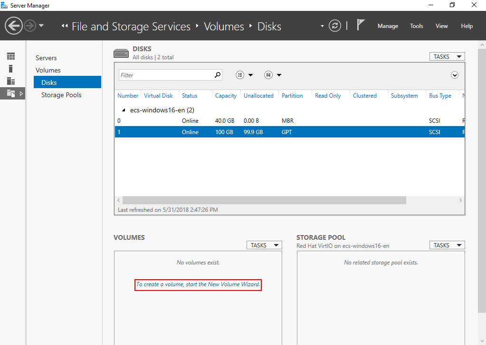
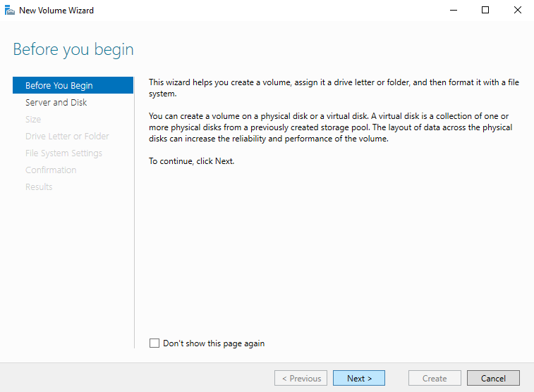
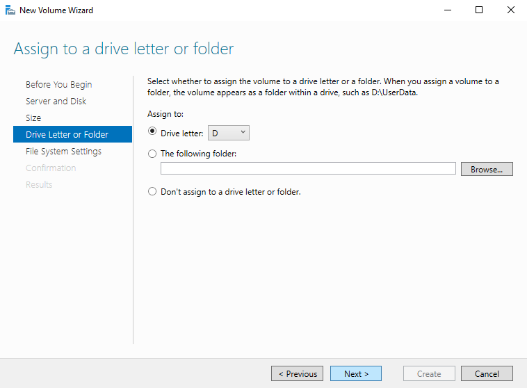
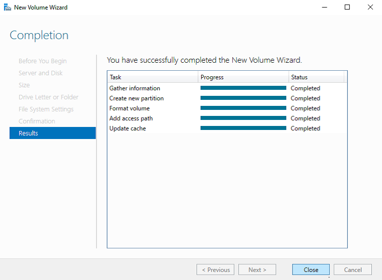
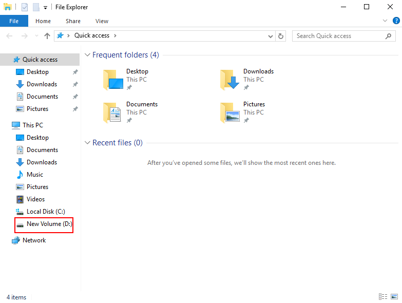
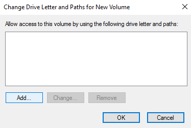

# Initializing a Windows Data Disk \(Windows Server 2016\)

## Scenarios

This section uses Windows Server 2016 Standard 64bit to describe how to initialize a data disk attached to a BMS running Windows.

The maximum disk capacity supported by MBR is 2 TB, and that supported by GPT is 18 EB. Therefore, use the GPT partition style if your disk capacity is greater than 2 TB. For details about disk partition styles, see  [Introduction to Data Disk Initialization Scenarios and Partition Styles](introduction-to-data-disk-initialization-scenarios-and-partition-styles.md).

The method for initializing a disk varies depending on the OSs running on the BMS. This document is for reference only. For detailed operations and differences, see the product documents of the OSs running on the corresponding BMSs.

## Prerequisites

-   You have logged in to the BMS.
-   A data disk has been attached to the BMS and has not been initialized.

## Procedure

1.  On the BMS desktop, click the start icon in the lower left corner.

    The  **Windows Server**  window is displayed.

2.  Click  **Server Manager**.

    The  **Server Manager**  window is displayed.

    **Figure  1**  Server Manager  
    

3.  In the navigation tree on the left, choose  **File and Storage Services**.

    The  **Servers**  page is displayed.

    **Figure  2**  Servers  
    

4.  In the navigation pane, choose  **Disks**.

    The  **Disks**  page is displayed.

    **Figure  3**  Disks  
    

5.  Disks are listed in the right pane. If the new disk is in the offline state, bring it online before initialize it.
    1.  Right-click the new disk and choose  **Bring Online**  from the shortcut menu.

        The  **Bring Disk Online**  dialog box is displayed.

        **Figure  4**  Bring Disk Online  
        

    2.  Click  **Yes**  to confirm the operation.
    3.  Click    in the upper area of the page to refresh the disk information.

        When the disk status changes from  **Offline**  to  **Online**, the disk has been brought online.

        **Figure  5**  Bring online succeeded  
        

6.  After the disk has been brought online, initialize the disk.
    1.  Right-click the new disk and choose  **Initialize**  from the shortcut menu.

        The  **Initialize Disk**  dialog box is displayed.

        **Figure  6**  Initialize Disk \(Windows 2016\)  
        .png "initialize-disk-(windows-2016)")

    2.  Click  **Yes**  to confirm the operation.
    3.  Click    in the upper area of the page to refresh the disk information.

        When the disk partition changes from  **Unknown**  to  **GPT**, the initialization is complete.

        **Figure  7**  Completing initialization  
        

7.  In the lower left area of the page, click  **To create a volume, start the New Volume Wizard.**  to create a new volume.

    The  **New Volume Wizard**  window is displayed.

    **Figure  8**  New Volume Wizard  
    

8.  Follow the prompts and click  **Next**.

    The  **Select the server and disk**  page is displayed.

    **Figure  9**  Select the server and disk  
    

9.  Select the server and disk, and then click  **Next**. The system selects the server to which the disk is attached by default. You can specify the server based on your requirements. In this example, the default setting is used.

    The  **Specify the size of the volume**  page is displayed.

    **Figure  10**  Specify Volume Size \(Windows 2016\)  
    .png "specify-volume-size-(windows-2016)")

10. Specify the volume size and click  **Next**. The system selects the maximum volume size by default. You can specify the volume size as required. In this example, the default setting is used.

    The  **Assign to a drive letter or folder**  page is displayed.

    **Figure  11**  Assign to a drive letter or folder  
    

11. Assign the volume to a drive letter or folder and click  **Next**. The system assigns the volume to drive letter D by default. In this example, the default setting is used.

    The  **Select file system settings**  page is displayed.

    **Figure  12**  Select file system settings  
    

12. Specify file system settings and click  **Next**. The system selects the NTFS file system by default. You can specify the file system type based on the actual condition. In this example, the default setting is used.

    > **NOTICE:**   
    >The partition sizes supported by file systems vary. Therefore, you are advised to choose an appropriate file system based on your service requirements.  

    The  **Confirm selections**  page is displayed.

    **Figure  13**  Confirm selections  
    

13. Confirm the volume location, volume properties, and file system settings. Then click  **Create**  to create a volume.

    If the page shown in  [Figure 14](#en-us_topic_0115255433_fig9863192213574)  is displayed, the volume is successfully created.

    **Figure  14**  Completion  
    

14. After the volume is created, click    and check whether a new volume appears in File Explorer. In this example, New Volume \(D:\) is the new volume.
    -   If New Volume \(D:\) appears, the disk is successfully initialized and no further action is required.

        **Figure  15**  File Explorer  
        

    -   If New Volume \(D:\) does not appear, perform the following operations to assign the volume to another drive letter or folder:
        1.  Click  , enter  **cmd**, and press  **Enter**.

            The  **Administrator: Command Prompt**  window is displayed.

        2.  Run the  **diskmgmt**  command.

            The  **Disk Management**  page is displayed.

            **Figure  16**  Disk Management \(Windows 2016\)  
            .png "disk-management-(windows-2016)")

        3.  In the right pane of  **Disk 1**, right-click and choose  **Change Drive Letter and Paths**.

            The  **Change Drive Letter and Paths for New Volume**  dialog box is displayed.

            **Figure  17**  Change Drive Letter and Paths for New Volume  
            

        4.  Click  **Add**.

            The  **Add Drive Letter or Path**  dialog box is displayed.

            **Figure  18**  Add Drive Letter or Path  
            

        5.  Select  **Assign the following drive letter**  to re-assign the volume to a drive letter. Then, click  **OK**. Drive letter D is used in this example.

            After assigning the drive letter, you can view New Volume \(D:\) in File Explorer.

            > **NOTE:**   
            >The drive letter selected here must be the same as that set in  [11](#en-us_topic_0115255433_li02801421135916).  

