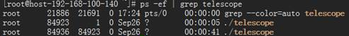

# Installing and Configuring Agent<a name="EN-US_TOPIC_0078758302"></a>

## Scenarios<a name="section136194292913"></a>

This section describes how to install and configure Agent on a BMS.

## Prerequisites<a name="section26121523016"></a>

-   The BMS is running properly.
-   The DNS server of the BMS runs properly. For how to configure the DNS server, see  [How Do I Configure the DNS Server?](how-do-i-configure-the-dns-server.md).

## Restrictions<a name="section173101536115215"></a>

-   Private images do not support this function.

    [Table 1](#table17683185813387)  lists the Linux images that support server monitoring.

    **Table  1**  Linux images that support server monitoring

    <a name="table17683185813387"></a>
    <table><thead align="left"><tr id="row468385817385"><th class="cellrowborder" valign="top" width="50%" id="mcps1.2.3.1.1"><p id="p3683145810389"><a name="p3683145810389"></a><a name="p3683145810389"></a>OS Type</p>
    </th>
    <th class="cellrowborder" valign="top" width="50%" id="mcps1.2.3.1.2"><p id="p2833165524015"><a name="p2833165524015"></a><a name="p2833165524015"></a>Version</p>
    </th>
    </tr>
    </thead>
    <tbody><tr id="row106831458193819"><td class="cellrowborder" valign="top" width="50%" headers="mcps1.2.3.1.1 "><p id="p7683175813382"><a name="p7683175813382"></a><a name="p7683175813382"></a>Red Hat</p>
    </td>
    <td class="cellrowborder" valign="top" width="50%" headers="mcps1.2.3.1.2 "><p id="p10683135816389"><a name="p10683135816389"></a><a name="p10683135816389"></a>6.5, 6.7, 6.8, 7.2, 7.3, and 7.4</p>
    </td>
    </tr>
    <tr id="row7790114219416"><td class="cellrowborder" valign="top" width="50%" headers="mcps1.2.3.1.1 "><p id="p5805242114117"><a name="p5805242114117"></a><a name="p5805242114117"></a>SUSE</p>
    </td>
    <td class="cellrowborder" valign="top" width="50%" headers="mcps1.2.3.1.2 "><p id="p20805174210417"><a name="p20805174210417"></a><a name="p20805174210417"></a>11.4 and 12.1</p>
    </td>
    </tr>
    <tr id="row5399175444111"><td class="cellrowborder" valign="top" width="50%" headers="mcps1.2.3.1.1 "><p id="p14399175415416"><a name="p14399175415416"></a><a name="p14399175415416"></a>Oracle Linux</p>
    </td>
    <td class="cellrowborder" valign="top" width="50%" headers="mcps1.2.3.1.2 "><p id="p039925418417"><a name="p039925418417"></a><a name="p039925418417"></a>6.5, 7.3, and 7.4</p>
    </td>
    </tr>
    <tr id="row167291723114217"><td class="cellrowborder" valign="top" width="50%" headers="mcps1.2.3.1.1 "><p id="p137292232421"><a name="p137292232421"></a><a name="p137292232421"></a>CentOS</p>
    </td>
    <td class="cellrowborder" valign="top" width="50%" headers="mcps1.2.3.1.2 "><p id="p47291123194219"><a name="p47291123194219"></a><a name="p47291123194219"></a>6.9, 7.2, 7.3, and 7.4</p>
    </td>
    </tr>
    <tr id="row0873051803"><td class="cellrowborder" valign="top" width="50%" headers="mcps1.2.3.1.1 "><p id="p1187495118012"><a name="p1187495118012"></a><a name="p1187495118012"></a>EulerOS</p>
    </td>
    <td class="cellrowborder" valign="top" width="50%" headers="mcps1.2.3.1.2 "><p id="p0874135112015"><a name="p0874135112015"></a><a name="p0874135112015"></a>2.2</p>
    </td>
    </tr>
    </tbody>
    </table>


## Procedure<a name="section1171365619316"></a>

1.  Download the telescope installation package from  [https://obs.otc.t-systems.com/obs-bms-agent/telescope.zip](https://obs.otc.t-systems.com/obs-bms-agent/telescope.zip).
2.  Upload the  **telescope.zip**  package to a directory on the BMS, such as  **/home/**.
3.  Log in to the BMS OS and run the following commands to decompress the software packages:

    **cd /home/**

    **unzip telescope.zip**

    **unzip telescope\_linux\_amd64\_1.0.1.zip**

    **cd telescope\_linux\_amd64\_1.0.1**

4.  <a name="li172641224134219"></a>Perform the following steps to create an agency for server monitoring of the BMS:
    1.  On the management console homepage, choose  **Service List**  \>  **Management & Deployment**  \>  **Identity and Access Management**.
    2.  In the navigation pane on the left, choose  **Agency**  and then click  **Create Agency**  in the upper right corner.
        -   **Agency Name**: Enter  **bms\_monitor\_agency**.
        -   **Agency Type**: Select  **Cloud service**.
        -   **Cloud Service**: This parameter is available if you select  **Cloud service**  for  **Agency Type**. Click  **Select**, select  **ECS BMS**  in the displayed  **Select Cloud Service**  dialog box, and click  **OK**.
        -   **Validity Period**: Select  **Permanent**.
        -   **Description**: This parameter is optional. You can enter  **Support BMS server monitoring**.
        -   **Permissions**: Locate the region where the BMS resides and click  **Modify**  in the  **Operation**  column. In the displayed dialog box, enter  **CES**  in the  **Available Policies**  search box. Then select  **CES \(CES Administrator\)**  and click  **OK**.

            > **NOTE:**   
            >If the BMS belongs to a sub-project, ensure that the sub-project has the CES Administrator permission.  


    3.  Click  **OK**.

        The operations to create an agency for server monitoring of the BMS are complete.

5.  Inject the agency.
    -   When you allocate a BMS, you can select the agency created in step  [4](#li172641224134219)  on the  **Allocate BMS**  page.
    -   To inject an agency into an existing BMS, click the BMS name to enter its details page, click  **Monitor**, and select the agency created in step  [4](#li172641224134219).

6.  Run the  **vi ./bin/conf\_ces.json**  command to open the  **conf\_ces.json**  file and configure the address of the server that receives data. You can ping the IP address or domain name to check connectivity.

    The configuration is as follows:

    ```
    {
    "Endpoint": "https://ces.eu-de.otc.t-systems.com:443"
    }
    ```

7.  Install the telescope service.

    1.  Run the  **chmod 755 setup.sh**  command to grant execute permissions of the  **setup.sh**  file.
    2.  Run the  **./setup.sh install**  command to install or update the telescope service.

        You can run the  **./setup.sh --help**  command to print the help information about the installation script and check how to use other commands in the installation script.

    > **NOTE:**   
    >If an error is reported during the installation, the time of the BMS may be different from that of the monitoring server. Uninstall the telescope service and change the time before installing the service again. An example command used to change the time is  **timedatectl set-timezone 'Asia/Shanghai'**.  

8.  Run the  **ps -ef | grep telescope**  command to check whether the telescope service is installed successfully.

    

9.  After performing the preceding steps, go to the management console homepage and click  **Cloud Eye**  under  **Management & Deployment**. On the  **Monitoring Overview**  page, click  **Bare Metal Server**  to view monitoring data of the BMS.

    You can also click  **View Monitoring Graph**  to view the monitoring graph for the BMS.

10. If you do not need server monitoring any longer, run  **./setup.sh uninstall**  in the directory where the installation package is stored in the BMS OS to uninstall the telescope service.

