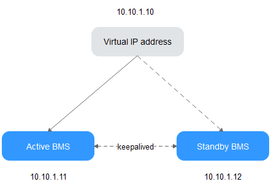

# Managing Virtual IP Addresses

## Virtual IP Address Overview

Virtual IP addresses, also called floating IP addresses, are used for active and standby switchover of servers to achieve high availability. If the active server is faulty and cannot provide services, the virtual IP address is dynamically switched to the standby server to provide services.

If you want to improve service high availability and avoid single points of failure, you can use BMSs that are deployed to work in the active/standby mode or one active and multiple standby modes. These BMSs use the same virtual IP address.

**Figure  1**  Networking diagram of the HA mode  

-   Bind two BMSs in the same subnet to the same virtual IP address.
-   Configure Keepalived for the two BMSs to work in the active/standby mode. For details about Keepalived configurations, see the common configuration methods in the industry.

> **NOTE:**   
>For more information about virtual IP addresses, see the  _Virtual Private Cloud User Guide_.  

## How Do I Bind a Virtual IP Address to a BMS?

1.  Log in to the management console.
2.  Under  **Computing**, click  **Bare Metal Server**.

    The BMS console is displayed.

3.  Click the name of the BMS to which a virtual IP address needs to be bound.

    The page showing details of the BMS is displayed.

4.  Click the  **NICs**  tab. Then, click  **Manage Virtual IP Address**.

    The page showing details of the particular VPC is displayed.

5.  On the  **Virtual IP Address**  tab, select a desired one or click  **Assign Virtual IP Address**  for a new one.
6.  Click  **Bind to Server**  in the  **Operation**  column and select the target BMS and the NIC to bind the virtual IP address to the NIC.

