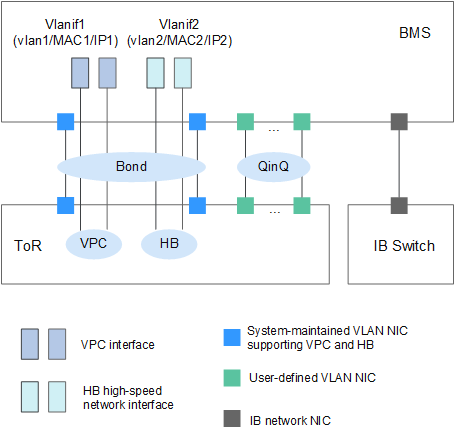
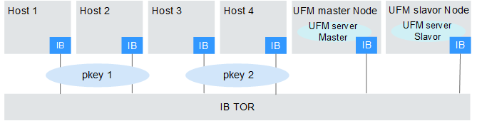

# Network

BMS provides four types of networks, VPC, high-speed network, use-defined VLAN, and IB network. They are isolated from each other. VPC and high-speed network interfaces are VLAN sub-interfaces created after system maintenance VLAN NICs are bonded. You can manage and configure NICs of use-defined VLANs and IB networks.

**Figure  1**  BMS service networks  

> **NOTE:**   
>-   In the preceding figure, ToR indicates the cabling mode in the server cabinet. The access switch is placed on top of the rack and the server is placed beneath it. HB indicates the high-speed network. QinQ indicates the 802.1Q tunnel.  
>-   VPC and high-speed network interfaces are generated by the system and you should not change them. They are configured in the same NIC bond.  
>-   ECSs and BMSs can communicate through VPCs or IB networks \(if any\).  
>-   Only the VPC supports the security group, EIP, and ELB.  
>-   For the high-speed network and user-defined VLAN, BMSs in the same network communicate with each other only through layer-2 connections.  

## VPC

A VPC is a logically isolated, configurable, and manageable virtual network created for BMSs. It helps to improve the security of resources in the cloud system and simplifies network deployment. You can create security groups and VPNs, configure IP address ranges, and specify bandwidth sizes in your VPC. With a VPC, you can manage and configure internal networks and change network configurations, simplifying network management. You can also customize access rules to control BMS access within a security group and across different security groups to enhance BMS security.

For more information, see  _Virtual Private Cloud User Guide_.

## High-Speed Network

A high-speed network is an internal network between BMSs. It provides high bandwidth for connecting BMSs in the same AZ. If you want to deploy services requiring high throughput and low latency, you can create high-speed networks. Currently, the BMS service supports high-speed networks with a maximum bandwidth of 10 Gbit/s.

For more information, see  [Overview](high-speed-network-overview.md).

## User-defined VLAN

You can use the Ethernet NICs \(10GE defined in BMS specifications\) not used by the system to configure a user-defined VLAN. The QinQ technology is used to isolate networks and provide additional physical planes and bandwidths. You can allocate VLAN subnets to isolate traffic in various scenarios including SAP HANA and VMware. User-defined VLAN NICs are in pairs. You can configure NIC bonding to achieve high availability. User-defined VLANs in different AZs cannot communicate.

> **NOTE:**   
>QinQ is a layer 2 tunnel protocol based on IEEE 802.1Q encapsulation. It adds a public VLAN tag to a frame with a private VLAN tag to allow the frame with double VLAN tags to be transmitted over the service provider's backbone network based on the public VLAN tag. This provides a layer 2 VPN tunnel for customers.  

## IB Network

The IB network features low latency and high bandwidth and is used in a number of High Performance Computing \(HPC\) projects. It uses the 100 Gbit/s Mellanox IB NIC, dedicated IB switch, and controller software UFM to ensure network communication and management, and uses the Partition Key to isolate IB networks of different tenants \(similar to the VLAN in the Ethernet\).

**Figure  2**  IB network isolation mode  

> **NOTE:**   
>Unified Fabric Manager \(UFM\) is the IB switch controller of the IB network based on OpenSM software and provides northbound service ports. It is deployed in active/standby mode.  

