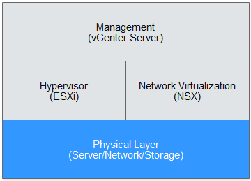

# Solution Overview

Bare Metal Server \(BMS\) provides dedicated physical servers with excellent computing performance to meet your requirements for high performance and stability in core application scenarios. The BMS service allows you to provision VMware ESXi BMSs. You can build a VMware private cloud based on the BMS cluster or migrate your VMware data center to the public cloud. You can enjoy the scalable resources and various services of the public cloud as well as the mature computing and network virtualization functions and the resource management system of VMware. This allows you to expand or migrate your services to the public cloud, or back up your resources in the public cloud.

This document provides a reference solution for deploying the VMware system using BMSs. You can also deploy the VMware system in a different mode based on the capabilities provided by the public cloud. This document applies to users with experience in deploying the VMware system.

## Logical Architecture

**Figure  1**  Logical architecture of VMware  

As shown in  [Figure 1](#fig996318917547), the management plane, hypervisor, and network virtualization layer are provided by VMware \(VMware vCenter Server®, VMware ESXi®, and VMware NSX®, respectively\). The public cloud provides the physical infrastructure required by the VMware system.

-   The BMS service provides BMSs using the  **physical.io2.4xlarge**  flavor. It has 44 physical cores, 384 GB memory, and 9600 GB local disks, providing excellent computing and storage capabilities.
-   The user-defined network is designed for the Virtualization on BMS solution and provides functions similar to Virtual Private Cloud \(VPC\). Through the user-defined network, service VMs provisioned by VMware can access:
    -   Elastic Cloud Server \(ECS\)
    -   BMS
    -   Direct Connect
    -   Internet

> **NOTE:**   
>VMware vSphere Replication is used for VM replication, and VMware vCenter Site Recovery Manager for restoration and disaster recovery \(DR\). Deploy them based on site requirements.  

## Licenses and Technical Support

Currently, the BMS service only supports automatic provisioning of ESXi BMSs. You need to install upper-layer management suites and their licenses.

If you have any problem with VMware products, contact VMware technical support.

