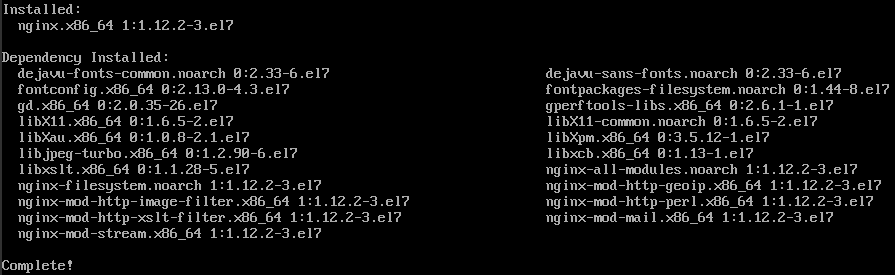
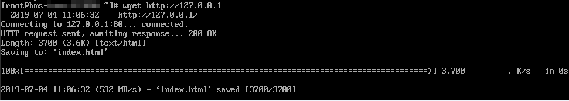

# Step 3: Deploy an Application

This section describes how to deploy an application on a BMS.

## Install and Start Nginx

1.  Run the  **yum install nginx**  command to install Nginx and enter  **y**  as prompted.

    If the information shown in the following figure is displayed, Nginx is installed successfully.

    

2.  Enter  **systemctl start nginx.service**  to start Nginx.

    > **NOTE:**   
    >This command applies to CentOS 7.4 64-bit, which is used as an example.  

3.  Enter  **wget http://127.0.0.1**  to test Nginx.

    

## Access the Default Web Page

Open a browser and enter http://_BMS EIP_  in the address box. If the Nginx welcome page is displayed, Nginx is installed successfully.

