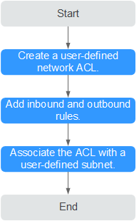

# Overview

## User-defined Network ACL

A user-defined network ACL is an optional layer of security for your subnets. You can associate one or more user-defined subnets with a user-defined network ACL for controlling traffic in and out of the subnets.

**Figure  1**  User-defined Network ACL  

Similar to security groups, user-defined network ACLs provide access control functions and add an additional layer of defense to your VPC. Security groups have only the allow rules, while user-defined network ACLs have both the allow rules and deny rules to implement fine-grained and comprehensive access control. Currently, user-defined networks do not support the security group function. You can use user-defined network ACLs to meet your network configuration requirements.

## Notes

-   User-defined network ACLs are similar to the network ACLs in the VPC service. For more information, see  _Virtual Private Cloud User Guide_.
-   By default, your user-defined network has no ACL. You can create a user-defined network ACL and associate it with a subnet. By default, a user-defined network ACL denies all inbound traffic to and outbound traffic from the associated subnet until you add rules.
-   A user-defined network ACL can be associated with multiple user-defined subnets. However, a user-defined subnet can be associated with only one user-defined network ACL.

## User-defined network ACL Configuration Process

**Figure  2**  Configuration process  

For details, see  [Creating and Managing a User-defined Network ACL](creating-and-managing-a-user-defined-network-acl.md).

