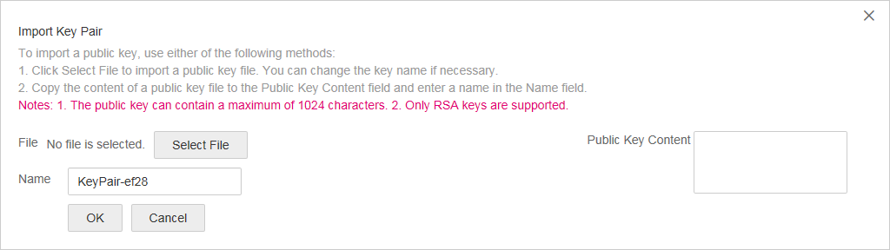

# Using an SSH Key Pair

## Use an SSH Key Pair

To ensure system security, you are recommended to use the key authentication mode to authorize the user who attempts to log in to a BMS. Therefore, you must use an existing key pair or create a new one for remote login authentication.

-   Creating a Key Pair

    If no key pair is available, create one that contains a public and a private key used for login authentication. You can use either of the following methods:

    -   Create a key pair using the management console. After the creation, the public key is automatically stored in the system, and the private key is manually stored in a local directory. For details, see  [Create a Key Pair on the Management Console](#section177941342144514).
    -   Use PuTTYgen to create a key pair, and save both the public and private keys to the local host. For details, see  [Create a Key Pair Using PuTTYgen](#section1553115399576). After the creation, import the key pair by following the instructions provided in  [Import a Key Pair](#section139515511165). Then, the key pair can be used.

        > **NOTE:**   
        >PuTTYgen is a tool for generating public and private keys. You can obtain the tool from  [https://www.chiark.greenend.org.uk/\~sgtatham/putty/latest.html](https://www.chiark.greenend.org.uk/~sgtatham/putty/latest.html).  

-   Using an existing key pair

    If a key pair is available locally, for example, generated using PuTTYgen, you can import the public key on the management console so that the system maintains the public key file. For details, see  [Import a Key Pair](#section139515511165).

## Create a Key Pair on the Management Console

1.  Log in to the management console.
2.  Under  **Computing**, click  **Bare Metal Server**.
3.  In the navigation tree, choose  **Key Pair**.
4.  On the right side of the page, click  **Create Key Pair**.
5.  Enter the key name and click  **OK**.

    An automatically allocated key name consists of  **KeyPair-**  and a 4-digit random number. Change it to an easy-to-remember one, for example,  **KeyPair-_xxxx_\_bms**.

6.  Download the private key file. Alternatively, the system will automatically download it for you. The file name is the specified key pair name with a suffix of .pem. Securely store the private key file. In the displayed dialog box, click  **OK**.

    > **NOTICE:**   
    >This is the only opportunity for you to save the private key file. Keep it secure. When creating a BMS, provide the name of the desired key pair. Each time you log in to the BMS using SSH, provide the private key.  

## Create a Key Pair Using PuTTYgen

1.  Obtain the public and private keys.
    1.  Double-click  **puttygen.exe**. The  **PuTTY Key Generator**  window is displayed.

        **Figure  1**  PuTTY Key Generator  
        

    2.  Click  **Generate**.

        The key generator automatically generates a key pair that consists of a public key and a private key. The public key is that shown in the red box in  [Figure 2](#fig1743640142214).

        **Figure  2**  Obtaining the public and private keys  
        

2.  Copy the public key content to a .txt file and save the file in a local directory.

    > **NOTE:**   
    >Do not save the public key by clicking  **Save public key**. Storing a public key by clicking  **Save public key**  of PuTTYgen will change the format of the public key content. Such a key cannot be imported to the management console.  

3.  Save the private key file.

    The format in which to save your private key varies depending on application scenarios: To ensure BMS security, you are limited to downloading the private key only once.

    -   Saving the private key in .ppk format

        When you are required to log in to a Linux BMS using PuTTY, you must use the .ppk private key. To save the private key in .ppk format, perform the following operations:

        1.  On the  **PuTTY Key Generator**  page, choose  **File**  \>  **Save private key**.
        2.  Save the private key, for example,  **kp-123.ppk**, to the local PC.

    -   Saving the private key in .pem format

        When you are required to log in to a Linux BMS using Xshell or attempt to obtain the password for logging in to a Windows BMS, you must use the .pem private key for authentication. To save the private key in .ppk format, perform the following operations:

        1.  On the  **PuTTY Key Generator**  page, choose  **Conversions**  \>  **Export OpenSSH key**.

            > **NOTICE:**   
            >If you use this private file to obtain the password for logging in to a Windows BMS, when you choose  **Export OpenSSH key**, do not configure  **Key passphrase**. Otherwise, obtaining the password will fail.  

        2.  Save the private key, for example,  **kp-123.pem**, in a local directory.

4.  After the public key file and private key file are saved, import the public key to the system by referring to  [Import a Key Pair](#section139515511165).

## Import a Key Pair

If you store a public key by clicking  **Save public key**  of PuTTYgen, the format of the public key content will change. Such a key cannot be imported to the management console. To resolve this issue, obtain the public key content in correct format and import the content to the management console. For details, see section  [What Should I Do If a Key Pair Created Using PuTTYgen Cannot Be Imported to the Management Console?](what-should-i-do-if-a-key-pair-created-using-puttygen-cannot-be-imported-to-the-management-console.md).

1.  Log in to the management console.
2.  Under  **Computing**, click  **Bare Metal Server**.
3.  In the navigation tree, choose  **Key Pair**.
4.  On the right side of the page, click  **Import Key Pair**.

    **Figure  3**  Import Public Key  
    

5.  Use either of the following methods to import the key pair:
    -   Selecting a file
        1.  On the  **Import Key Pair**  page of the management console, click  **Select File**  and select the local public key file, for example, the .txt file saved in  [2](#li1156822695811).

            > **NOTE:**   
            >When importing a key pair, ensure that the public key is imported. Otherwise, importing the key pair will fail.  

        2.  Click  **OK**.

            After the public key is imported, you can change its name.

    -   Copying the public key content
        1.  Copy the content of the public key in .txt file into the  **Public Key Content**  text box.
        2.  Click  **OK**.

## Delete a Key Pair

If you no longer need a key pair, you can delete it. After a key pair is deleted, it cannot be restored. However, you can still use the private key saved locally to log in to the BMS, and the deleted key pair is still displayed in the BMS details.

> **NOTE:**   
>-   If your key pair has been bound to a BMS and you do not unbind the key pair from the BMS before deleting the key pair, you cannot create a key pair of the same name. When you enter this name when creating or importing a key pair, the console displays an error message indicating that the key pair already exists.  
>-   If your key pair is not bound to any BMS or has been unbound from the BMS before it is deleted, you can create a key pair of the same name.  

1.  Log in to the management console.
2.  Under  **Computing**, click  **Bare Metal Server**.
3.  In the navigation tree, choose  **Key Pair**.
4.  Locate the row that contains the target key pair and click  **Delete**  in the  **Operation**  column.

