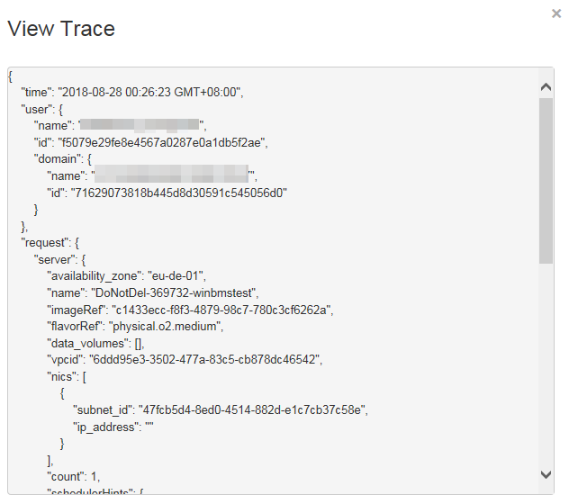

# Viewing Traces

1.  Log in to the management console.
2.  Click  **Service List**  and select  **Cloud Trace Service**  under  **Management & Deployment**.
3.  Choose  **Trace List**  in the navigation pane on the left.
4.  You can use filters to query traces. The following four filters are available:
    -   **Trace Source**,  **Resource Type**, and  **Search By**

        Select the filter from the drop-down list.

        When you select  **Trace name**  for  **Search By**, you also need to select a specific trace name. When you select  **Resource ID**  for  **Search By**, you also need to select or enter a specific resource ID. When you select  **Resource name**  for  **Search By**, you also need to select or enter a specific resource name.

    -   **Operator**: Select a specific operator \(a user rather than tenant\).
    -   **Trace Rating**: Available options include  **all trace status**,  **normal**,  **warning**, and  **incident**. You can only select one of them.
    -   Start time and end time: You can specify the time period to query traces.

5.  Click    on the left of the record to be queried to extend its details.

    **Figure  1**  Expanding trace details  
    

6.  Locate a trace and click  **View Trace**  in the  **Operation**  column.

    **Figure  2**  Viewing a trace  
    

    For details about the key fields in the CTS trace structure, see  _Cloud Trace Service User Guide_.

